## Question: p1c04-001
- **Subject:** #p1
- **Chapter:** #c04
- **Topic:** #বলের_স্বজ্ঞামূলক_ধারণা
- **Source:** #Book_ইসহাক_স্যার
- **Type:** #MCQ
- **Difficulty:** #hard
- **Board Exam:**
- **Admission Exam:** #RUET_12-13, #KU_18-19
- **College Exam:**
- **Book Question Number:** 4
- **Tags:**

বলের মাত্রা সমীকরণ কোনটি?

### Options
- [x] $[MLT^{-2}]$
- [ ] $[MLT^{-1}]$
- [ ] $[ML^2T^{-1}]$
- [ ] $[ML^2T^{-2}]$

### Explanation

  

## Question: p1c04-002
- **Subject:** #p1
- **Chapter:** #c04
- **Topic:** #বলের_স্বজ্ঞামূলক_ধারণা
- **Source:** #Book_ইসহাক_স্যার
- **Type:** #MCQ
- **Difficulty:** #medium
- **Board Exam:**
- **Admission Exam:**
- **College Exam:**
- **Book Question Number:** 7
- **Tags:**

বলের ভারসাম্য নির্দেশ করে—
i. 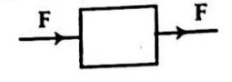
ii. 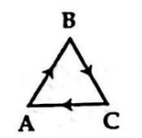
iii. 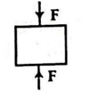
নিচের কোনটি সঠিক?

### Options
- [ ] i
- [ ] i ও ii
- [x] ii ও iii
- [ ] i, ii ও iii

### Explanation

  

## Question: p1c04-003
- **Subject:** #p1
- **Chapter:** #c04
- **Topic:** #বলের_স্বজ্ঞামূলক_ধারণা
- **Source:** #Book_ইসহাক_স্যার
- **Type:** #MCQ
- **Difficulty:** #easy
- **Board Exam:** #RB_15
- **Admission Exam:**
- **College Exam:**
- **Book Question Number:** 73
- **Tags:**

 ‎ 
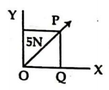
উদ্দীপক অনুযায়ী $\text{OY}$-অক্ষ বরাবর বলের মান—

### Options
- [ ] $0.8\text{ N}$
- [ ] $1.25\text{ N}$
- [x] $3.5\text{ N}$
- [ ] $20\text{ N}$

### Explanation

  

## Question: p1c04-004
- **Subject:** #p1
- **Chapter:** #c04
- **Topic:** #বলের_স্বজ্ঞামূলক_ধারণা
- **Source:** #Book_ইসহাক_স্যার
- **Type:** #MCQ
- **Difficulty:** #hard
- **Board Exam:**
- **Admission Exam:** #Medical_20-21
- **College Exam:**
- **Book Question Number:** 119
- **Tags:**

সূর্যোদয়ের দিকে $12$ মিটার যাওয়ার পর এক ব্যক্তি উত্তর দিকে $5\text{ m}$ চলে গেলো। তার স্থানচ্যুতি কত হবে?

### Options
- [ ] $17\text{ m}$
- [ ] $17.67\text{ m}$
- [ ] $16.67\text{ m}$
- [x] $13\text{ m}$

### Explanation

  

## Question: p1c04-005
- **Subject:** #p1
- **Chapter:** #c04
- **Topic:** #মৌলিক_বল
- **Source:** #Book_ইসহাক_স্যার
- **Type:** #MCQ
- **Difficulty:** #easy
- **Board Exam:** #CB_19
- **Admission Exam:**
- **College Exam:**
- **Book Question Number:** 1
- **Tags:**

সবচেয়ে শক্তিশালী বল হচ্ছে—

### Options
- [ ] মহাকর্ষ বল
- [ ] তড়িৎ চৌম্বকীয় বল
- [x] সবল নিউক্লীয় বল
- [ ] দুর্বল নিউক্লীয় বল

### Explanation

  

## Question: p1c04-006
- **Subject:** #p1
- **Chapter:** #c04
- **Topic:** #মৌলিক_বল
- **Source:** #Book_ইসহাক_স্যার
- **Type:** #MCQ
- **Difficulty:** #medium
- **Board Exam:** #CB_22, #CB_16, #DiB_22, #DB_16, #ChB_16, #JB_15
- **Admission Exam:** #Medical_16-17, #KU_11-12, #BRUR_12-13, #DU_20-21, #DU_22-23
- **College Exam:**
- **Book Question Number:** 2
- **Tags:**

নিচের বলগুলোর মধ্যে কোনটি সবচেয়ে দুর্বল?

### Options
- [x] মহাকর্ষ বল
- [ ] তড়িৎ চৌম্বকীয় বল
- [ ] সবল নিউক্লীয় বল
- [ ] দুর্বল নিউক্লীয় বল

### Explanation

  

## Question: p1c04-007
- **Subject:** #p1
- **Chapter:** #c04
- **Topic:** #মৌলিক_বল
- **Source:** #Book_ইসহাক_স্যার
- **Type:** #MCQ
- **Difficulty:** #medium
- **Board Exam:**
- **Admission Exam:** #JU_21-22
- **College Exam:**
- **Book Question Number:** 3
- **Tags:**

বিটা ক্ষয় কোন বলের কারণে?

### Options
- [ ] সবল নিউক্লীয়
- [x] দুর্বল নিউক্লীয়
- [ ] তড়িৎ চৌম্বকীয়
- [ ] মহাকর্ষ বল

### Explanation

  

## Question: p1c04-008
- **Subject:** #p1
- **Chapter:** #c04
- **Topic:** #মৌলিক_বল
- **Source:** #Book_ইসহাক_স্যার
- **Type:** #MCQ
- **Difficulty:** #medium
- **Board Exam:** #RB_22, #CB_21, #BB_17
- **Admission Exam:** #RU_16-17
- **College Exam:**
- **Book Question Number:** 8
- **Tags:**

নিউক্লিয়নের মধ্যে কোন কণার পারস্পরিক বিনিময়ের দ্বারা সবল নিউক্লীয় বলের উৎপত্তি হয়?

### Options
- [ ] গ্রাভিটন
- [ ] নিউট্রিনো
- [x] মেসন
- [ ] ইলেকট্রন

### Explanation

  

## Question: p1c04-009
- **Subject:** #p1
- **Chapter:** #c04
- **Topic:** #মৌলিক_বল
- **Source:** #Book_ইসহাক_স্যার
- **Type:** #MCQ
- **Difficulty:** #medium
- **Board Exam:** #RB_15
- **Admission Exam:** #Medical_17-18, #Agriculture_21-22
- **College Exam:**
- **Book Question Number:** 27
- **Tags:**

মহাকর্ষ বল কোন কণার বিনিময়ের ফলে কার্যকর হয়?

### Options
- [x] গ্রাভিটন
- [ ] মেসন
- [ ] ফোটন
- [ ] নিউট্রন

### Explanation

  

## Question: p1c04-010
- **Subject:** #p1
- **Chapter:** #c04
- **Topic:** #মৌলিক_বল
- **Source:** #Book_ইসহাক_স্যার
- **Type:** #MCQ
- **Difficulty:** #medium
- **Board Exam:** #CB_23, #SB_15
- **Admission Exam:** #JU_21-22
- **College Exam:**
- **Book Question Number:** 28
- **Tags:**

তড়িৎচুম্বকীয় বল কোন কণার পারস্পরিক বিনিময়ের ফলে কার্যকর হয়?

### Options
- [x] ফোটন
- [ ] মেসন
- [ ] প্রোটন
- [ ] গ্রাভিটন

### Explanation

  

## Question: p1c04-011
- **Subject:** #p1
- **Chapter:** #c04
- **Topic:** #মৌলিক_বল
- **Source:** #Book_ইসহাক_স্যার
- **Type:** #MCQ
- **Difficulty:** #hard
- **Board Exam:** #MB_22, #DiB_15
- **Admission Exam:** #Dental_17-18, #RU_14-15, #BUET_10-11
- **College Exam:**
- **Book Question Number:** 29
- **Tags:**

আণবিক গঠনের জন্য দায়ী বল কোনটি?

### Options
- [ ] মহাকর্ষ বল
- [ ] দুর্বল নিউক্লীয় বল
- [ ] সবল নিউক্লীয় বল
- [x] তড়িৎচুম্বকীয় বল

### Explanation

  

## Question: p1c04-012
- **Subject:** #p1
- **Chapter:** #c04
- **Topic:** #মৌলিক_বল
- **Source:** #Book_ইসহাক_স্যার
- **Type:** #MCQ
- **Difficulty:** #medium
- **Board Exam:** #JB_21, #MB_21
- **Admission Exam:**
- **College Exam:**
- **Book Question Number:** 101
- **Tags:**

ইউরেনিয়াম, থোরিয়াম এসব মৌলিক পদার্থের তেজস্ক্রিয় ভাঙন ঘটে কোন বলের কারণে?

### Options
- [ ] মহাকর্ষ বল
- [ ] তড়িৎ চৌম্বক বল
- [ ] দুর্বল নিউক্লীয় বল
- [x] সবল নিউক্লীয় বল

### Explanation

  

## Question: p1c04-013
- **Subject:** #p1
- **Chapter:** #c04
- **Topic:** #মৌলিক_বল
- **Source:** #Book_ইসহাক_স্যার
- **Type:** #MCQ
- **Difficulty:** #hard
- **Board Exam:**
- **Admission Exam:** #Medical_23-24
- **College Exam:**
- **Book Question Number:** 117
- **Tags:**

কোন কণার পারস্পরিক বিনিময়ের জন্য তাড়িত চৌম্বক বল কার্যকর হয়?

### Options
- [ ] মেসন
- [ ] গ্রাভিটন
- [x] ফোটন
- [ ] প্রোটন

### Explanation

  

## Question: p1c04-014
- **Subject:** #p1
- **Chapter:** #c04
- **Topic:** #মৌলিক_বল
- **Source:** #Book_ইসহাক_স্যার
- **Type:** #MCQ
- **Difficulty:** #hard
- **Board Exam:**
- **Admission Exam:** #Medical_23-24
- **College Exam:**
- **Book Question Number:** 118
- **Tags:**

কোন মৌলিক বলের কারণে নিউট্রিনো ও বিটা কণা নির্গমন ঘটে?

### Options
- [x] দুর্বল নিউক্লীয় বল
- [ ] মহাকর্ষ বল
- [ ] তড়িৎ চুম্বকীয় বল
- [ ] সবল নিউক্লীয় বল

### Explanation

  

## Question: p1c04-015
- **Subject:** #p1
- **Chapter:** #c04
- **Topic:** #নিউটনের_প্রথম_গতিসূত্র
- **Source:** #Book_ইসহাক_স্যার
- **Type:** #MCQ
- **Difficulty:** #medium
- **Board Exam:**
- **Admission Exam:**
- **College Exam:**
- **Book Question Number:** 53
- **Tags:**

সুষম গতিবেগে চলন্ত একটি বস্তুর ওপর—

### Options
- [ ] একটি নিট বল ক্রিয়া করে
- [x] একটি নিট শূন্য বল ক্রিয়া করে
- [ ] একটি সুষম ত্বরণ ক্রিয়া করে
- [ ] উপরের কোনোটিই নয়

### Explanation

  

## Question: p1c04-016
- **Subject:** #p1
- **Chapter:** #c04
- **Topic:** #নিউটনের_দ্বিতীয়_গতিসূত্র_বলের_পরিমাপ
- **Source:** #Book_ইসহাক_স্যার
- **Type:** #MCQ
- **Difficulty:** #medium
- **Board Exam:**
- **Admission Exam:** #JU_17-18
- **College Exam:**
- **Book Question Number:** 6
- **Tags:**

কত মানের একটি বল $10\text{ kg}$ ভরের একটি বস্তুর ওপর $4\text{ s}$ ক্রিয়া করলে বেগের পরিবর্তন $40\text{ ms}^{-1}$ হবে?

### Options
- [ ] $200\text{ N}$
- [ ] $50\text{ N}$
- [ ] $150\text{ N}$
- [x] $100\text{ N}$

### Explanation

  

## Question: p1c04-017
- **Subject:** #p1
- **Chapter:** #c04
- **Topic:** #নিউটনের_দ্বিতীয়_গতিসূত্র_বলের_পরিমাপ
- **Source:** #Book_ইসহাক_স্যার
- **Type:** #MCQ
- **Difficulty:** #medium
- **Board Exam:**
- **Admission Exam:** #DU_16-17
- **College Exam:**
- **Book Question Number:** 11
- **Tags:**

$30\text{ kg}$ ভরের একটি স্থির বস্তুর বেগ $2\text{ min}$ এ বৃদ্ধি করে $36\text{ km/h}$ এ উন্নীত করার জন্য বস্তুটির ওপর কত বল প্রয়োগ করতে হবে?

### Options
- [ ] $2\text{ N}$
- [x] $2.5\text{ N}$
- [ ] $300\text{ N}$
- [ ] $5\text{ N}$

### Explanation

  

## Question: p1c04-018
- **Subject:** #p1
- **Chapter:** #c04
- **Topic:** #নিউটনের_দ্বিতীয়_গতিসূত্র_বলের_পরিমাপ
- **Source:** #Book_ইসহাক_স্যার
- **Type:** #MCQ
- **Difficulty:** #medium
- **Board Exam:** #SB_22, #All_Board_18
- **Admission Exam:** #IU_17-18, #CU_15-16, #GST_21-22
- **College Exam:**
- **Book Question Number:** 31
- **Tags:**

$4\text{ N}$ বল একটি বস্তুর ওপর $1\text{ s}$ ব্যাপী ক্রিয়া করলে ভরবেগের পরিবর্তন কত?

### Options
- [ ] $2\text{ kgms}^{-1}$
- [x] $4\text{ kgms}^{-1}$
- [ ] $8\text{ kgms}^{-1}$
- [ ] $16\text{ kgms}^{-1}$

### Explanation

  

## Question: p1c04-019
- **Subject:** #p1
- **Chapter:** #c04
- **Topic:** #নিউটনের_দ্বিতীয়_গতিসূত্র_বলের_পরিমাপ
- **Source:** #Book_ইসহাক_স্যার
- **Type:** #MCQ
- **Difficulty:** #medium
- **Board Exam:** #JB_23, #BB_23, #CB_22, #SB_22, #SB_15, #RB_17, #ChB_16
- **Admission Exam:**
- **College Exam:**
- **Book Question Number:** 40
- **Tags:**

বলের ঘাত হচ্ছে—
i. বল ও বলের ক্রিয়া কালের গুণফল
ii. ভরবেগের পরিবর্তন
iii. ভরবেগের পরিবর্তনের হার
নিচের কোনটি সঠিক?

### Options
- [ ] i ও iii
- [ ] ii ও iii
- [x] i ও ii
- [ ] i, ii ও iii

### Explanation

  

## Question: p1c04-020
- **Subject:** #p1
- **Chapter:** #c04
- **Topic:** #নিউটনের_দ্বিতীয়_গতিসূত্র_বলের_পরিমাপ
- **Source:** #Book_ইসহাক_স্যার
- **Type:** #MCQ
- **Difficulty:** #medium
- **Board Exam:**
- **Admission Exam:** #BSMRSTU_15-16
- **College Exam:**
- **Book Question Number:** 52
- **Tags:**

$0.5\text{ kg}$ ভরের একটি ক্রিকেট বল $30\text{ ms}^{-1}$ বেগে গিয়ে লম্বভাবে একটি ব্যাটকে আঘাত করল এবং বিপরীত দিকে $20\text{ ms}^{-1}$ বেগে প্রতিক্ষিপ্ত হলো। বলের দ্বারা ব্যাটের ওপর প্রযুক্ত বলের ঘাত—

### Options
- [ ] $0.5\text{ Ns}$
- [ ] $1.0\text{ Ns}$
- [x] $25\text{ Ns}$
- [ ] $50\text{ Ns}$

### Explanation

  

## Question: p1c04-021
- **Subject:** #p1
- **Chapter:** #c04
- **Topic:** #নিউটনের_দ্বিতীয়_গতিসূত্র_বলের_পরিমাপ
- **Source:** #Book_ইসহাক_স্যার
- **Type:** #MCQ
- **Difficulty:** #medium
- **Board Exam:** #ChB_23, #DiB_23, #JB_17
- **Admission Exam:** #KU_18-19, #JU_21-22, #CU_21-22, #CU_18-19
- **College Exam:**
- **Book Question Number:** 54
- **Tags:**

কোনটি বলের ঘাতের মাত্রা সমীকরণ?

### Options
- [x] $[MLT^{-1}]$
- [ ] $[ML^{-1}T^{-2}]$
- [ ] $[MLT^{-2}]$
- [ ] $[M^{-1}LT^{-2}]$

### Explanation

  

## Question: p1c04-022
- **Subject:** #p1
- **Chapter:** #c04
- **Topic:** #নিউটনের_দ্বিতীয়_গতিসূত্র_বলের_পরিমাপ
- **Source:** #Book_ইসহাক_স্যার
- **Type:** #MCQ
- **Difficulty:** #medium
- **Board Exam:**
- **Admission Exam:**
- **College Exam:**
- **Book Question Number:** 72
- **Tags:**

স্থির অবস্থান থেকে $100\text{ kg}$ ভরের একটি গাড়ি অনুভূমিকের সাথে $30^\circ$ কোণে $20\text{ m}$ দূরত্বের একটি আনত তল বেয়ে নামছে। গাড়িটির বেগ কত?

### Options
- [ ] $9.8\text{ ms}^{-1}$
- [x] $14\text{ ms}^{-1}$
- [ ] $98\text{ ms}^{-1}$
- [ ] $196\text{ ms}^{-1}$

### Explanation

  

## Question: p1c04-023
- **Subject:** #p1
- **Chapter:** #c04
- **Topic:** #নিউটনের_দ্বিতীয়_গতিসূত্র_বলের_পরিমাপ
- **Source:** #Book_ইসহাক_স্যার
- **Type:** #MCQ
- **Difficulty:** #medium
- **Board Exam:**
- **Admission Exam:** #DU_16-17, #JU_16-17
- **College Exam:**
- **Book Question Number:** 79
- **Tags:**

একটি বস্তুর ওপর $5\text{ N}$ বল $10\text{ s}$ ক্রিয়া করে। ভরবেগের পরিবর্তন কী?

### Options
- [ ] $50\text{ kgms}^{-2}$
- [x] $50\text{ kgms}^{-1}$
- [ ] $25\text{ kgms}^{-1}$
- [ ] $25\text{ kgms}^{-2}$

### Explanation

  

## Question: p1c04-024
- **Subject:** #p1
- **Chapter:** #c04
- **Topic:** #নিউটনের_দ্বিতীয়_গতিসূত্র_বলের_পরিমাপ
- **Source:** #Book_ইসহাক_স্যার
- **Type:** #MCQ
- **Difficulty:** #medium
- **Board Exam:**
- **Admission Exam:** #JU_17-18
- **College Exam:**
- **Book Question Number:** 81
- **Tags:**

$5\text{ kg}$ ভরের একটি বস্তু $10\text{ ms}^{-1}$ বেগে চলছে। বস্তুটিকে $20$ সেকেন্ডে থামাতে হলে কত বল প্রয়োগ করতে হবে?

### Options
- [ ] $5\text{ N}$
- [ ] $400\text{ N}$
- [x] $2.5\text{ N}$
- [ ] $25\text{ N}$

### Explanation

  

## Question: p1c04-025
- **Subject:** #p1
- **Chapter:** #c04
- **Topic:** #নিউটনের_দ্বিতীয়_গতিসূত্র_বলের_পরিমাপ
- **Source:** #Book_ইসহাক_স্যার
- **Type:** #MCQ
- **Difficulty:** #medium
- **Board Exam:** #JB_21, #MB_21, #CB_19, #DiB_19
- **Admission Exam:**
- **College Exam:**
- **Book Question Number:** 82
- **Tags:**

বলের ঘাতের একক কোনটি?

### Options
- [ ] $\text{N}$
- [ ] $\text{kgm}$
- [x] $\text{kgms}^{-1}$
- [ ] $\text{J}$

### Explanation

  

## Question: p1c04-026
- **Subject:** #p1
- **Chapter:** #c04
- **Topic:** #নিউটনের_দ্বিতীয়_গতিসূত্র_বলের_পরিমাপ
- **Source:** #Book_ইসহাক_স্যার
- **Type:** #MCQ
- **Difficulty:** #medium
- **Board Exam:**
- **Admission Exam:** #JU_21-22, #CU_21-22, #CU_18-19
- **College Exam:**
- **Book Question Number:** 91
- **Tags:**

ঘাত বলের মাত্রা কোনটি?

### Options
- [ ] $[MLT^{-1}]$
- [x] $[MLT^{-2}]$
- [ ] $[ML^2T^{-2}]$
- [ ] $[MLT^{-3}]$

### Explanation

  

## Question: p1c04-027
- **Subject:** #p1
- **Chapter:** #c04
- **Topic:** #নিউটনের_দ্বিতীয়_গতিসূত্র_বলের_পরিমাপ
- **Source:** #Book_ইসহাক_স্যার
- **Type:** #MCQ
- **Difficulty:** #easy
- **Board Exam:** #DB_23, #ChB_19
- **Admission Exam:**
- **College Exam:**
- **Book Question Number:** 95
- **Tags:**

বলের ঘাতের সাথে কোন রাশিটির সাংখ্যিক মান সমান?

### Options
- [ ] কৌণিক ভরবেগের পরিবর্তন
- [x] রৈখিক ভরবেগের পরিবর্তন
- [ ] জড়তার ভ্রামক
- [ ] টর্ক

### Explanation

  

## Question: p1c04-028
- **Subject:** #p1
- **Chapter:** #c04
- **Topic:** #নিউটনের_দ্বিতীয়_গতিসূত্র_বলের_পরিমাপ
- **Source:** #Book_ইসহাক_স্যার
- **Type:** #MCQ
- **Difficulty:** #easy
- **Board Exam:** #BB_19
- **Admission Exam:**
- **College Exam:**
- **Book Question Number:** 96
- **Tags:**

খুব অল্প সময়ের জন্য খুব বড় মানের বল প্রযুক্ত হলে তাকে বলে—

### Options
- [ ] সংসক্তি বল
- [ ] ঘূর্ণন বল
- [ ] তড়িৎ বল
- [x] ঘাত বল

### Explanation

  

## Question: p1c04-029
- **Subject:** #p1
- **Chapter:** #c04
- **Topic:** #নিউটনের_দ্বিতীয়_গতিসূত্র_বলের_পরিমাপ
- **Source:** #Book_ইসহাক_স্যার
- **Type:** #MCQ
- **Difficulty:** #hard
- **Board Exam:**
- **Admission Exam:** #CKRUET_22-23
- **College Exam:**
- **Book Question Number:** 103
- **Tags:**

$40\text{ N}$ এর একটি বল $8\text{ kg}$ ভরের একটি স্থির বস্তুর ওপর ক্রিয়া করে। $4\text{ s}$ পর যদি বলের ক্রিয়া বন্ধ হয়ে যায় তবে প্রথম থেকে $9\text{ s}$ এ বস্তুটি কত দূরত্ব অতিক্রম করবে?

### Options
- [ ] $120\text{ m}$
- [ ] $110\text{ m}$
- [ ] $130\text{ m}$
- [x] $140\text{ m}$

### Explanation

  

## Question: p1c04-030
- **Subject:** #p1
- **Chapter:** #c04
- **Topic:** #নিউটনের_দ্বিতীয়_গতিসূত্র_বলের_পরিমাপ
- **Source:** #Book_ইসহাক_স্যার
- **Type:** #MCQ
- **Difficulty:** #hard
- **Board Exam:**
- **Admission Exam:** #DU_22-23
- **College Exam:**
- **Book Question Number:** 104
- **Tags:**

$m$ ও $2m$ ভরের দুটি আয়তাকার বাক্স একটি ঘর্ষণহীন অনুভূতিক পৃষ্ঠে একটি দড়ি দ্বারা সংযুক্ত। $\text{F}$ মাত্রার একটি সম্মুখ বল দ্বারা ভারী বাক্সটিকে ডান দিকে টানা হচ্ছে। ফলে, হালকা বাক্সটি দড়ি দ্বারা টান অনুভব করে। দড়িটিতে টান কত?

### Options
- [ ] $F$
- [ ] $F/6$
- [x] $F/3$
- [ ] $F/2$

### Explanation

  

## Question: p1c04-031
- **Subject:** #p1
- **Chapter:** #c04
- **Topic:** #নিউটনের_দ্বিতীয়_গতিসূত্র_বলের_পরিমাপ
- **Source:** #Book_ইসহাক_স্যার
- **Type:** #MCQ
- **Difficulty:** #hard
- **Board Exam:**
- **Admission Exam:** #CKRUET_22-23
- **College Exam:**
- **Book Question Number:** 105
- **Tags:**

গরম বাতাসে পরিপূর্ণ $M$ ভরের একটি বেলুন (ঝুড়িসহ) পৃথিবীর দিকে ধ্রুব ত্বরণ $a$-তে নেমে আসছে। ঝুড়ি থেকে কী পরিমাণ $m$ ভর ফেলে দিলে বেলুনটি ওপরের দিকে একই ধ্রুব ত্বরণ $a$-তে ওঠে যাবে। সকল ক্ষেত্রে বেলুনটির আয়তন একই ছিল বলে ধরে নেওয়া হলো। (অভিকর্ষজ ত্বরণ $= g$)

### Options
- [x] $m = \frac{2a}{g + a}M$
- [ ] $m = \frac{g + a}{2M}M$
- [ ] $m = \frac{2a}{g}M$
- [ ] $m = \frac{M}{2a(g + a)}$

### Explanation

  

## Question: p1c04-032
- **Subject:** #p1
- **Chapter:** #c04
- **Topic:** #নিউটনের_তৃতীয়_গতিসূত্র_ও_রৈখিক_ভরবেগের_নিত্যতা
- **Source:** #Book_ইসহাক_স্যার
- **Type:** #MCQ
- **Difficulty:** #easy
- **Board Exam:** #RB_23, #DB_22, #DB_16, #All_Board_18
- **Admission Exam:** #JUST_16-17, #Marine_15-16, #Agriculture_21-22, #DU_21-22, #KU_19-20, #JU_18-19
- **College Exam:**
- **Book Question Number:** 32
- **Tags:**

নিউটনের গতির তৃতীয় সূত্রানুসারে ক্রিয়া-প্রতিক্রিয়ার মধ্যবর্তী কোণ কত?

### Options
- [ ] $0^\circ$
- [ ] $90^\circ$
- [x] $180^\circ$
- [ ] $360^\circ$

### Explanation

  

## Question: p1c04-033
- **Subject:** #p1
- **Chapter:** #c04
- **Topic:** #নিউটনের_তৃতীয়_গতিসূত্র_ও_রৈখিক_ভরবেগের_নিত্যতা
- **Source:** #Book_ইসহাক_স্যার
- **Type:** #MCQ
- **Difficulty:** #medium
- **Board Exam:**
- **Admission Exam:**
- **College Exam:**
- **Book Question Number:** 49
- **Tags:**

একটি মেশিনগান থেকে প্রতি সেকেন্ডে $n$ সংখ্যক বুলেট নির্গত হয়। প্রতিটি বুলেটের ভর $m\text{ kg}$ এবং এর বেগ $v\text{ ms}^{-1}$ হলে মেশিনগানের ওপর প্রযুক্ত বল ($\text{N}$ এককে) হলো—

### Options
- [x] $mnv$
- [ ] $\frac{mn}{v}$
- [ ] $mv$
- [ ] $\frac{mv}{n}$

### Explanation

  

## Question: p1c04-034
- **Subject:** #p1
- **Chapter:** #c04
- **Topic:** #ভরবেগের_নিত্যতা_বা_সংরক্ষণ
- **Source:** #Book_ইসহাক_স্যার
- **Type:** #MCQ
- **Difficulty:** #medium
- **Board Exam:**
- **Admission Exam:**
- **College Exam:**
- **Book Question Number:** 9
- **Tags:**

নিচের উদ্দীপকটি পড়ে ৯নং ও ১০নং প্রশ্নের উত্তর দাও : $6\text{ kg}$ ভরের একটি বন্দুক থেকে $10\text{ g}$ ভরের একটি বুলেট $300\text{ ms}^{-1}$ বেগে বের হয়ে গেল, বুলেটটি বের হওয়ার সময় একটি বল পেছনের দিকে ধাক্কা দিল।
বন্দুকের আদি ভরবেগ কত?

### Options
- [ ] $0.4\text{ kg ms}^{-1}$
- [ ] $0.8\text{ kg ms}^{-1}$
- [ ] $0.18\text{ kg ms}^{-1}$
- [x] $0\text{ kg ms}^{-1}$

### Explanation

  

## Question: p1c04-035
- **Subject:** #p1
- **Chapter:** #c04
- **Topic:** #ভরবেগের_নিত্যতা_বা_সংরক্ষণ
- **Source:** #Book_ইসহাক_স্যার
- **Type:** #MCQ
- **Difficulty:** #medium
- **Board Exam:**
- **Admission Exam:** #JU_16-17, #JnU_17-18, #DU_12-13, #CU_18-19
- **College Exam:**
- **Book Question Number:** 10
- **Tags:**

বন্দুকটি কত বেগে পেছনে সরে আসবে?

### Options
- [x] $-0.5\text{ ms}^{-1}$
- [ ] $0.5\text{ ms}^{-1}$
- [ ] $5\text{ ms}^{-1}$
- [ ] $50\text{ ms}^{-1}$

### Explanation

  

## Question: p1c04-036
- **Subject:** #p1
- **Chapter:** #c04
- **Topic:** #ভরবেগের_নিত্যতা_বা_সংরক্ষণ
- **Source:** #Book_ইসহাক_স্যার
- **Type:** #MCQ
- **Difficulty:** #easy
- **Board Exam:** #SB_21, #CB_15
- **Admission Exam:** #Medical_17-18, #JUST_15-16, #MBSTU_19-20
- **College Exam:**
- **Book Question Number:** 12
- **Tags:**

ভরবেগের মাত্রা সমীকরণ কোনটি?

### Options
- [x] $[MLT^{-1}]$
- [ ] $[MLT^{-2}]$
- [ ] $[ML^2T]$
- [ ] $[ML^2T^2]$

### Explanation

  

## Question: p1c04-037
- **Subject:** #p1
- **Chapter:** #c04
- **Topic:** #ভরবেগের_নিত্যতা_বা_সংরক্ষণ
- **Source:** #Book_ইসহাক_স্যার
- **Type:** #MCQ
- **Difficulty:** #easy
- **Board Exam:** #ChB_23
- **Admission Exam:**
- **College Exam:**
- **Book Question Number:** 45
- **Tags:**

নিচের উদ্দীপকটি পড় এবং ৪৫নং ও ৪৬নং প্রশ্নের উত্তর দাও: একটি ভারী বস্তুর ভর অপর একটি হালকা বস্তুর ভরের দ্বিগুণ। বস্তু দুটির ভরবেগ সমান।
হালকা ও ভারী বস্তুর বেগের অনুপাত কত?

### Options
- [ ] $1 : 2$
- [x] $2 : 1$
- [ ] $4 : 1$
- [ ] $1 : 4$

### Explanation

  

## Question: p1c04-038
- **Subject:** #p1
- **Chapter:** #c04
- **Topic:** #ভরবেগের_নিত্যতা_বা_সংরক্ষণ
- **Source:** #Book_ইসহাক_স্যার
- **Type:** #MCQ
- **Difficulty:** #medium
- **Board Exam:**
- **Admission Exam:**
- **College Exam:**
- **Book Question Number:** 46
- **Tags:**

বস্তু দুটির গতিশক্তির অনুপাত কত?

### Options
- [ ] $2 : 1$
- [x] $1 : 2$
- [ ] $1 : 4$
- [ ] $4 : 1$

### Explanation

  

## Question: p1c04-039
- **Subject:** #p1
- **Chapter:** #c04
- **Topic:** #ভরবেগের_নিত্যতা_বা_সংরক্ষণ
- **Source:** #Book_ইসহাক_স্যার
- **Type:** #MCQ
- **Difficulty:** #medium
- **Board Exam:**
- **Admission Exam:** #KU_14-15, #NSTU_17-18
- **College Exam:**
- **Book Question Number:** 50
- **Tags:**

জেট ইঞ্জিন বা রকেটের কার্যনীতির ভিত্তি হলো—

### Options
- [ ] ভরের নিত্যতা সূত্র
- [ ] শক্তির নিত্যতা সূত্র
- [x] রৈখিক ভরবেগের নিত্যতা সূত্র
- [ ] কৌণিক ভরবেগের নিত্যতা সূত্র

### Explanation

  

## Question: p1c04-040
- **Subject:** #p1
- **Chapter:** #c04
- **Topic:** #ভরবেগের_নিত্যতা_বা_সংরক্ষণ
- **Source:** #Book_ইসহাক_স্যার
- **Type:** #MCQ
- **Difficulty:** #medium
- **Board Exam:**
- **Admission Exam:**
- **College Exam:**
- **Book Question Number:** 51
- **Tags:**

$20\text{ m}$ উঁচু হতে একটি বল ফেলে দেয়া হলো। নিচে বালির মধ্যে $1\text{ m}$ ঢুকে থেমে গেল। এক্ষেত্রে—

### Options
- [x] কেবলমাত্র ভরবেগ সংরক্ষিত থাকবে
- [ ] কেবলমাত্র গতিশক্তি সংরক্ষিত থাকবে
- [ ] ভরবেগ ও গতিশক্তি উভয়ই সংরক্ষিত থাকবে
- [ ] ভরবেগ ও গতিশক্তি কোনোটাই সংরক্ষিত থাকবে না

### Explanation

  

## Question: p1c04-041
- **Subject:** #p1
- **Chapter:** #c04
- **Topic:** #ভরবেগের_নিত্যতা_বা_সংরক্ষণ
- **Source:** #Book_ইসহাক_স্যার
- **Type:** #MCQ
- **Difficulty:** #medium
- **Board Exam:**
- **Admission Exam:**
- **College Exam:**
- **Book Question Number:** 84
- **Tags:**

নিচের কোন লেখচিত্রটি গতিশীল কণার গতিশক্তি ও ভরবেগ $\text{P}$-এর পরিবর্তন নির্দেশ করে?

### Options
- [ ] 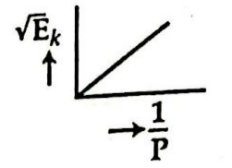
- [ ] 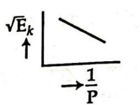
- [ ] 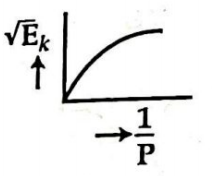
- [x] 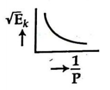

### Explanation

  

## Question: p1c04-042
- **Subject:** #p1
- **Chapter:** #c04
- **Topic:** #ভরবেগের_নিত্যতা_বা_সংরক্ষণ
- **Source:** #Book_ইসহাক_স্যার
- **Type:** #MCQ
- **Difficulty:** #hard
- **Board Exam:**
- **Admission Exam:** #Medical_20-21
- **College Exam:**
- **Book Question Number:** 120
- **Tags:**

$10\text{ kg}$ ভরের একটি বস্তু (object) ভূমিতে $12\text{ ms}^{-2}$-এ চলে, তবে এর ভরবেগ (momentum) হবে—

### Options
- [x] $1.20\text{ kg ms}^{-1}$
- [ ] $1.2\text{ kg ms}^{-1}$
- [ ] $12\text{ kg ms}^{-1}$
- [ ] $10\text{ kg ms}^{-1}$

### Explanation

  

## Question: p1c04-043
- **Subject:** #p1
- **Chapter:** #c04
- **Topic:** #ভরবেগের_নিত্যতা_বা_সংরক্ষণ
- **Source:** #Book_ইসহাক_স্যার
- **Type:** #MCQ
- **Difficulty:** #easy
- **Board Exam:** #DB_24
- **Admission Exam:**
- **College Exam:**
- **Book Question Number:** 124
- **Tags:**

বস্তুর গতি জড়তা কোনটির সমানুপাতিক?

### Options
- [x] ভর
- [ ] বেগ
- [ ] ভরবেগ
- [ ] বল

### Explanation

  

## Question: p1c04-044
- **Subject:** #p1
- **Chapter:** #c04
- **Topic:** #ভরবেগের_নিত্যতা_বা_সংরক্ষণ
- **Source:** #Book_ইসহাক_স্যার
- **Type:** #MCQ
- **Difficulty:** #easy
- **Board Exam:** #RB_24
- **Admission Exam:**
- **College Exam:**
- **Book Question Number:** 125
- **Tags:**

$m$ ভরের কোনো বস্তুর গতিশক্তি $E_k$ হলে এর ভরবেগ হবে—

### Options
- [ ] $\sqrt{\frac{1}{2}mE_k}$
- [x] $\sqrt{2mE_k}$
- [ ] $\sqrt{2m}E_k$
- [ ] $m\sqrt{2E_k}$

### Explanation

  

## Question: p1c04-045
- **Subject:** #p1
- **Chapter:** #c04
- **Topic:** #নিউটনের_গতিসূত্র_ও_ভরবেগের_নিত্যতা_সূত্রের_কয়েকটি_ব্যবহার
- **Source:** #Book_ইসহাক_স্যার
- **Type:** #MCQ
- **Difficulty:** #medium
- **Board Exam:**
- **Admission Exam:** #RU_17-18
- **College Exam:**
- **Book Question Number:** 13
- **Tags:**

একটি লিফট $2.8\text{ ms}^{-2}$ ত্বরণে নিচে নামছে। লিফটের মধ্যে দাঁড়ানো এক ব্যক্তির ভর $90\text{ kg}$ হলে তিনি যে ওজন অনুভব করেন—

### Options
- [ ] $252\text{ N}$
- [x] $630\text{ N}$
- [ ] $887\text{ N}$
- [ ] $1134\text{ N}$

### Explanation

  

## Question: p1c04-046
- **Subject:** #p1
- **Chapter:** #c04
- **Topic:** #নিউটনের_গতিসূত্র_ও_ভরবেগের_নিত্যতা_সূত্রের_কয়েকটি_ব্যবহার
- **Source:** #Book_ইসহাক_স্যার
- **Type:** #MCQ
- **Difficulty:** #medium
- **Board Exam:**
- **Admission Exam:**
- **College Exam:**
- **Book Question Number:** 78
- **Tags:**

একটি লিফট $a$ ত্বরণে নিচে নামছে। $m$ ভরের একজন ব্যক্তি লিফটের মেঝেতে কত বল প্রয়োগ করবে?

### Options
- [ ] $ma - mg$
- [ ] $ma$
- [x] $m(g - a)$
- [ ] $m(g + a)$

### Explanation

  

## Question: p1c04-047
- **Subject:** #p1
- **Chapter:** #c04
- **Topic:** #নিউটনের_গতিসূত্র_ও_ভরবেগের_নিত্যতা_সূত্রের_কয়েকটি_ব্যবহার
- **Source:** #Book_ইসহাক_স্যার
- **Type:** #MCQ
- **Difficulty:** #medium
- **Board Exam:**
- **Admission Exam:**
- **College Exam:**
- **Book Question Number:** 83
- **Tags:**

লিফটে দণ্ডায়মান একজন ব্যক্তির অতিভারহীনতা পরিলক্ষিত হয় যখন লিফটের ত্বরণ, $a$

### Options
- [ ] $a = g$
- [ ] $a < g$
- [x] $a > g$
- [ ] $a \le g$

### Explanation

  

## Question: p1c04-048
- **Subject:** #p1
- **Chapter:** #c04
- **Topic:** #নিউটনের_গতিসূত্র_ও_ভরবেগের_নিত্যতা_সূত্রের_কয়েকটি_ব্যবহার
- **Source:** #Book_ইসহাক_স্যার
- **Type:** #MCQ
- **Difficulty:** #medium
- **Board Exam:**
- **Admission Exam:**
- **College Exam:**
- **Book Question Number:** 85
- **Tags:**

এক ব্যক্তি প্লেনের মধ্যে একটি স্প্রিং তুলা যন্ত্রের সাহায্যে একটা বস্তুর ওজন পরিমাপ করছেন। এরোপ্লেনটা স্থির অবস্থা থেকে খাড়া ওপরের দিকে ক্রমাগত উঠতে থাকলে স্প্রিং তুলা যন্ত্রে পাঠের কীরূপ পরিবর্তন হবে?

### Options
- [ ] ক্রমশ বৃদ্ধি পাবে
- [ ] ক্রমশ হ্রাস পাবে
- [x] প্রথমে বৃদ্ধি পাবে এবং তারপর হ্রাস পাবে
- [ ] অপরিবর্তিত থাকবে

### Explanation

  

## Question: p1c04-049
- **Subject:** #p1
- **Chapter:** #c04
- **Topic:** #নিউটনের_গতিসূত্র_ও_ভরবেগের_নিত্যতা_সূত্রের_কয়েকটি_ব্যবহার
- **Source:** #Book_ইসহাক_স্যার
- **Type:** #MCQ
- **Difficulty:** #hard
- **Board Exam:**
- **Admission Exam:** #AFMC_23-24
- **College Exam:**
- **Book Question Number:** 116
- **Tags:**

রকেটের জ্বালানি হিসেবে কী ব্যবহৃত হয়?

### Options
- [ ] তরল নাইট্রোজেন
- [x] তরল হাইড্রোজেন
- [ ] কার্বন ডাই অক্সাইড
- [ ] তরল হিলিয়াম

### Explanation

  

## Question: p1c04-050
- **Subject:** #p1
- **Chapter:** #c04
- **Topic:** #নিউটনের_গতিসূত্রের_সীমাবদ্ধতা
- **Source:** #Book_ইসহাক_স্যার
- **Type:** #MCQ
- **Difficulty:** #hard
- **Board Exam:**
- **Admission Exam:** #Medical_22-23
- **College Exam:**
- **Book Question Number:** 102
- **Tags:**

নিচের কোনটি নিউটনীয় বা চিরায়ত বলবিদ্যার অপরিবর্তনীয় নয়?

### Options
- [x] বেগ
- [ ] কাল
- [ ] ভর
- [ ] স্থান

### Explanation

  

## Question: p1c04-051
- **Subject:** #p1
- **Chapter:** #c04
- **Topic:** #ঘূর্ণগতি
- **Source:** #Book_ইসহাক_স্যার
- **Type:** #MCQ
- **Difficulty:** #hard
- **Board Exam:** #DB_23
- **Admission Exam:** #KUET_17-18
- **College Exam:**
- **Book Question Number:** 14
- **Tags:**

সার্কাস খেলায় একটি বাইক $1200\text{ m/min}$ বেগে একটি বৃত্তাকার পথে ঘুরছে। বৃত্তাকার পথের ব্যাসার্ধ $200\text{ m}$ হলে বাইকটির কৌণিক বেগ কত?

### Options
- [ ] $0.01\text{ rad s}^{-1}$
- [ ] $0.001\text{ rad s}^{-1}$
- [x] $0.1\text{ rad s}^{-1}$
- [ ] $0.002\text{ rad s}^{-1}$

### Explanation

  

## Question: p1c04-052
- **Subject:** #p1
- **Chapter:** #c04
- **Topic:** #ঘূর্ণগতি
- **Source:** #Book_ইসহাক_স্যার
- **Type:** #MCQ
- **Difficulty:** #medium
- **Board Exam:**
- **Admission Exam:**
- **College Exam:**
- **Book Question Number:** 60
- **Tags:**

নিচের উদ্দীপকটি পড়ে ৬০নং ও ৬১নং প্রশ্নের উত্তর দাও : পৃথিবী থেকে চাঁদের দূরত্ব $3.84 \times 10^5\text{ km}$ এবং চাঁদ পৃথিবীকে বৃত্তাকার কক্ষপথে $27.3$ দিনে একবার প্রদক্ষিণ করে।
চাঁদের কৌণিক দ্রুতি—

### Options
- [ ] $2.85\text{ rad s}^{-1}$
- [x] $2.66 \times 10^{-6}\text{ rad s}^{-1}$
- [ ] $2.66 \times 10^5\text{ rad s}^{-1}$
- [ ] $2.85 \times 10^{-6}\text{ rad s}^{-1}$

### Explanation

  

## Question: p1c04-053
- **Subject:** #p1
- **Chapter:** #c04
- **Topic:** #ঘূর্ণগতি
- **Source:** #Book_ইসহাক_স্যার
- **Type:** #MCQ
- **Difficulty:** #medium
- **Board Exam:**
- **Admission Exam:** #DU_16-17
- **College Exam:**
- **Book Question Number:** 61
- **Tags:**

চাঁদের রৈখিক বেগ—

### Options
- [ ] $2.044\text{ km s}^{-1}$
- [ ] $1.55\text{ km s}^{-1}$
- [x] $1.022\text{ km s}^{-1}$
- [ ] $5 \times 10^3\text{ km s}^{-1}$

### Explanation

  

## Question: p1c04-054
- **Subject:** #p1
- **Chapter:** #c04
- **Topic:** #ঘূর্ণগতি
- **Source:** #Book_ইসহাক_স্যার
- **Type:** #MCQ
- **Difficulty:** #medium
- **Board Exam:**
- **Admission Exam:** #Agriculture_21-22
- **College Exam:**
- **Book Question Number:** 62
- **Tags:**

কৌণিক বেগ $\omega$ —
i. $\omega = 2\pi n$
ii. $\omega = \frac{v}{r}$
iii. $\omega = \frac{2\pi}{T}$
নিচের কোনটি সঠিক?

### Options
- [ ] i ও ii
- [ ] i ও iii
- [ ] ii ও iii
- [x] i, ii ও iii

### Explanation

  

## Question: p1c04-055
- **Subject:** #p1
- **Chapter:** #c04
- **Topic:** #ঘূর্ণগতি
- **Source:** #Book_ইসহাক_স্যার
- **Type:** #MCQ
- **Difficulty:** #medium
- **Board Exam:**
- **Admission Exam:** #MBSTU_15-16, #IU_15-16, #Agriculture_21-22
- **College Exam:**
- **Book Question Number:** 74
- **Tags:**

রৈখিক ত্বরণ ও কৌণিক ত্বরণের সম্পর্ক—

### Options
- [ ] $a = \frac{r}{\alpha}$
- [ ] $a = \frac{\alpha}{r}$
- [ ] $a = r^2\alpha$
- [x] $a = r\alpha$

### Explanation

  

## Question: p1c04-056
- **Subject:** #p1
- **Chapter:** #c04
- **Topic:** #ঘূর্ণগতি
- **Source:** #Book_ইসহাক_স্যার
- **Type:** #MCQ
- **Difficulty:** #hard
- **Board Exam:**
- **Admission Exam:** #CUET_15-16
- **College Exam:**
- **Book Question Number:** 80
- **Tags:**

$5\text{ kg}$ ভর ও $0.25\text{ m}$ ব্যাসার্ধের একটি বেলুন $50\text{ rads}^{-1}$ কৌণিক বেগে গড়াতে থাকলে তার গতিশক্তি কত হবে?

### Options
- [ ] $0.078\text{ J}$
- [x] $390.63\text{ J}$
- [ ] $0.73\text{ J}$
- [ ] $585.94\text{ J}$

### Explanation

  

## Question: p1c04-057
- **Subject:** #p1
- **Chapter:** #c04
- **Topic:** #ঘূর্ণগতি
- **Source:** #Book_ইসহাক_স্যার
- **Type:** #MCQ
- **Difficulty:** #medium
- **Board Exam:** #DiB_19
- **Admission Exam:** #RU_17-18
- **College Exam:**
- **Book Question Number:** 99
- **Tags:**

রৈখিক বেগ ও কৌণিক বেগের মধ্যে সম্পর্ক হলো—

### Options
- [ ] $\vec{\omega} = \vec{v} \times \vec{r}$
- [ ] $\vec{v} = \vec{\omega} \cdot \vec{r}$
- [ ] $\vec{\omega} = \vec{v} \cdot \vec{r}$
- [x] $\vec{v} = \vec{\omega} \times \vec{r}$

### Explanation

  

## Question: p1c04-058
- **Subject:** #p1
- **Chapter:** #c04
- **Topic:** #ঘূর্ণগতি
- **Source:** #Book_ইসহাক_স্যার
- **Type:** #MCQ
- **Difficulty:** #easy
- **Board Exam:** #DB_19
- **Admission Exam:**
- **College Exam:**
- **Book Question Number:** 100
- **Tags:**

কৌণিক কম্পাঙ্ক-এর মাত্রা কোনটি?

### Options
- [ ] $[M^0LT]$
- [x] $[M^0L^0T^{-1}]$
- [ ] $[M^0L^{-1}T]$
- [ ] $[M^0LT^{-1}]$

### Explanation

  

## Question: p1c04-059
- **Subject:** #p1
- **Chapter:** #c04
- **Topic:** #ঘূর্ণগতি
- **Source:** #Book_ইসহাক_স্যার
- **Type:** #MCQ
- **Difficulty:** #medium
- **Board Exam:** #BB_24, #DiB_24
- **Admission Exam:**
- **College Exam:**
- **Book Question Number:** 126
- **Tags:**

ঘূর্ণায়মান কোনো বস্তুর কৌণিক বেগ $10\%$ বৃদ্ধি করলে ঘূর্ণন গতিশক্তি বৃদ্ধি পায়—

### Options
- [ ] $10\%$
- [ ] $20\%$
- [x] $21\%$
- [ ] $40\%$

### Explanation

  

## Question: p1c04-060
- **Subject:** #p1
- **Chapter:** #c04
- **Topic:** #জড়তার_ভ্রামক
- **Source:** #Book_ইসহাক_স্যার
- **Type:** #MCQ
- **Difficulty:** #easy
- **Board Exam:** #DB_21
- **Admission Exam:** #Medical_05-06, #MBSTU_15-16, #CU_16-17, #CU_20-21
- **College Exam:**
- **Book Question Number:** 15
- **Tags:**

জড়তার ভ্রামকের একক—

### Options
- [ ] $\text{kgm}^{-2}$
- [ ] $\text{kgm}$
- [ ] $\text{kgm}^{-1}$
- [x] $\text{kgm}^2$

### Explanation

  

## Question: p1c04-061
- **Subject:** #p1
- **Chapter:** #c04
- **Topic:** #জড়তার_ভ্রামক
- **Source:** #Book_ইসহাক_স্যার
- **Type:** #MCQ
- **Difficulty:** #medium
- **Board Exam:** #BB_23, #JB_15, #SB_16
- **Admission Exam:** #CU_21-22, #BSMRSTU_21-22
- **College Exam:**
- **Book Question Number:** 17
- **Tags:**

কোনো বস্তুর জড়তার ভ্রামক নির্ভর করে এর—

### Options
- [x] ভর ও ঘূর্ণন অক্ষের ওপর
- [ ] আয়তন
- [ ] কৌণিক বেগের ওপর
- [ ] কৌণিক ভরবেগের ওপর

### Explanation

  

## Question: p1c04-062
- **Subject:** #p1
- **Chapter:** #c04
- **Topic:** #জড়তার_ভ্রামক
- **Source:** #Book_ইসহাক_স্যার
- **Type:** #MCQ
- **Difficulty:** #medium
- **Board Exam:** #CB_15
- **Admission Exam:**
- **College Exam:**
- **Book Question Number:** 18
- **Tags:**

পাতলা বৃত্তাকার চাকতির চক্রগতির ব্যাসার্ধ হলো—

### Options
- [ ] $K = \frac{r}{\sqrt{2}}$
- [ ] $K = \frac{r}{\sqrt{3}}$
- [x] $K = \frac{r}{2}$
- [ ] $K = \frac{r}{\sqrt{12}}$

### Explanation

  

## Question: p1c04-063
- **Subject:** #p1
- **Chapter:** #c04
- **Topic:** #জড়তার_ভ্রামক
- **Source:** #Book_ইসহাক_স্যার
- **Type:** #MCQ
- **Difficulty:** #medium
- **Board Exam:** #SB_21, #JB_16
- **Admission Exam:** #JU_17-18, #JnU_17-18
- **College Exam:**
- **Book Question Number:** 22
- **Tags:**

$M$ ভরের এবং $R$ ব্যাসার্ধের একটি চাকতি তার কেন্দ্র দিয়ে লম্বভাবে গমনকারী কোনো অক্ষের সাপেক্ষে ঘুরছে। চাকতির জড়তার ভ্রামক কত?

### Options
- [x] $\frac{MR^2}{2}$
- [ ] $MR^2$
- [ ] $\frac{3}{2}MR^2$
- [ ] $2MR^2$

### Explanation

  

## Question: p1c04-064
- **Subject:** #p1
- **Chapter:** #c04
- **Topic:** #জড়তার_ভ্রামক
- **Source:** #Book_ইসহাক_স্যার
- **Type:** #MCQ
- **Difficulty:** #medium
- **Board Exam:** #ChB_22, #ChB_21, #All_Board_14
- **Admission Exam:**
- **College Exam:**
- **Book Question Number:** 33
- **Tags:**

$m$ ভর ও $r$ ব্যাসার্ধের বৃত্তাকার চাকতির যেকোনো ব্যাসের সাপেক্ষে জড়তার ভ্রামকের মান কোনটি?

### Options
- [ ] $\frac{3}{2}mr^2$
- [ ] $mr^2$
- [ ] $\frac{1}{2}mr^2$
- [x] $\frac{1}{4}mr^2$

### Explanation

  

## Question: p1c04-065
- **Subject:** #p1
- **Chapter:** #c04
- **Topic:** #জড়তার_ভ্রামক
- **Source:** #Book_ইসহাক_স্যার
- **Type:** #MCQ
- **Difficulty:** #easy
- **Board Exam:** #RB_15
- **Admission Exam:**
- **College Exam:**
- **Book Question Number:** 38
- **Tags:**

নিচের উদ্দীপকের আলোকে ৩৮নং ও ৩৯নং প্রশ্নের উত্তর দাও : করিম পরীক্ষাগারে $1\text{ m}$ দৈর্ঘ্য ও $2\text{ kg}$ ভরের একটি সরু ও সুষম দণ্ডের প্রথমে মধ্যবিন্দু ও দৈর্ঘ্যের সাথে লম্বভাবে গমনকারী অক্ষের সাপেক্ষে এবং পরবর্তীতে ওই একই দণ্ডের প্রান্ত দিয়ে এবং দৈর্ঘ্যের লম্বভাবে গমনকারী অক্ষের সাপেক্ষে জড়তার ভ্রামক ও চক্রগতির ব্যাসার্ধ নির্ণয় করলেন।
প্রথম ক্ষেত্রে দণ্ডটির জড়তার ভ্রামক কোনটি?

### Options
- [x] $0.167\text{ kgm}^2$
- [ ] $0.67\text{ kgm}^2$
- [ ] $1\text{ kgm}^2$
- [ ] $2\text{ kgm}^2$

### Explanation

  

## Question: p1c04-066
- **Subject:** #p1
- **Chapter:** #c04
- **Topic:** #জড়তার_ভ্রামক
- **Source:** #Book_ইসহাক_স্যার
- **Type:** #MCQ
- **Difficulty:** #medium
- **Board Exam:**
- **Admission Exam:**
- **College Exam:**
- **Book Question Number:** 39
- **Tags:**

ঘূর্ণন অক্ষ এক প্রান্তে হলে চক্রগতির ব্যাসার্ধ হবে প্রথম ক্ষেত্রের—

### Options
- [ ] $\frac{1}{4}$ গুণ
- [x] $2$ গুণ
- [ ] $12$ গুণ
- [ ] $36$ গুণ

### Explanation

  

## Question: p1c04-067
- **Subject:** #p1
- **Chapter:** #c04
- **Topic:** #জড়তার_ভ্রামক
- **Source:** #Book_ইসহাক_স্যার
- **Type:** #MCQ
- **Difficulty:** #easy
- **Board Exam:** #JB_15
- **Admission Exam:**
- **College Exam:**
- **Book Question Number:** 41
- **Tags:**

কোনো বস্তুর জড়তার ভ্রামক নির্ভর করে—

### Options
- [ ] কৌণিক বেগের ওপর
- [ ] কৌণিক ভরবেগের ওপর
- [ ] রৈখিক বেগের ওপর
- [x] ভর ও ঘূর্ণন অক্ষের অবস্থানের ওপর

### Explanation

  

## Question: p1c04-068
- **Subject:** #p1
- **Chapter:** #c04
- **Topic:** #জড়তার_ভ্রামক
- **Source:** #Book_ইসহাক_স্যার
- **Type:** #MCQ
- **Difficulty:** #hard
- **Board Exam:** #DiB_15
- **Admission Exam:** #JU_17-18, #RU_16-17, #Marine_15-16, #BRUR_10-11, #CU_15-16, #KUET_06-07
- **College Exam:**
- **Book Question Number:** 44
- **Tags:**

একটি চাকার ভর $10\text{ kg}$ এবং চক্রগতির ব্যাসার্ধ $0.5\text{ m}$। এর জড়তার ভ্রামক কত?

### Options
- [ ] $2.5\text{ kgm}$
- [x] $2.5\text{ kgm}^2$
- [ ] $5\text{ kgm}$
- [ ] $5\text{ kgm}^2$

### Explanation

  

## Question: p1c04-069
- **Subject:** #p1
- **Chapter:** #c04
- **Topic:** #জড়তার_ভ্রামক
- **Source:** #Book_ইসহাক_স্যার
- **Type:** #MCQ
- **Difficulty:** #easy
- **Board Exam:** #DB_17
- **Admission Exam:**
- **College Exam:**
- **Book Question Number:** 48
- **Tags:**

নির্দিষ্ট ভরের কোনো চাকতির ব্যাসার্ধ অর্ধেক করা হলে কেন্দ্রমুখী অক্ষের সাপেক্ষে জড়তার ভ্রামক কতগুণ হবে?

### Options
- [x] এক-চতুর্থাংশ
- [ ] অর্ধেক
- [ ] দ্বিগুণ
- [ ] চারগুণ

### Explanation

  

## Question: p1c04-070
- **Subject:** #p1
- **Chapter:** #c04
- **Topic:** #জড়তার_ভ্রামক
- **Source:** #Book_ইসহাক_স্যার
- **Type:** #MCQ
- **Difficulty:** #medium
- **Board Exam:** #DiB_22, #BB_23, #ChB_17
- **Admission Exam:**
- **College Exam:**
- **Book Question Number:** 75
- **Tags:**

নিচের উদ্দীপকের আলোকে ৭৫নং ও ৭৬নং প্রশ্নের উত্তর দাও:
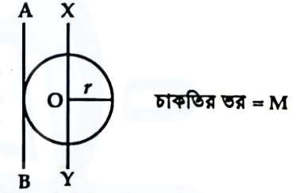
চাকতির ভর $= M$
নিরেট চাকতির $\text{XY}$-অক্ষের সাপেক্ষে চক্রগতির ব্যাসার্ধ—

### Options
- [ ] $\frac{r}{2}$
- [ ] $\sqrt{\frac{3}{2}}r$
- [ ] $r$
- [x] $\frac{r}{\sqrt{2}}$

### Explanation

  

## Question: p1c04-071
- **Subject:** #p1
- **Chapter:** #c04
- **Topic:** #জড়তার_ভ্রামক
- **Source:** #Book_ইসহাক_স্যার
- **Type:** #MCQ
- **Difficulty:** #medium
- **Board Exam:** #BB_23, #ChB_22, #ChB_21, #CB_21
- **Admission Exam:**
- **College Exam:**
- **Book Question Number:** 76
- **Tags:**

$\text{AB}$-অক্ষের সাপেক্ষে চাকতির জড়তার ভ্রামক কত হবে—

### Options
- [ ] $\frac{1}{2}Mr^2$
- [x] $\frac{1}{4}Mr^2$
- [ ] $Mr^2$
- [ ] $\frac{3}{2}Mr^2$

### Explanation

  

## Question: p1c04-072
- **Subject:** #p1
- **Chapter:** #c04
- **Topic:** #জড়তার_ভ্রামক
- **Source:** #Book_ইসহাক_স্যার
- **Type:** #MCQ
- **Difficulty:** #hard
- **Board Exam:** #DB_19
- **Admission Exam:**
- **College Exam:**
- **Book Question Number:** 87
- **Tags:**

$2400\text{ J}$ গতিশক্তিবিনষ্ট একটি চাকা প্রতি মিনিটে $602$ বার ঘুরে। চাকাটির জড়তার ভ্রামক কত?

### Options
- [ ] $0.605\text{ kgm}^2$
- [ ] $0.828\text{ kgm}^2$
- [ ] $1.21\text{ kgm}^2$
- [x] $76.14\text{ kgm}^2$

### Explanation

  

## Question: p1c04-073
- **Subject:** #p1
- **Chapter:** #c04
- **Topic:** #জড়তার_ভ্রামক
- **Source:** #Book_ইসহাক_স্যার
- **Type:** #MCQ
- **Difficulty:** #medium
- **Board Exam:** #ChB_19
- **Admission Exam:**
- **College Exam:**
- **Book Question Number:** 88
- **Tags:**

সমকৌণিক বেগে আবর্তনরত কোনো দৃঢ় বস্তুর গতিশক্তি ও জড়তার ভ্রামকের অনুপাত—

### Options
- [ ] কৌণিক বেগের সমানুপাতিক
- [x] কৌণিক বেগের বর্গের সমানুপাতিক
- [ ] রৈখিক বেগের সমানুপাতিক
- [ ] রৈখিক বেগের বর্গের সমানুপাতিক

### Explanation

  

## Question: p1c04-074
- **Subject:** #p1
- **Chapter:** #c04
- **Topic:** #জড়তার_ভ্রামক
- **Source:** #Book_ইসহাক_স্যার
- **Type:** #MCQ
- **Difficulty:** #medium
- **Board Exam:** #DB_23, #JB_19, #RB_21
- **Admission Exam:**
- **College Exam:**
- **Book Question Number:** 93
- **Tags:**

নিচের উদ্দীপকটি পড় এবং ৯৩ ও ৯৪নং প্রশ্নের উত্তর দাও :
$\text{AB}$ দণ্ডটি $\text{XY}$-অক্ষের সাপেক্ষে ঘূর্ণনশীল। দণ্ডের মোট দৈর্ঘ্য $2\text{ m}$ এবং মোট ভর $2\text{ kg}$।
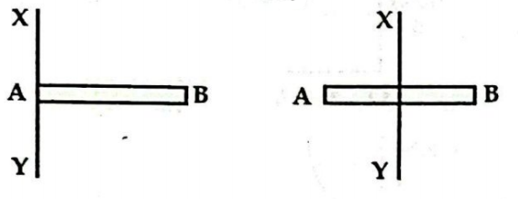
চিত্র ক-এর জড়তার ভ্রামক $I_1$ এবং চিত্র খ-এর জড়তার ভ্রামক $I_2$ হলে, কোনটি সঠিক?

### Options
- [ ] $I_1 : I_2 = 1 : 1$
- [ ] $I_1 : I_2 = 1 : 2$
- [x] $I_1 : I_2 = 4 : 1$
- [ ] $I_1 : I_2 = 1 : 4$

### Explanation

  

## Question: p1c04-075
- **Subject:** #p1
- **Chapter:** #c04
- **Topic:** #জড়তার_ভ্রামক
- **Source:** #Book_ইসহাক_স্যার
- **Type:** #MCQ
- **Difficulty:** #medium
- **Board Exam:**
- **Admission Exam:**
- **College Exam:**
- **Book Question Number:** 94
- **Tags:**

চিত্র খ-এ চক্রগতির ব্যাসার্ধের মান—

### Options
- [ ] $\frac{1}{\sqrt{3}}$
- [ ] $\frac{2}{\sqrt{3}}$
- [ ] $\frac{1}{\sqrt{12}}$
- [x] $\sqrt{\frac{3}{4}}$

### Explanation

  

## Question: p1c04-076
- **Subject:** #p1
- **Chapter:** #c04
- **Topic:** #জড়তার_ভ্রামক
- **Source:** #Book_ইসহাক_স্যার
- **Type:** #MCQ
- **Difficulty:** #hard
- **Board Exam:**
- **Admission Exam:** #BUET_22-23
- **College Exam:**
- **Book Question Number:** 106
- **Tags:**

একটি বিন্দু বস্তুর জড়তার ভ্রামক $5\text{ kgm}^2$ ও কৌণিক বেগ $65\text{ rad s}^{-1}$ হলে এর কৌণিক গতিশক্তি কত?

### Options
- [ ] $11.5\text{ kJ}$
- [ ] $12.6\text{ kJ}$
- [x] $10.6\text{ kJ}$
- [ ] $9.6\text{ kJ}$

### Explanation

  

## Question: p1c04-077
- **Subject:** #p1
- **Chapter:** #c04
- **Topic:** #জড়তার_ভ্রামক
- **Source:** #Book_ইসহাক_স্যার
- **Type:** #MCQ
- **Difficulty:** #hard
- **Board Exam:**
- **Admission Exam:** #Dental_19-20
- **College Exam:**
- **Book Question Number:** 108
- **Tags:**

জড়তার ভ্রামক কোনটির ওপর নির্ভর করে?

### Options
- [ ] কৌণিক ত্বরণ
- [ ] চক্রগতির ব্যাসার্ধ
- [x] বস্তুর ভরের বণ্টন
- [ ] ঘূর্ণন গতিশক্তি

### Explanation

  

## Question: p1c04-078
- **Subject:** #p1
- **Chapter:** #c04
- **Topic:** #জড়তার_ভ্রামক
- **Source:** #Book_ইসহাক_স্যার
- **Type:** #MCQ
- **Difficulty:** #medium
- **Board Exam:** #DB_23
- **Admission Exam:**
- **College Exam:**
- **Book Question Number:** 109
- **Tags:**

নিচের উদ্দীপকটি পড় এবং ১০৯ ও ১১০নং প্রশ্নের উত্তর দাও :
নিম্নের চিত্রে $1\text{ kg}$ ভর এবং $1\text{ m}$ দৈর্ঘ্যের একটি সুষম দণ্ড $\text{AB}$ এর লম্বগামী অক্ষ $\text{XY}$ সাপেক্ষে ঘুরছে।
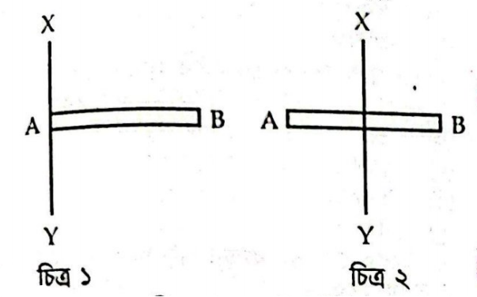
চিত্র ১ ও চিত্র ২-এ উল্লেখিত দণ্ডের জড়তার ভ্রামকের অনুপাত হলো—

### Options
- [ ] $1 : 1$
- [x] $1 : 2$
- [ ] $1 : 4$
- [ ] $4 : 1$

### Explanation

  

## Question: p1c04-079
- **Subject:** #p1
- **Chapter:** #c04
- **Topic:** #জড়তার_ভ্রামক
- **Source:** #Book_ইসহাক_স্যার
- **Type:** #MCQ
- **Difficulty:** #medium
- **Board Exam:**
- **Admission Exam:**
- **College Exam:**
- **Book Question Number:** 110
- **Tags:**

চিত্র ১ অনুযায়ী দণ্ডটির চক্রগতির ব্যাসার্ধের মান—

### Options
- [ ] $\frac{1}{\sqrt{2}}\text{ m}$
- [x] $\frac{1}{\sqrt{3}}\text{ m}$
- [ ] $\frac{2}{\sqrt{3}}\text{ m}$
- [ ] $\frac{1}{3\sqrt{2}}\text{ m}$

### Explanation

  

## Question: p1c04-080
- **Subject:** #p1
- **Chapter:** #c04
- **Topic:** #জড়তার_ভ্রামক
- **Source:** #Book_ইসহাক_স্যার
- **Type:** #MCQ
- **Difficulty:** #medium
- **Board Exam:** #BB_23
- **Admission Exam:**
- **College Exam:**
- **Book Question Number:** 111
- **Tags:**

নিচের উদ্দীপকটি পড় এবং ১১১ ও ১১২নং প্রশ্নের উত্তর দাও :
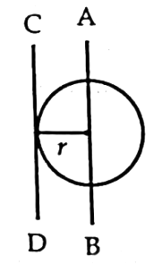
চাকতির ভর $= 2\text{ kg}$
$\text{AB}$ অক্ষের সাপেক্ষে চক্রগতির ব্যাসার্ধ কোনটি?

### Options
- [ ] $\frac{r}{2}$
- [x] $\frac{r}{\sqrt{2}}$
- [ ] $r$
- [ ] $\sqrt{2}r$

### Explanation

  

## Question: p1c04-081
- **Subject:** #p1
- **Chapter:** #c04
- **Topic:** #জড়তার_ভ্রামক
- **Source:** #Book_ইসহাক_স্যার
- **Type:** #MCQ
- **Difficulty:** #medium
- **Board Exam:**
- **Admission Exam:**
- **College Exam:**
- **Book Question Number:** 112
- **Tags:**

$\text{CD}$ অক্ষের সাপেক্ষে জড়তার ভ্রামক কত?

### Options
- [ ] $\frac{r^2}{2}$
- [ ] $r^2$
- [ ] $2r^2$
- [x] $3r^2$

### Explanation

  

## Question: p1c04-082
- **Subject:** #p1
- **Chapter:** #c04
- **Topic:** #জড়তার_ভ্রামক_সংক্রান্ত_দুটি_উপপাদ্য
- **Source:** #Book_ইসহাক_স্যার
- **Type:** #MCQ
- **Difficulty:** #medium
- **Board Exam:** #DB_19
- **Admission Exam:** #MBSTU_19-20
- **College Exam:**
- **Book Question Number:** 65
- **Tags:**

কোনটি সমান্তরাল অক্ষ উপপাদ্য?

### Options
- [ ] $L = I_x + I_y$
- [ ] $I = I_G + MK$
- [x] $I = I_G + Mh^2$
- [ ] $I_G = I + MK^2$

### Explanation

  

## Question: p1c04-083
- **Subject:** #p1
- **Chapter:** #c04
- **Topic:** #কৌনিক_ভরবেগ
- **Source:** #Book_ইসহাক_স্যার
- **Type:** #MCQ
- **Difficulty:** #medium
- **Board Exam:** #DB_22, #RB_16
- **Admission Exam:** #JnU_15-16, #BSFMSTU_19-20, #CU_20-21
- **College Exam:**
- **Book Question Number:** 21
- **Tags:**

নিচের কোন সম্পর্কটি সঠিক?

### Options
- [ ] $\vec{L} = \vec{r} \times \vec{F}$
- [ ] $\vec{L} = \vec{F} \times \vec{r}$
- [x] $\vec{L} = \vec{r} \times \vec{P}$
- [ ] $\vec{L} = \vec{P} \times \vec{r}$

### Explanation

  

## Question: p1c04-084
- **Subject:** #p1
- **Chapter:** #c04
- **Topic:** #কৌনিক_ভরবেগ
- **Source:** #Book_ইসহাক_স্যার
- **Type:** #MCQ
- **Difficulty:** #medium
- **Board Exam:** #DB_16
- **Admission Exam:** #DU_21-22, #RU_21-22, #CU_11-12
- **College Exam:**
- **Book Question Number:** 23
- **Tags:**

বৃত্তীয় গতির ক্ষেত্রে কৌণিক ভরবেগের রাশি কোনটি?

### Options
- [ ] $mr\omega$
- [x] $mr^2\omega$
- [ ] $mr\omega^2$
- [ ] $m^2r\omega$

### Explanation

  

## Question: p1c04-085
- **Subject:** #p1
- **Chapter:** #c04
- **Topic:** #কৌনিক_ভরবেগ
- **Source:** #Book_ইসহাক_স্যার
- **Type:** #MCQ
- **Difficulty:** #medium
- **Board Exam:** #BB_22, #BB_21, #RB_21, #ChB_21, #DiB_21, #JB_15
- **Admission Exam:** #JU_18-19, #IU_06-07
- **College Exam:**
- **Book Question Number:** 24
- **Tags:**

কৌণিক ভরবেগের মাত্রা সমীকরণ কোনটি?

### Options
- [ ] $MLT^{-1}$
- [ ] $ML^2T^0$
- [x] $ML^2T^{-1}$
- [ ] $ML^2T^{-2}$

### Explanation

  

## Question: p1c04-086
- **Subject:** #p1
- **Chapter:** #c04
- **Topic:** #কৌনিক_ভরবেগ
- **Source:** #Book_ইসহাক_স্যার
- **Type:** #MCQ
- **Difficulty:** #medium
- **Board Exam:** #ChB_22, #CB_21, #BB_21, #RB_23, #RB_15
- **Admission Exam:** #DU_18-19
- **College Exam:**
- **Book Question Number:** 36
- **Tags:**

কৌণিক ভরবেগের একক কোনটি?

### Options
- [ ] $\text{kgm}^2\text{s}^{-2}$
- [ ] $\text{kgms}^{-2}$
- [ ] $\text{kgms}^{-1}$
- [x] $\text{kgm}^2\text{s}^{-1}$

### Explanation

  

## Question: p1c04-087
- **Subject:** #p1
- **Chapter:** #c04
- **Topic:** #কৌনিক_ভরবেগ
- **Source:** #Book_ইসহাক_স্যার
- **Type:** #MCQ
- **Difficulty:** #medium
- **Board Exam:**
- **Admission Exam:**
- **College Exam:**
- **Book Question Number:** 57
- **Tags:**

কৌণিক ভরবেগের ক্ষেত্রে—
i. $\vec{L} = \vec{r} \times \vec{P}$
ii. কৌণিক ভরবেগ একটি ভেক্টর রাশি
iii. কৌণিক ভরবেগের একক $\text{kgm}^2\text{s}^{-1}$
নিচের কোনটি সঠিক?

### Options
- [ ] i
- [ ] i ও ii
- [ ] ii ও iii
- [x] i, ii ও iii

### Explanation

  

## Question: p1c04-088
- **Subject:** #p1
- **Chapter:** #c04
- **Topic:** #কৌনিক_ভরবেগ
- **Source:** #Book_ইসহাক_স্যার
- **Type:** #MCQ
- **Difficulty:** #hard
- **Board Exam:**
- **Admission Exam:** #CUET_14-15
- **College Exam:**
- **Book Question Number:** 115
- **Tags:**

নিজ ঘূর্ণন অক্ষের সাপেক্ষে দুটি বস্তুর জড়তার ভ্রামক যথাক্রমে $I$ ও $2I$। যদি তাদের ঘূর্ণন গতিশক্তি সমান হয়, তাদের কৌণিক ভরবেগের অনুপাত কত?

### Options
- [ ] $1 : 2$
- [ ] $\sqrt{2} : 1$
- [x] $1 : \sqrt{2}$
- [ ] $2 : 1$

### Explanation

  

## Question: p1c04-089
- **Subject:** #p1
- **Chapter:** #c04
- **Topic:** #কৌনিক_ভরবেগ_ও_কৌনিক_বেগের_সম্পর্ক
- **Source:** #Book_ইসহাক_স্যার
- **Type:** #MCQ
- **Difficulty:** #easy
- **Board Exam:**
- **Admission Exam:**
- **College Exam:**
- **Book Question Number:** 56
- **Tags:**

কৌণিক ভরবেগ ও কৌণিক বেগের মধ্যে সম্পর্ক কোনটি?

### Options
- [x] $L = I\omega$
- [ ] $L = \frac{1}{\omega}$
- [ ] $L = \frac{\omega}{I}$
- [ ] $L \propto \omega$

### Explanation

  

## Question: p1c04-090
- **Subject:** #p1
- **Chapter:** #c04
- **Topic:** #টর্ক
- **Source:** #Book_ইসহাক_স্যার
- **Type:** #MCQ
- **Difficulty:** #medium
- **Board Exam:** #SB_22, #ChB_21, #BB_19, #BB_15, #RB_15, #DiB_16
- **Admission Exam:** #RUET_12-13, #JU_17-18, #JKKNIU_19-20, #DU_19-20, #JnU_09-10, #JnU_17-18, #IU_04-05, #DU_13-14, #BRUR_16-17
- **College Exam:**
- **Book Question Number:** 19
- **Tags:**

টর্কের বা বলের ভ্রামকের মাত্রা কোনটি?

### Options
- [ ] $ML^2T^2$
- [x] $ML^2T^{-2}$
- [ ] $M^2LT^{-2}$
- [ ] $ML^{-3}T^2$

### Explanation

  

## Question: p1c04-091
- **Subject:** #p1
- **Chapter:** #c04
- **Topic:** #টর্ক
- **Source:** #Book_ইসহাক_স্যার
- **Type:** #MCQ
- **Difficulty:** #medium
- **Board Exam:** #RB_22, #SB_21, #DB_19, #JB_16
- **Admission Exam:** #DU_19-20
- **College Exam:**
- **Book Question Number:** 25
- **Tags:**

টর্কের একক হচ্ছে—

### Options
- [ ] $\text{N}^{-1}\text{m}$
- [ ] $\text{Nm}^{-2}$
- [x] $\text{Nm}$
- [ ] $\text{Nm}^{-1}$

### Explanation

  

## Question: p1c04-092
- **Subject:** #p1
- **Chapter:** #c04
- **Topic:** #টর্ক
- **Source:** #Book_ইসহাক_স্যার
- **Type:** #MCQ
- **Difficulty:** #medium
- **Board Exam:** #SB_22, #DiB_15
- **Admission Exam:** #JU_21-22
- **College Exam:**
- **Book Question Number:** 43
- **Tags:**

টর্কের অপর নাম কী?

### Options
- [ ] ঘর্ষণ বল
- [ ] জড়তার ভ্রামক
- [x] ঘূর্ণন বল
- [ ] কেন্দ্রমুখী বল

### Explanation

  

## Question: p1c04-093
- **Subject:** #p1
- **Chapter:** #c04
- **Topic:** #টর্ক
- **Source:** #Book_ইসহাক_স্যার
- **Type:** #MCQ
- **Difficulty:** #medium
- **Board Exam:** #DB_22, #DB_21, #DB_15, #DiB_22, #CB_21, #ChB_19
- **Admission Exam:**
- **College Exam:**
- **Book Question Number:** 55
- **Tags:**

বলের ভ্রামক এর সমীকরণ—
i. $\vec{\tau} = \vec{r} \times \vec{F}$
ii. $\vec{\tau} = I\vec{\alpha}$
iii. $\vec{\tau} = \frac{d\vec{L}}{dt}$
নিচের কোনটি সঠিক?

### Options
- [ ] i ও ii
- [ ] i ও iii
- [ ] ii ও iii
- [x] i, ii ও iii

### Explanation

  

## Question: p1c04-094
- **Subject:** #p1
- **Chapter:** #c04
- **Topic:** #টর্ক
- **Source:** #Book_ইসহাক_স্যার
- **Type:** #MCQ
- **Difficulty:** #easy
- **Board Exam:** #RB_22, #MB_22, #CB_17
- **Admission Exam:**
- **College Exam:**
- **Book Question Number:** 58
- **Tags:**

ব্যাসার্ধ ভেক্টর ও প্রযুক্ত বলের ভেক্টর গুণনকে বলে—

### Options
- [ ] জড়তার ভ্রামক
- [ ] কৌণিক ভরবেগ
- [ ] চক্রগতির ব্যাসার্ধ
- [x] টর্ক

### Explanation

  

## Question: p1c04-095
- **Subject:** #p1
- **Chapter:** #c04
- **Topic:** #টর্ক_ও_কৌনিক_ত্বরণের_সম্পর্ক
- **Source:** #Book_ইসহাক_স্যার
- **Type:** #MCQ
- **Difficulty:** #medium
- **Board Exam:** #BB_22
- **Admission Exam:** #JKKNIU_18-19, #RU_14-15
- **College Exam:**
- **Book Question Number:** 16
- **Tags:**

টর্ক $\tau$, জড়তার ভ্রামক $I$ ও কৌণিক ত্বরণ $\alpha$-এর মধ্যে সম্পর্ক হলো—

### Options
- [ ] $\tau = I^2\alpha$
- [ ] $\tau = \sqrt{I\alpha}$
- [ ] $\tau = \frac{I}{\alpha}$
- [x] $\tau = I\alpha$

### Explanation

  

## Question: p1c04-096
- **Subject:** #p1
- **Chapter:** #c04
- **Topic:** #টর্ক_ও_কৌনিক_ত্বরণের_সম্পর্ক
- **Source:** #Book_ইসহাক_স্যার
- **Type:** #MCQ
- **Difficulty:** #medium
- **Board Exam:** #DiB_21, #JB_15
- **Admission Exam:**
- **College Exam:**
- **Book Question Number:** 42
- **Tags:**

একটি চাকার জড়তার ভ্রামক $10\text{ kgm}^2$। চাকাটিকে $10\text{ rads}^{-2}$ কৌণিক ত্বরণ সৃষ্টি করতে কত টর্ক প্রয়োগ করতে হবে?

### Options
- [ ] $10\text{ Nm}$
- [x] $100\text{ Nm}$
- [ ] $150\text{ Nm}$
- [ ] $200\text{ Nm}$

### Explanation

  

## Question: p1c04-097
- **Subject:** #p1
- **Chapter:** #c04
- **Topic:** #টর্ক_ও_কৌনিক_ত্বরণের_সম্পর্ক
- **Source:** #Book_ইসহাক_স্যার
- **Type:** #MCQ
- **Difficulty:** #hard
- **Board Exam:**
- **Admission Exam:** #Dental_24-25
- **College Exam:**
- **Book Question Number:** 122
- **Tags:**

$2\text{ kg}$ ভরের একটি চাকার ব্যাস $50\text{ cm}$। এতে $2\text{ rads}^{-1}$ ত্বরণ সৃষ্টি করতে হলে কত টর্ক প্রয়োগ করতে হবে?

### Options
- [x] $0.25\text{ Nm}$
- [ ] $2\text{ Nm}$
- [ ] $0.125\text{ Nm}$
- [ ] $1\text{ Nm}$

### Explanation

  

## Question: p1c04-098
- **Subject:** #p1
- **Chapter:** #c04
- **Topic:** #ঘূর্ণগতির_ক্ষেত্রে_নিউটনের_গতিসূত্রের_রূপ
- **Source:** #Book_ইসহাক_স্যার
- **Type:** #MCQ
- **Difficulty:** #medium
- **Board Exam:**
- **Admission Exam:**
- **College Exam:**
- **Book Question Number:** 63
- **Tags:**

কৌণিক গতি সূত্র সম্পর্কিত সমীকরণ—
i. $\tan\theta = \frac{v^2}{rg}$
ii. $L = I\omega$
iii. $\tau = I\alpha$
নিচের কোনটি সঠিক?

### Options
- [ ] i ও ii
- [ ] i ও iii
- [ ] ii ও iii
- [x] i, ii ও iii

### Explanation

  

## Question: p1c04-099
- **Subject:** #p1
- **Chapter:** #c04
- **Topic:** #ঘূর্ণগতির_ক্ষেত্রে_নিউটনের_গতিসূত্রের_রূপ
- **Source:** #Book_ইসহাক_স্যার
- **Type:** #MCQ
- **Difficulty:** #easy
- **Board Exam:** #RB_23, #BB_23, #DiB_17
- **Admission Exam:**
- **College Exam:**
- **Book Question Number:** 64
- **Tags:**

কৌণিক ভরবেগের পরিবর্তনের হার—

### Options
- [ ] বলের সমান
- [ ] কৌণিক ত্বরণের সমান
- [x] টর্কের সমান
- [ ] জড়তার ভ্রামকের সমান

### Explanation

  

## Question: p1c04-100
- **Subject:** #p1
- **Chapter:** #c04
- **Topic:** #ঘূর্ণগতির_ক্ষেত্রে_নিউটনের_গতিসূত্রের_রূপ
- **Source:** #Book_ইসহাক_স্যার
- **Type:** #MCQ
- **Difficulty:** #hard
- **Board Exam:** #JB_24
- **Admission Exam:** #Medical_23-24
- **College Exam:**
- **Book Question Number:** 107
- **Tags:**

কৌণিক ভরবেগের পরিবর্তনের হার—

### Options
- [ ] কৌণিক ত্বরণের সমান
- [ ] বলের সমান
- [x] টর্কের সমান
- [ ] জড়তার ভ্রামকের সমান

### Explanation

  

## Question: p1c04-101
- **Subject:** #p1
- **Chapter:** #c04
- **Topic:** #কৌনিক_ভরবেগের_নিত্যতা_বা_সংরক্ষণ_সূত্র
- **Source:** #Book_ইসহাক_স্যার
- **Type:** #MCQ
- **Difficulty:** #medium
- **Board Exam:** #MB_22, #BB_16
- **Admission Exam:** #JU_19-20
- **College Exam:**
- **Book Question Number:** 20
- **Tags:**

যখন কোনো কণার ওপর প্রযুক্ত টর্ক শূন্য তখন নিচের কোন রাশিটি ধ্রুবক হয়?

### Options
- [ ] বল
- [x] কৌণিক ভরবেগ
- [ ] রৈখিক ভরবেগ
- [ ] বলের ঘাত

### Explanation

  

## Question: p1c04-102
- **Subject:** #p1
- **Chapter:** #c04
- **Topic:** #কৌনিক_ভরবেগের_নিত্যতা_বা_সংরক্ষণ_সূত্র
- **Source:** #Book_ইসহাক_স্যার
- **Type:** #MCQ
- **Difficulty:** #easy
- **Board Exam:**
- **Admission Exam:**
- **College Exam:**
- **Book Question Number:** 59
- **Tags:**

কোনটি কৌণিক ভরবেগের সংরক্ষণ সূত্র?

### Options
- [x] $L = \text{ধ্রুবক}$
- [ ] $P = \text{ধ্রুবক}$
- [ ] $\tau = \text{ধ্রুবক}$
- [ ] $F = \text{ধ্রুবক}$

### Explanation

  

## Question: p1c04-103
- **Subject:** #p1
- **Chapter:** #c04
- **Topic:** #কেন্দ্রমুখী_বল_ও_কেন্দ্রবিমুখী_বল
- **Source:** #Book_ইসহাক_স্যার
- **Type:** #MCQ
- **Difficulty:** #medium
- **Board Exam:** #DB_16
- **Admission Exam:**
- **College Exam:**
- **Book Question Number:** 30
- **Tags:**

কোনো অক্ষের সাপেক্ষে $m$ ভরের একটি কণা সমকৌণিক দ্রুতিতে অক্ষ হতে $r$ লম্ব দূরত্বে থেকে ঘুরতে থাকলে এর—
(i) $F = \frac{mv^2}{r}$
(ii) $F = m\omega^2r$
(iii) $L = mvr$
নিচের কোনটি সঠিক?

### Options
- [ ] i ও ii
- [x] i ও iii
- [ ] ii ও iii
- [ ] i, ii ও iii

### Explanation

  

## Question: p1c04-104
- **Subject:** #p1
- **Chapter:** #c04
- **Topic:** #কেন্দ্রমুখী_বল_ও_কেন্দ্রবিমুখী_বল
- **Source:** #Book_ইসহাক_স্যার
- **Type:** #MCQ
- **Difficulty:** #medium
- **Board Exam:** #ChB_22, #DiB_21, #RB_15
- **Admission Exam:**
- **College Exam:**
- **Book Question Number:** 37
- **Tags:**

কোনটি কেন্দ্রমুখী বলের রাশিমালা?

### Options
- [ ] $mv^2r$
- [x] $\frac{mv^2}{r}$
- [ ] $mv^2r^2$
- [ ] $\frac{m\omega^2}{r}$

### Explanation

  

## Question: p1c04-105
- **Subject:** #p1
- **Chapter:** #c04
- **Topic:** #কেন্দ্রমুখী_বল_ও_কেন্দ্রবিমুখী_বল
- **Source:** #Book_ইসহাক_স্যার
- **Type:** #MCQ
- **Difficulty:** #medium
- **Board Exam:** #CB_22
- **Admission Exam:** #MBSTU_19-20
- **College Exam:**
- **Book Question Number:** 66
- **Tags:**

কেন্দ্রমুখী বল—
(i) একটি কার্যহীন বল
(ii) এটি বস্তুর গতিপথের দিকে ক্রিয়া করে
(iii) এর মান $\frac{mv^2}{r}$
নিচের কোনটি সঠিক?

### Options
- [ ] i ও ii
- [x] i ও iii
- [ ] ii ও iii
- [ ] i, ii ও iii

### Explanation

  

## Question: p1c04-106
- **Subject:** #p1
- **Chapter:** #c04
- **Topic:** #কেন্দ্রমুখী_বল_ও_কেন্দ্রবিমুখী_বল
- **Source:** #Book_ইসহাক_স্যার
- **Type:** #MCQ
- **Difficulty:** #hard
- **Board Exam:**
- **Admission Exam:** #RUET_14-15, #KUET_15-16, #KUET_14-15, #JU_18-19
- **College Exam:**
- **Book Question Number:** 90
- **Tags:**

একটি ইলেকট্রন নিউক্লিয়াসের চারদিকে $5.2 \times 10^{-11}\text{ m}$ ব্যাসার্ধের একটি বৃত্তাকার পথে $2.18 \times 10^6\text{ ms}^{-1}$ বেগে প্রদক্ষিণ করছে। ইলেকট্রনের ভর $9.1 \times 10^{-31}\text{ kg}$ হলে কেন্দ্রমুখী বলের মান কত?

### Options
- [ ] $3.82 \times 10^{-8}\text{ N}$
- [x] $8.32 \times 10^{-8}\text{ N}$
- [ ] $3.82 \times 10^{-9}\text{ N}$
- [ ] $8.32 \times 10^{-9}\text{ N}$

### Explanation

  

## Question: p1c04-107
- **Subject:** #p1
- **Chapter:** #c04
- **Topic:** #কেন্দ্রমুখী_বল_ও_কেন্দ্রবিমুখী_বল
- **Source:** #Book_ইসহাক_স্যার
- **Type:** #MCQ
- **Difficulty:** #easy
- **Board Exam:** #DB_24
- **Admission Exam:**
- **College Exam:**
- **Book Question Number:** 123
- **Tags:**

একটি বস্তুকণাকে সুতায় বেঁধে বৃত্তাকার পথে ঘুরালে কাজের পরিমাণ হবে—

### Options
- [ ] ঋণাত্মক
- [x] শূন্য
- [ ] ধনাত্মক
- [ ] অসীম

### Explanation

  

## Question: p1c04-108
- **Subject:** #p1
- **Chapter:** #c04
- **Topic:** #যানবাহন_ও_রাস্তার_বাঁক
- **Source:** #Book_ইসহাক_স্যার
- **Type:** #MCQ
- **Difficulty:** #hard
- **Board Exam:** #RB_21
- **Admission Exam:** #KUET_13-14, #SUST_12-13
- **College Exam:**
- **Book Question Number:** 5
- **Tags:**

একজন সাইকেল চালক $25\text{ s}$ এ $600\text{ m}$ দূরত্বের একটি মোড়ে বাঁক নেয়। উলম্বের সাথে তার কোণের মান কত?

### Options
- [ ] $31^\circ 26'$
- [x] $31^\circ 62'$
- [ ] $35^\circ 2'$
- [ ] $31^\circ 60'$

### Explanation

  

## Question: p1c04-109
- **Subject:** #p1
- **Chapter:** #c04
- **Topic:** #যানবাহন_ও_রাস্তার_বাঁক
- **Source:** #Book_ইসহাক_স্যার
- **Type:** #MCQ
- **Difficulty:** #medium
- **Board Exam:** #RB_21, #RB_15, #ChB_21, #SB_19
- **Admission Exam:**
- **College Exam:**
- **Book Question Number:** 67
- **Tags:**

রাস্তার ব্যাংকিং নির্ভর করে—
(i) গাড়ির ভরের ওপর
(ii) গাড়ির দ্রুতির ওপর
(iii) রাস্তার বাঁকের ব্যাসার্ধের ওপর
নিচের কোনটি সঠিক?

### Options
- [ ] i ও ii
- [ ] i ও iii
- [x] ii ও iii
- [ ] i, ii ও iii

### Explanation

  

## Question: p1c04-110
- **Subject:** #p1
- **Chapter:** #c04
- **Topic:** #যানবাহন_ও_রাস্তার_বাঁক
- **Source:** #Book_ইসহাক_স্যার
- **Type:** #MCQ
- **Difficulty:** #easy
- **Board Exam:** #CB_21
- **Admission Exam:**
- **College Exam:**
- **Book Question Number:** 68
- **Tags:**

একটি গাড়ির নিরাপদে বাঁক নেওয়ার শর্ত হলো—

### Options
- [x] $v \le (\tan\theta rg)^{\frac{1}{2}}$
- [ ] $v \le (\tan\theta rg)$
- [ ] $v > \tan\theta rg$
- [ ] $v > (\tan\theta rg)^{\frac{1}{2}}$

### Explanation

  

## Question: p1c04-111
- **Subject:** #p1
- **Chapter:** #c04
- **Topic:** #যানবাহন_ও_রাস্তার_বাঁক
- **Source:** #Book_ইসহাক_স্যার
- **Type:** #MCQ
- **Difficulty:** #hard
- **Board Exam:**
- **Admission Exam:** #RUET_13-14
- **College Exam:**
- **Book Question Number:** 71
- **Tags:**

কোনো সাইকেল আরোহীকে $60\text{ m}$ ব্যাসার্ধের বৃত্তাকার পথে কত বেগে ঘুরাতে হবে যাতে সে উল্লম্ব তলের সাথে $30^\circ$ কোণে আনত থাকবে?

### Options
- [ ] $8.18\text{ ms}^{-1}$
- [x] $18.48\text{ ms}^{-1}$
- [ ] $1.88\text{ ms}^{-1}$
- [ ] $81.84\text{ ms}^{-1}$
- [ ] None

### Explanation

  

## Question: p1c04-112
- **Subject:** #p1
- **Chapter:** #c04
- **Topic:** #যানবাহন_ও_রাস্তার_বাঁক
- **Source:** #Book_ইসহাক_স্যার
- **Type:** #MCQ
- **Difficulty:** #easy
- **Board Exam:** #ChB_24
- **Admission Exam:**
- **College Exam:**
- **Book Question Number:** 121
- **Tags:**

একটি গাড়ি নিরাপদে বাঁক নেওয়ার শর্ত কোনটি?

### Options
- [x] $v \le (rg \tan\theta)^{\frac{1}{2}}$
- [ ] $v \le (rg \tan\theta)$
- [ ] $v > (rg \tan\theta)^{\frac{1}{2}}$
- [ ] $v (rg \tan\theta)$

### Explanation

  

## Question: p1c04-113
- **Subject:** #p1
- **Chapter:** #c04
- **Topic:** #সংঘর্ষ
- **Source:** #Book_ইসহাক_স্যার
- **Type:** #MCQ
- **Difficulty:** #medium
- **Board Exam:** #BB_15
- **Admission Exam:**
- **College Exam:**
- **Book Question Number:** 26
- **Tags:**

সমান ভরের দুটি বস্তুর মধ্যে স্থিতিস্থাপক সংঘর্ষ হলে নিচের কোনটি সত্য? এখানে ১ম বস্তুর আদি ও শেষ বেগ $u_1$ ও $v_1$ এবং ২য় বস্তুর আদি ও শেষ বেগ $u_2$ ও $v_2$।

### Options
- [x] $u_1 = v_2$
- [ ] $u_1 = v_1$
- [ ] $u_1 = u_2$
- [ ] $u_2 = v_2$

### Explanation

  

## Question: p1c04-114
- **Subject:** #p1
- **Chapter:** #c04
- **Topic:** #সংঘর্ষ
- **Source:** #Book_ইসহাক_স্যার
- **Type:** #MCQ
- **Difficulty:** #medium
- **Board Exam:**
- **Admission Exam:** #IU_18-19
- **College Exam:**
- **Book Question Number:** 34
- **Tags:**

নিচের উদ্দীপকটি পড়ে ৩৪নং ও ৩৫নং প্রশ্নের উত্তর দাও : $3\text{ ms}^{-1}$ বেগে $2\text{ kg}$ ভরের একটি বস্তু $0.5\text{ kg}$ ভরের অন্য একটি স্থির বস্তুর সাথে সোজাসুজি স্থিতিস্থাপক সংঘর্ষে লিপ্ত হয়।
সংঘর্ষের পর দ্বিতীয় বস্তুর বেগ কত?

### Options
- [ ] $2.5\text{ ms}^{-1}$
- [ ] $4\text{ ms}^{-1}$
- [x] $4.8\text{ ms}^{-1}$
- [ ] $5\text{ ms}^{-1}$

### Explanation

  

## Question: p1c04-115
- **Subject:** #p1
- **Chapter:** #c04
- **Topic:** #সংঘর্ষ
- **Source:** #Book_ইসহাক_স্যার
- **Type:** #MCQ
- **Difficulty:** #medium
- **Board Exam:**
- **Admission Exam:**
- **College Exam:**
- **Book Question Number:** 35
- **Tags:**

১ম বস্তুর ভর ২য় বস্তুর ভরের তুলনায় অনেক বেশি হলে সংঘর্ষের হার—
(i) ১ম বস্তুটি একই বেগে চলতে থাকবে
(ii) ২য় বস্তুটি ১ম বস্তুর বেগে চলতে থাকবে
(iii) ২য় বস্তুটি ১ম বস্তুর দ্বিগুণ বেগে চলতে থাকবে
নিচের কোনটি সঠিক?

### Options
- [ ] i
- [ ] i ও ii
- [x] i ও iii
- [ ] i, ii ও iii

### Explanation

  

## Question: p1c04-116
- **Subject:** #p1
- **Chapter:** #c04
- **Topic:** #সংঘর্ষ
- **Source:** #Book_ইসহাক_স্যার
- **Type:** #MCQ
- **Difficulty:** #medium
- **Board Exam:** #DB_15
- **Admission Exam:**
- **College Exam:**
- **Book Question Number:** 69
- **Tags:**

নিচের উদ্দীপকটি পড়ে পরবর্তী দুইটি প্রশ্নের উত্তর দাও : কোনো একটি সরলরেখায় $5u$ বেগে চলমান $m$ ভরের একটি বস্তু একই সরলরেখায় $u$ বেগে চলমান $5m$ ভরের অপর একটি বস্তুকে ধাক্কা দিল এবং ধাক্কার পর বস্তু দুটি একটি দিকে যুক্ত অবস্থায় চলতে থাকল।
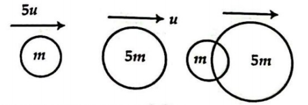
যুক্ত অবস্থায় বস্তু দুইটির বেগ কত?

### Options
- [ ] $\frac{3}{10}u$
- [x] $\frac{10}{6}u$
- [ ] $u$
- [ ] $\frac{6}{5}u$

### Explanation

  

## Question: p1c04-117
- **Subject:** #p1
- **Chapter:** #c04
- **Topic:** #সংঘর্ষ
- **Source:** #Book_ইসহাক_স্যার
- **Type:** #MCQ
- **Difficulty:** #medium
- **Board Exam:** #DB_15
- **Admission Exam:**
- **College Exam:**
- **Book Question Number:** 70
- **Tags:**

এই সংঘর্ষের আগে এবং পরে—

### Options
- [ ] গতিশক্তি এবং ভরবেগ উভয়ই স্থির থাকে
- [ ] ভরবেগ বৃদ্ধি পায় এবং গতিশক্তি স্থির থাকে
- [ ] গতিশক্তি এবং ভরবেগ উভয়ই হ্রাস পায়
- [x] গতিশক্তি হ্রাস পায় এবং ভরবেগ স্থির থাকে

### Explanation

  

## Question: p1c04-118
- **Subject:** #p1
- **Chapter:** #c04
- **Topic:** #সংঘর্ষ
- **Source:** #Book_ইসহাক_স্যার
- **Type:** #MCQ
- **Difficulty:** #easy
- **Board Exam:** #All_Board_18
- **Admission Exam:**
- **College Exam:**
- **Book Question Number:** 77
- **Tags:**

অস্থিতিস্থাপক সংঘর্ষে সংরক্ষিত হয়—

### Options
- [ ] গতিশক্তি
- [x] ভরবেগ
- [ ] কৌণিক ভরবেগ
- [ ] স্থিতিশক্তি

### Explanation

  

## Question: p1c04-119
- **Subject:** #p1
- **Chapter:** #c04
- **Topic:** #সংঘর্ষ
- **Source:** #Book_ইসহাক_স্যার
- **Type:** #MCQ
- **Difficulty:** #medium
- **Board Exam:** #RB_19
- **Admission Exam:**
- **College Exam:**
- **Book Question Number:** 89
- **Tags:**

দুটি সমান ভরের বস্তুর মধ্যে স্থিতিস্থাপক সংঘর্ষ ঘটলে—
(i) সংঘর্ষের পূর্বের ও পরের মোট ভরবেগ একই থাকবে
(ii) সংঘর্ষের পূর্বের ও পরের মোট গতিশক্তি একই থাকবে
(iii) সংঘর্ষের পর বস্তুদ্বয় বেগ বিনিময় করবে
নিচের কোনটি সঠিক?

### Options
- [ ] i ও ii
- [ ] ii ও iii
- [ ] i ও iii
- [x] i, ii ও iii

### Explanation

  

## Question: p1c04-120
- **Subject:** #p1
- **Chapter:** #c04
- **Topic:** #সংঘর্ষ
- **Source:** #Book_ইসহাক_স্যার
- **Type:** #MCQ
- **Difficulty:** #medium
- **Board Exam:** #RB_19
- **Admission Exam:**
- **College Exam:**
- **Book Question Number:** 92
- **Tags:**

নিচের চিত্রটি লক্ষ কর এবং ৯২নং প্রশ্নের উত্তর দাও :
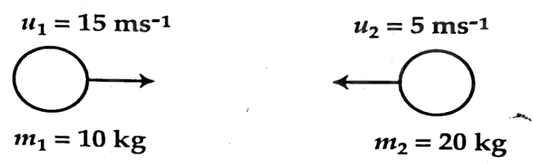
সংঘর্ষের ফলে বস্তুদ্বয় মিলিত হলে মিলিত বেগ কত হবে?

### Options
- [x] $\frac{5}{3}\text{ ms}^{-1}$
- [ ] $\frac{7}{3}\text{ ms}^{-1}$
- [ ] $\frac{8}{3}\text{ ms}^{-1}$
- [ ] $\frac{10}{3}\text{ ms}^{-1}$

### Explanation

  

## Question: p1c04-121
- **Subject:** #p1
- **Chapter:** #c04
- **Topic:** #সংঘর্ষ
- **Source:** #Book_ইসহাক_স্যার
- **Type:** #MCQ
- **Difficulty:** #hard
- **Board Exam:**
- **Admission Exam:** #BUET_14-15
- **College Exam:**
- **Book Question Number:** 113
- **Tags:**

একটি বস্তু $60\text{ cms}^{-1}$ বেগে গতিশীল অবস্থায় একটি স্থির বস্তুর সাথে স্থিতিস্থাপক সংঘর্ষে লিপ্ত হলো। সংঘর্ষের পর প্রথম বস্তুর বেগ $40\text{ ms}^{-1}$ হলে, ২য় বস্তুর বেগ কত? [ভর সমান]

### Options
- [x] $100\text{ cm s}^{-1}$
- [ ] $20\text{ cm s}^{-1}$
- [ ] $40\text{ cm s}^{-1}$
- [ ] $45\text{ cm s}^{-1}$

### Explanation

  

## Question: p1c04-122
- **Subject:** #p1
- **Chapter:** #c04
- **Topic:** #ঘর্ষণ
- **Source:** #Book_ইসহাক_স্যার
- **Type:** #MCQ
- **Difficulty:** #medium
- **Board Exam:** #JB_21, #SB_15
- **Admission Exam:**
- **College Exam:**
- **Book Question Number:** 47
- **Tags:**

নিচের কোনটি ঘর্ষণ বলের উদাহরণ?

### Options
- [ ] সংসক্তি বল
- [ ] সংরক্ষণশীল বল
- [ ] আসঞ্জন বল
- [x] অসংরক্ষণশীল বল

### Explanation

  

## Question: p1c04-123
- **Subject:** #p1
- **Chapter:** #c04
- **Topic:** #ঘর্ষণ
- **Source:** #Book_ইসহাক_স্যার
- **Type:** #MCQ
- **Difficulty:** #easy
- **Board Exam:** #CB_19
- **Admission Exam:**
- **College Exam:**
- **Book Question Number:** 86
- **Tags:**

সাইকেলের বেগ এবং চাকার ঘর্ষণের মধ্যবর্তী কোণ কত?

### Options
- [ ] $0^\circ$
- [ ] $90^\circ$
- [x] $180^\circ$
- [ ] $360^\circ$

### Explanation

  

## Question: p1c04-124
- **Subject:** #p1
- **Chapter:** #c04
- **Topic:** #ঘর্ষণ
- **Source:** #Book_ইসহাক_স্যার
- **Type:** #MCQ
- **Difficulty:** #medium
- **Board Exam:** #DiB_19, #MB_23
- **Admission Exam:**
- **College Exam:**
- **Book Question Number:** 97
- **Tags:**

নিচের উদ্দীপকটি পড় এবং ৯৭ ও ৯৮নং প্রশ্নের উত্তর দাও:
$1500\text{ kg}$ ভরের একটি গাড়ি $400\text{ N}$ ঘর্ষণ বলযুক্ত সোজা রাস্তায় $5\text{ ms}^{-2}$ সমত্বরণে চলে।
গাড়ির ইঞ্জিন কর্তৃক প্রযুক্ত বল—

### Options
- [ ] $0.4\text{ KN}$
- [ ] $7.1\text{ KN}$
- [ ] $7.5\text{ KN}$
- [x] $7.9\text{ KN}$

### Explanation

  

## Question: p1c04-125
- **Subject:** #p1
- **Chapter:** #c04
- **Topic:** #ঘর্ষণ
- **Source:** #Book_ইসহাক_স্যার
- **Type:** #MCQ
- **Difficulty:** #medium
- **Board Exam:**
- **Admission Exam:**
- **College Exam:**
- **Book Question Number:** 98
- **Tags:**

উদ্দীপকের গাড়িটি যদি ত্বরণে না চলে ধ্রুব বেগে চলে তবে ইঞ্জিন কর্তৃক প্রযুক্ত বল বনাম সময় লেখচিত্র হবে—

### Options
- [x] 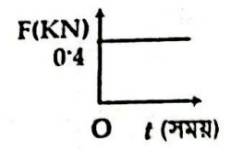
- [ ] 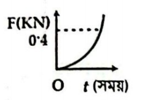
- [ ] 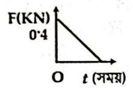
- [ ] 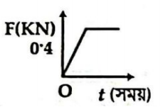

### Explanation

  

## Question: p1c04-126
- **Subject:** #p1
- **Chapter:** #c04
- **Topic:** #ঘর্ষণ
- **Source:** #Book_ইসহাক_স্যার
- **Type:** #MCQ
- **Difficulty:** #hard
- **Board Exam:**
- **Admission Exam:** #JU_17-18
- **College Exam:**
- **Book Question Number:** 114
- **Tags:**

একটি কাঠের তক্তার ওপর অবস্থিত একটি ইটের নিশ্চল কোণ $40^\circ$, ইট ও তক্তার মধ্যকার স্থিতি ঘর্ষণ গুণাঙ্ক কত?

### Options
- [ ] $0.87$
- [ ] $0.85$
- [x] $0.84$
- [ ] $0.92$

### Explanation

  