## Question: p1c07-001
- **Subject:** #p1
- **Chapter:** #c07
- **Topic:** #পদার্থের_আন্তঃআণবিক_বল
- **Source:** #Book_ইসহাক_স্যার
- **Type:** #MCQ
- **Difficulty:** #medium
- **Board Exam:** #DB_23, #DB_15, #ChB_15
- **Admission Exam:**
- **College Exam:**
- **Book Question Number:** 1
- **Tags:**

কোনো পদার্থের অণুগুলোর মধ্যে নিট বল শূন্য হয় যখন—

### Options
- [x] $r = r_0$
- [ ] $r < r_0$
- [ ] $r > r_0$
- [ ] $r \gg r_0$

### Explanation

## Question: p1c07-002
- **Subject:** #p1
- **Chapter:** #c07
- **Topic:** #পদার্থের_তিন_অবস্থা_কঠিন_তরল_ও_বায়বীয়
- **Source:** #Book_ইসহাক_স্যার
- **Type:** #MCQ
- **Difficulty:** #easy
- **Board Exam:** #JB_16
- **Admission Exam:**
- **College Exam:**
- **Book Question Number:** 24
- **Tags:**

কোন অবস্থায় অণুসমূহের মধ্যে আন্তঃআণবিক আকর্ষণ বল সর্বনিম্ন হয়?

### Options
- [ ] তরল
- [ ] প্লাজমা
- [ ] কঠিন
- [x] বায়বীয়

### Explanation

## Question: p1c07-003
- **Subject:** #p1
- **Chapter:** #c07
- **Topic:** #পদার্থের_তিন_অবস্থা_কঠিন_তরল_ও_বায়বীয়
- **Source:** #Book_ইসহাক_স্যার
- **Type:** #MCQ
- **Difficulty:** #easy
- **Board Exam:** #DiB_24
- **Admission Exam:**
- **College Exam:**
- **Book Question Number:** 92
- **Tags:**

কোন অবস্থায় অণুসমূহের মধ্যে আন্তঃআণবিক আকর্ষণ বল সর্বাধিক হয়?

### Options
- [x] কঠিন
- [ ] তরল
- [ ] বায়বীয়
- [ ] প্লাজমা

### Explanation

## Question: p1c07-004
- **Subject:** #p1
- **Chapter:** #c07
- **Topic:** #পদার্থের_বন্ধন
- **Source:** #Book_ইসহাক_স্যার
- **Type:** #MCQ
- **Difficulty:** #easy
- **Board Exam:** #RB_15
- **Admission Exam:**
- **College Exam:**
- **Book Question Number:** 37
- **Tags:**

কোনটির ক্ষেত্রে ভ্যান ডার ওয়াল বল বিদ্যমান?

### Options
- [ ] অক্সিজেন অণুর বন্ধন
- [ ] সোডিয়াম ও ক্লোরিন পরমাণুর বন্ধন
- [x] সিলিকন পরমাণুর বন্ধন
- [ ] তামার পরমাণু বন্ধন

### Explanation

## Question: p1c07-005
- **Subject:** #p1
- **Chapter:** #c07
- **Topic:** #পদার্থের_বন্ধন
- **Source:** #Book_ইসহাক_স্যার
- **Type:** #MCQ
- **Difficulty:** #easy
- **Board Exam:** #BB_24
- **Admission Exam:**
- **College Exam:**
- **Book Question Number:** 93
- **Tags:**

নিচের কোন বন্ধনটি সকল অণুতে বিদ্যমান?

### Options
- [ ] ধাতব
- [x] সমযোজী
- [ ] আয়নিক
- [ ] ভ্যানডার ওয়ালস

### Explanation

## Question: p1c07-006
- **Subject:** #p1
- **Chapter:** #c07
- **Topic:** #স্থিতিস্থাপকতা
- **Source:** #Book_ইসহাক_স্যার
- **Type:** #MCQ
- **Difficulty:** #hard
- **Board Exam:**
- **Admission Exam:** #KUET_16-17
- **College Exam:**
- **Book Question Number:** 12
- **Tags:**

$5\text{ m}$ দৈর্ঘ্য এবং $1\text{ mm}$ ব্যাসবিশিষ্ট তারে $1000\text{ kg}$ ভর চাপালে দৈর্ঘ্য $0.3\text{ mm}$ প্রসারিত হয়। তারটির সঞ্চিত শক্তির পরিমাণ কত ?

### Options
- [ ] $0.0147\text{ J}$
- [ ] $0.03\text{ J}$
- [x] $0.147\text{ J}$
- [ ] $100\text{ J}$

### Explanation

## Question: p1c07-007
- **Subject:** #p1
- **Chapter:** #c07
- **Topic:** #স্থিতিস্থাপকতা
- **Source:** #Book_ইসহাক_স্যার
- **Type:** #MCQ
- **Difficulty:** #medium
- **Board Exam:**
- **Admission Exam:** #DU_16-17
- **College Exam:**
- **Book Question Number:** 56
- **Tags:**

নিচের কোনটি সঠিক?

### Options
- [ ] $U = \frac{1}{2}Y$
- [ ] $U = V = \frac{1}{2}Al$
- [x] $U = \frac{1}{2}\frac{Yl^2}{L^2}$
- [ ] $U = \frac{1}{2}\frac{Al}{L}$

### Explanation

## Question: p1c07-008
- **Subject:** #p1
- **Chapter:** #c07
- **Topic:** #স্থিতিস্থাপকতা
- **Source:** #Book_ইসহাক_স্যার
- **Type:** #MCQ
- **Difficulty:** #easy
- **Board Exam:**
- **Admission Exam:**
- **College Exam:**
- **Book Question Number:** 66
- **Tags:**

$K_1$ ও $K_2$ বল ধ্রুবকবিশিষ্ট দুটি স্প্রিংকে শ্রেণিতে যুক্ত করা হলো। এদের তুল্য বল ধ্রুবক কত ?

### Options
- [ ] $2(K_1 + K_2)$
- [ ] $K_1 + K_2$
- [x] $\frac{K_1K_2}{K_1 + K_2}$
- [ ] $\frac{K_1 + K_2}{K_1K_2}$

### Explanation

## Question: p1c07-009
- **Subject:** #p1
- **Chapter:** #c07
- **Topic:** #স্থিতিস্থাপকতা
- **Source:** #Book_ইসহাক_স্যার
- **Type:** #MCQ
- **Difficulty:** #easy
- **Board Exam:** #JB_19
- **Admission Exam:**
- **College Exam:**
- **Book Question Number:** 79
- **Tags:**

কোনো তারকে কেটে সমান দুই টুকরা করা হলো। এতে তারের অসহ ভার হবে—

### Options
- [ ] পূর্বের অর্ধেক
- [x] পূর্বের সমান
- [ ] পূর্বের দ্বিগুণ
- [ ] পূর্বের এক-চতুর্থাংশ

### Explanation

## Question: p1c07-010
- **Subject:** #p1
- **Chapter:** #c07
- **Topic:** #স্থিতিস্থাপকতা
- **Source:** #Book_ইসহাক_স্যার
- **Type:** #MCQ
- **Difficulty:** #easy
- **Board Exam:** #BB_19
- **Admission Exam:**
- **College Exam:**
- **Book Question Number:** 81
- **Tags:**

স্থিতিস্থাপকতা সম্পর্কে বলা হয়, ইহা—
i. তাপমাত্রার সাথে পরিবর্তন হয়
ii. ভেজালের উপস্থিতিতে পরিবর্তন হয়
iii. পদার্থের আকৃতির ওপর নির্ভর করে
নিচের কোনটি সঠিক?

### Options
- [x] i ও ii
- [ ] ii ও iii
- [ ] i ও iii
- [ ] i, ii ও iii

### Explanation

## Question: p1c07-011
- **Subject:** #p1
- **Chapter:** #c07
- **Topic:** #স্থিতিস্থাপকতা
- **Source:** #Book_ইসহাক_স্যার
- **Type:** #MCQ
- **Difficulty:** #easy
- **Board Exam:** #RB_23
- **Admission Exam:**
- **College Exam:**
- **Book Question Number:** 97
- **Tags:**

নিচের কোনটি সর্বাপেক্ষা বেশি স্থিতিস্থাপক?

### Options
- [ ] সিসা
- [ ] তামা
- [x] নিকেল
- [ ] অ্যালুমিনিয়াম

### Explanation

## Question: p1c07-012
- **Subject:** #p1
- **Chapter:** #c07
- **Topic:** #স্থিতিস্থাপকতা
- **Source:** #Book_ইসহাক_স্যার
- **Type:** #MCQ
- **Difficulty:** #medium
- **Board Exam:**
- **Admission Exam:** #Medical_17-18
- **College Exam:**
- **Book Question Number:** 107
- **Tags:**

সর্বাপেক্ষা স্থিতিস্থাপক কোনটি?

### Options
- [x] তামা
- [ ] লোহা
- [ ] কোয়ার্টজ
- [ ] কাঠ

### Explanation

## Question: p1c07-013
- **Subject:** #p1
- **Chapter:** #c07
- **Topic:** #স্থিতিস্থাপকতা
- **Source:** #Book_ইসহাক_স্যার
- **Type:** #MCQ
- **Difficulty:** #easy
- **Board Exam:** #DiB_24
- **Admission Exam:**
- **College Exam:**
- **Book Question Number:** 114
- **Tags:**

কোনো একটি তারকে কেটে সমান তিন টুকরা করা হলো, এতে তারের অসহভারের মান কত হবে?

### Options
- [ ] পূর্বের অর্ধেক
- [ ] পূর্বের এক-তৃতীয়াংশ
- [x] পূর্বের সমান
- [ ] পূর্বের এক-চতুর্থাংশ

### Explanation

## Question: p1c07-014
- **Subject:** #p1
- **Chapter:** #c07
- **Topic:** #বিভিন্ন_প্রকার_বিকৃতি_ও_পীড়ন
- **Source:** #Book_ইসহাক_স্যার
- **Type:** #MCQ
- **Difficulty:** #easy
- **Board Exam:** #CB_16
- **Admission Exam:**
- **College Exam:**
- **Book Question Number:** 19
- **Tags:**

নিচের উদ্দীপকটি পড়ে ১৯নং ও ২০নং প্রশ্নের উত্তর দাও:
$\text{D}$ ব্যাস ও $\text{L}$ দৈর্ঘ্যের একটি তার এক প্রান্তে দৃঢ়ভাবে আটকানো আছে। তারটির নিচের প্রান্তে একটি ভর ঝুলানোতে এর দৈর্ঘ্য $x$ পরিমাণ বৃদ্ধি পেল। $x, \text{L}$-এর অর্ধেক।
$\text{Y} = 2.0 \times 10^{11}\text{ Nm}^{-2}$ হলে পীড়ন কত?

### Options
- [ ] $0.25 \times 10^{11}\text{ Nm}^{-2}$
- [ ] $0.5 \times 10^{11}\text{ Nm}^{-2}$
- [x] $1 \times 10^{11}\text{ Nm}^{-2}$
- [ ] $4 \times 10^{11}\text{ Nm}^{-2}$

### Explanation

## Question: p1c07-015
- **Subject:** #p1
- **Chapter:** #c07
- **Topic:** #বিভিন্ন_প্রকার_বিকৃতি_ও_পীড়ন
- **Source:** #Book_ইসহাক_স্যার
- **Type:** #MCQ
- **Difficulty:** #medium
- **Board Exam:** #CB_19
- **Admission Exam:** #JU_22-23
- **College Exam:**
- **Book Question Number:** 47
- **Tags:**

কোনো তারের অসহ পীড়ন নির্ভর করে তারের—

### Options
- [ ] ব্যাসার্ধের ওপর
- [ ] দৈর্ঘ্যের ওপর
- [x] প্রস্থচ্ছেদের আকৃতির ওপর
- [ ] উপাদানের ওপর

### Explanation

## Question: p1c07-016
- **Subject:** #p1
- **Chapter:** #c07
- **Topic:** #বিভিন্ন_প্রকার_বিকৃতি_ও_পীড়ন
- **Source:** #Book_ইসহাক_স্যার
- **Type:** #MCQ
- **Difficulty:** #easy
- **Board Exam:**
- **Admission Exam:**
- **College Exam:**
- **Book Question Number:** 62
- **Tags:**

নিচের উদ্দীপকের আলোকে নিচের দুটি প্রশ্নের উত্তর দাও :
সমান দৈর্ঘ্যের তিনটি তার A, B, C এ একই মানের পীড়ন $5 \times 10^{12}\text{ Nm}^{-2}$ প্রয়োগের ফলে দৈর্ঘ্য বৃদ্ধি যথাক্রমে $5\%$, $2\%$ এবং $1\%$ হলো।
B তারের বিকৃতি—

### Options
- [ ] $2$
- [ ] $0.2$
- [x] $0.02$
- [ ] $0.002$

### Explanation

## Question: p1c07-017
- **Subject:** #p1
- **Chapter:** #c07
- **Topic:** #বিভিন্ন_প্রকার_বিকৃতি_ও_পীড়ন
- **Source:** #Book_ইসহাক_স্যার
- **Type:** #MCQ
- **Difficulty:** #hard
- **Board Exam:** #CB_23, #DiB_23
- **Admission Exam:** #DU_20-21, #KUET_14-15
- **College Exam:**
- **Book Question Number:** 63
- **Tags:**

নিচের উদ্দীপকটি পড়ে ৬৩নং ও ৬৪নং প্রশ্নের উত্তর দাও:
$2\text{ m}$ দৈর্ঘ্য এবং $1\text{ mm}^2$ প্রস্থচ্ছেদের ক্ষেত্রফলবিশিষ্ট তারে $20\text{ kg}$ ভর ঝুলালে তারটি $1\text{ mm}$ প্রসারিত হয়।
তারটির পীড়ন কত ?

### Options
- [x] $1.96 \times 10^8\text{ Nm}^{-2}$
- [ ] $2.0 \times 10^7\text{ Nm}^{-2}$
- [ ] $1.96 \times 10^5\text{ Nm}^{-2}$
- [ ] $1.96 \times 10^2\text{ Nm}^{-2}$

### Explanation

## Question: p1c07-018
- **Subject:** #p1
- **Chapter:** #c07
- **Topic:** #বিভিন্ন_প্রকার_বিকৃতি_ও_পীড়ন
- **Source:** #Book_ইসহাক_স্যার
- **Type:** #MCQ
- **Difficulty:** #medium
- **Board Exam:** #DB_23, #All_Board_18
- **Admission Exam:** #DU_19-20
- **College Exam:**
- **Book Question Number:** 67
- **Tags:**

একটি তারের প্রস্থচ্ছেদের ক্ষেত্রফল $1\text{ mm}^2$ এবং অসহ ভার $40\text{ kg}$। তারের অসহ পীড়ন—

### Options
- [ ] $4 \times 10^{-6}\text{ Nm}^{-2}$
- [ ] $3.92 \times 10^{-4}\text{ Nm}^{-2}$
- [x] $3.92 \times 10^8\text{ Nm}^{-2}$
- [ ] $4 \times 10^7\text{ Nm}^{-2}$

### Explanation

## Question: p1c07-019
- **Subject:** #p1
- **Chapter:** #c07
- **Topic:** #বিভিন্ন_প্রকার_বিকৃতি_ও_পীড়ন
- **Source:** #Book_ইসহাক_স্যার
- **Type:** #MCQ
- **Difficulty:** #medium
- **Board Exam:** #MB_22
- **Admission Exam:** #Medical_15-16, #KU_12-13
- **College Exam:**
- **Book Question Number:** 71
- **Tags:**

$\text{SI}$ পদ্ধতিতে পীড়নের একক কোনটি ?

### Options
- [x] $\text{Nm}^{-2}$
- [ ] $\text{Nm}$
- [ ] $\text{Nm}^{-1}$
- [ ] $\frac{\text{m}}{\text{N}}$

### Explanation

## Question: p1c07-020
- **Subject:** #p1
- **Chapter:** #c07
- **Topic:** #বিভিন্ন_প্রকার_বিকৃতি_ও_পীড়ন
- **Source:** #Book_ইসহাক_স্যার
- **Type:** #MCQ
- **Difficulty:** #medium
- **Board Exam:** #RB_23, #ChB_19
- **Admission Exam:** #DU_22-23, #SUST_17-18
- **College Exam:**
- **Book Question Number:** 84
- **Tags:**

নিচের কোন রাশিটি মাত্রাবিহীন?

### Options
- [x] বিকৃতি
- [ ] পীড়ন
- [ ] ইয়ং গুণাঙ্ক
- [ ] দৃঢ়তার গুণাঙ্ক

### Explanation

## Question: p1c07-021
- **Subject:** #p1
- **Chapter:** #c07
- **Topic:** #বিভিন্ন_প্রকার_বিকৃতি_ও_পীড়ন
- **Source:** #Book_ইসহাক_স্যার
- **Type:** #MCQ
- **Difficulty:** #easy
- **Board Exam:** #DiB_23
- **Admission Exam:**
- **College Exam:**
- **Book Question Number:** 98
- **Tags:**

$0.5\text{ mm}^2$ প্রস্থচ্ছেদের ক্ষেত্রফলবিশিষ্ট তারে $10\text{ kg}$ ভর ঝুলানো তারটির পীড়ন—

### Options
- [ ] $19.6\text{ Nm}^{-2}$
- [ ] $1.96 \times 10^5\text{ Nm}^{-2}$
- [x] $1.96 \times 10^8\text{ Nm}^{-2}$
- [ ] $1.96 \times 10^{19}\text{ Nm}^{-2}$

### Explanation

## Question: p1c07-022
- **Subject:** #p1
- **Chapter:** #c07
- **Topic:** #বিভিন্ন_প্রকার_বিকৃতি_ও_পীড়ন
- **Source:** #Book_ইসহাক_স্যার
- **Type:** #MCQ
- **Difficulty:** #easy
- **Board Exam:** #CB_23
- **Admission Exam:**
- **College Exam:**
- **Book Question Number:** 99
- **Tags:**

কোনো তারের দৈর্ঘ্য বরাবর বল প্রয়োগ করে তারটির দৈর্ঘ্য বরাবর দৈর্ঘ্য দ্বিগুণ করা হলো। তারটির বিকৃতি—

### Options
- [ ] $0.25$
- [ ] $0.5$
- [x] $1$
- [ ] $2$

### Explanation

## Question: p1c07-023
- **Subject:** #p1
- **Chapter:** #c07
- **Topic:** #বিভিন্ন_প্রকার_বিকৃতি_ও_পীড়ন
- **Source:** #Book_ইসহাক_স্যার
- **Type:** #MCQ
- **Difficulty:** #medium
- **Board Exam:**
- **Admission Exam:** #SAU_18-19
- **College Exam:**
- **Book Question Number:** 106
- **Tags:**

একটি তারের প্রস্থচ্ছেদের ক্ষেত্রফল $0.003\text{ m}^2$। অসহপীড়ন $3.267 \times 10^5\text{ Nm}^{-1}$ হলে অসহভার কত?

### Options
- [ ] $10\text{ kg}$
- [ ] $10^2\text{ N}$
- [ ] $9.8 \times 110^2\text{ N}$
- [x] $9.8 \times 10^2\text{ N}$

### Explanation

## Question: p1c07-024
- **Subject:** #p1
- **Chapter:** #c07
- **Topic:** #হুকের_সূত্র
- **Source:** #Book_ইসহাক_স্যার
- **Type:** #MCQ
- **Difficulty:** #easy
- **Board Exam:** #DiB_16
- **Admission Exam:**
- **College Exam:**
- **Book Question Number:** 33
- **Tags:**

হুকের সূত্র নিম্নরূপ : (স্থিতিস্থাপক সীমার মধ্যে)

### Options
- [ ] $\text{পীড়ন} = \frac{1}{\text{বিকৃতি}}$
- [x] $\text{পীড়ন} \propto \text{বিকৃতি}$
- [ ] $\text{পীড়ন} \propto (\text{বিকৃতি})^2$
- [ ] $\text{পীড়ন} \propto \frac{1}{(\text{বিকৃতি})^2}$

### Explanation

## Question: p1c07-025
- **Subject:** #p1
- **Chapter:** #c07
- **Topic:** #হুকের_সূত্র
- **Source:** #Book_ইসহাক_স্যার
- **Type:** #MCQ
- **Difficulty:** #easy
- **Board Exam:** #All_Board_18
- **Admission Exam:**
- **College Exam:**
- **Book Question Number:** 51
- **Tags:**

স্থিতিস্থাপক সীমার মধ্যে কোনটি সবসময় ধ্রুবক থাকে ?
i. $\frac{\text{পীড়ন}}{\text{বিকৃতি}}$
ii. $\frac{\text{পার্শ্ব বিকৃতি}}{\text{দৈর্ঘ্য বিকৃতি}}$
iii. $\frac{\text{বল}}{\text{ক্ষেত্রফল}}$
নিচের কোনটি সঠিক?

### Options
- [x] i ও ii
- [ ] i ও iii
- [ ] ii ও iii
- [ ] i, ii ও iii

### Explanation

## Question: p1c07-026
- **Subject:** #p1
- **Chapter:** #c07
- **Topic:** #হুকের_সূত্র
- **Source:** #Book_ইসহাক_স্যার
- **Type:** #MCQ
- **Difficulty:** #medium
- **Board Exam:** #DB_22, #DB_19, #DiB_22
- **Admission Exam:**
- **College Exam:**
- **Book Question Number:** 59
- **Tags:**

স্থিতিস্থাপক সীমার মধ্যে দৈর্ঘ্য প্রসারণ বনাম ভার-এর সঠিক লেখচিত্র কোনটি ?

### Options
- [x] 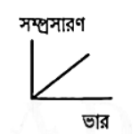
- [ ] 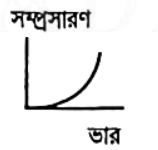
- [ ] 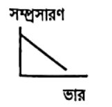
- [ ] 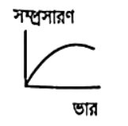

### Explanation

## Question: p1c07-027
- **Subject:** #p1
- **Chapter:** #c07
- **Topic:** #পীড়ন-বিকৃতি_লেখচিত্র
- **Source:** #Book_ইসহাক_স্যার
- **Type:** #MCQ
- **Difficulty:** #easy
- **Board Exam:** #CB_16
- **Admission Exam:**
- **College Exam:**
- **Book Question Number:** 21
- **Tags:**

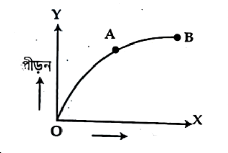
চিত্রে পীড়ন এবং বিকৃতির মধ্যকার লেখচিত্রে $\text{OA}$ রেখার ঢাল কী নির্দেশ করে?

### Options
- [ ] নতি বিন্দু
- [x] ইয়ং-এর গুণাঙ্ক
- [ ] ভর বিন্দু
- [ ] স্থায়ী বিকৃতি

### Explanation

## Question: p1c07-028
- **Subject:** #p1
- **Chapter:** #c07
- **Topic:** #পীড়ন-বিকৃতি_লেখচিত্র
- **Source:** #Book_ইসহাক_স্যার
- **Type:** #MCQ
- **Difficulty:** #medium
- **Board Exam:** #BB_22, #DiB_22, #DiB_16
- **Admission Exam:**
- **College Exam:**
- **Book Question Number:** 32
- **Tags:**

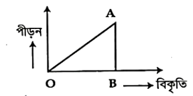
চিত্রে বিকৃতি বনাম পীড়ন লেখচিত্রের $\Delta\text{OAB}$-এর ক্ষেত্রফল নির্দেশ করে—

### Options
- [ ] ইয়ং-এর গুণাঙ্ক
- [x] সর্বমোট কৃত কাজ
- [ ] পয়সনের অনুপাত
- [ ] একক আয়তনে বিভবশক্তি

### Explanation

## Question: p1c07-029
- **Subject:** #p1
- **Chapter:** #c07
- **Topic:** #পীড়ন-বিকৃতি_লেখচিত্র
- **Source:** #Book_ইসহাক_স্যার
- **Type:** #MCQ
- **Difficulty:** #medium
- **Board Exam:** #DiB_19
- **Admission Exam:**
- **College Exam:**
- **Book Question Number:** 89
- **Tags:**

চিত্রে একটি ধাতব তারের জন্য দৈর্ঘ্য পীড়ন—দৈর্ঘ্য বিকৃতি লেখ দেখানো হলো :
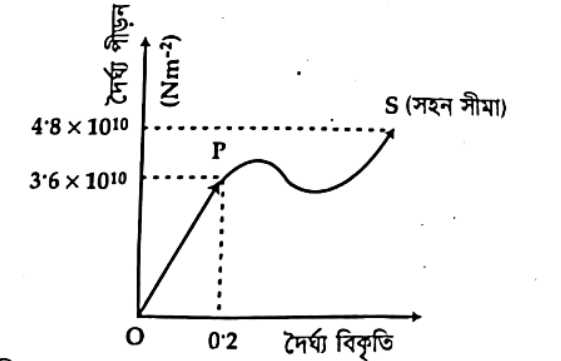
উদ্দীপক অনুসারে নিচের ৮৯ ও ৯০নং প্রশ্নের উত্তর দাও :
তারটির উপাদানের ইয়ং-এর গুণাঙ্ক কত?

### Options
- [ ] $7.2 \times 10^9\text{ Nm}^{-2}$
- [ ] $3.6 \times 10^{10}\text{ Nm}^{-2}$
- [ ] $4.8 \times 10^{10}\text{ Nm}^{-2}$
- [x] $1.8 \times 10^{11}\text{ Nm}^{-2}$

### Explanation

## Question: p1c07-030
- **Subject:** #p1
- **Chapter:** #c07
- **Topic:** #পীড়ন-বিকৃতি_লেখচিত্র
- **Source:** #Book_ইসহাক_স্যার
- **Type:** #MCQ
- **Difficulty:** #medium
- **Board Exam:**
- **Admission Exam:**
- **College Exam:**
- **Book Question Number:** 90
- **Tags:**

তারটির ওপর পীড়ন—
i. $4.8 \times 10^{10}\text{ Nm}^{-2}$-এর চেয়ে বেশি হলে তারটি ছিঁড়ে যাবে
ii. $4.2 \times 10^{10}\text{ Nm}^{-2}$ হলে তারটির স্থায়ী বিকৃতি হবে
iii. $3.6 \times 10^{10}\text{ Nm}^{-2}$-এর চেয়ে কম হলে কোনো বিকৃতি ঘটবে না
নিচের কোনটি সঠিক?

### Options
- [ ] i ও ii
- [ ] i ও iii
- [ ] ii ও iii
- [x] i, ii ও iii

### Explanation

## Question: p1c07-031
- **Subject:** #p1
- **Chapter:** #c07
- **Topic:** #স্থিতিস্থাপকতার_বিভিন্ন_গুণাঙ্ক
- **Source:** #Book_ইসহাক_স্যার
- **Type:** #MCQ
- **Difficulty:** #medium
- **Board Exam:** #CB_23, #CB_19, #CB_15, #ChB_23, #JB_22, #DB_16
- **Admission Exam:** #JnU_17-18, #DU_17-18, #CU_16-17, #RU_19-20, #Medical_16-17, #IU_17-18, #DU_20-21, #MBSTU_15-16, #CoU_16-17
- **College Exam:**
- **Book Question Number:** 5
- **Tags:**

পীড়নের বা ইয়ং-এর গুণাঙ্কের মাত্রা সমীকরণ—

### Options
- [ ] $[MLT^2]$
- [ ] $[ML^{-1}T^{-1}]$
- [x] $[ML^{-1}T^{-2}]$
- [ ] $[MLT^3]$

### Explanation

## Question: p1c07-032
- **Subject:** #p1
- **Chapter:** #c07
- **Topic:** #স্থিতিস্থাপকতার_বিভিন্ন_গুণাঙ্ক
- **Source:** #Book_ইসহাক_স্যার
- **Type:** #MCQ
- **Difficulty:** #medium
- **Board Exam:** #BB_22, #DiB_16
- **Admission Exam:** #JU_17-18, #RU_20-21
- **College Exam:**
- **Book Question Number:** 7
- **Tags:**

$1\text{ m}$ দৈর্ঘ্য ও $1\text{ mm}^2$ প্রস্থচ্ছেদের ক্ষেত্রফলবিশিষ্ট একটি ইস্পাতের তারে দৈর্ঘ্য $10\%$ বৃদ্ধি করতে প্রযুক্ত বল কোনটি ? [$Y = 2 \times 10^{11}\text{ Nm}^{-2}$]

### Options
- [x] $2 \times 10^4\text{ N}$
- [ ] $2 \times 10^5\text{ N}$
- [ ] $2 \times 10^6\text{ N}$
- [ ] $2 \times 10^7\text{ N}$

### Explanation

## Question: p1c07-033
- **Subject:** #p1
- **Chapter:** #c07
- **Topic:** #স্থিতিস্থাপকতার_বিভিন্ন_গুণাঙ্ক
- **Source:** #Book_ইসহাক_স্যার
- **Type:** #MCQ
- **Difficulty:** #medium
- **Board Exam:** #ChB_22, #DB_14
- **Admission Exam:** #RU_17-18
- **College Exam:**
- **Book Question Number:** 8
- **Tags:**

স্থিতিস্থাপক সীমার মধ্যে আকার পীড়ন ও আকার বিকৃতির অনুপাত হচ্ছে—

### Options
- [ ] ইয়ং-এর গুণাঙ্ক
- [ ] আয়তন গুণাঙ্ক
- [x] দৃঢ়তার গুণাঙ্ক
- [ ] পয়সনের অনুপাত

### Explanation

## Question: p1c07-034
- **Subject:** #p1
- **Chapter:** #c07
- **Topic:** #স্থিতিস্থাপকতার_বিভিন্ন_গুণাঙ্ক
- **Source:** #Book_ইসহাক_স্যার
- **Type:** #MCQ
- **Difficulty:** #medium
- **Board Exam:** #DB_22, #DB_17, #ChB_16
- **Admission Exam:** #RU_17-18, #Medical_09-10
- **College Exam:**
- **Book Question Number:** 9
- **Tags:**

আয়তন গুণাঙ্কের বিপরীত রাশি কোনটি ?

### Options
- [ ] পয়সনের অনুপাত
- [x] সংনম্যতা
- [ ] ইয়ং গুণাঙ্ক
- [ ] দৃঢ়তার গুণাঙ্ক

### Explanation

## Question: p1c07-035
- **Subject:** #p1
- **Chapter:** #c07
- **Topic:** #স্থিতিস্থাপকতার_বিভিন্ন_গুণাঙ্ক
- **Source:** #Book_ইসহাক_স্যার
- **Type:** #MCQ
- **Difficulty:** #medium
- **Board Exam:**
- **Admission Exam:** #RUET_14-15, #BRUR_17-18, #RU_17-18
- **College Exam:**
- **Book Question Number:** 15
- **Tags:**

$1\text{ cm}^2$ প্রস্থচ্ছেদবিশিষ্ট তামার তারকে টেনে দ্বিগুণ লম্বা করতে কত বলের প্রয়োজন হবে ?

### Options
- [ ] $10^7\text{ N}$
- [ ] $3 \times 10^7\text{ N}$
- [ ] $4 \times 10^7\text{ N}$
- [x] $2 \times 10^7\text{ N}$

### Explanation

## Question: p1c07-036
- **Subject:** #p1
- **Chapter:** #c07
- **Topic:** #স্থিতিস্থাপকতার_বিভিন্ন_গুণাঙ্ক
- **Source:** #Book_ইসহাক_স্যার
- **Type:** #MCQ
- **Difficulty:** #easy
- **Board Exam:** #CB_16
- **Admission Exam:**
- **College Exam:**
- **Book Question Number:** 20
- **Tags:**

একই উপাদানের $\text{2D}$ ব্যাস এবং $\text{3L}$ দৈর্ঘ্যের অপর একটি তারে সমপরিমাণ ভর ঝুলালে—
i. পয়সনের অনুপাত অপরিবর্তিত থাকবে
ii. দৈর্ঘ্য বৃদ্ধি পাবে $\frac{3x}{4}$
iii. পীড়নের পরিবর্তন হবে
নিচের কোনটি সঠিক?

### Options
- [ ] i ও ii
- [ ] ii ও iii
- [ ] i ও iii
- [x] i, ii ও iii

### Explanation

## Question: p1c07-037
- **Subject:** #p1
- **Chapter:** #c07
- **Topic:** #স্থিতিস্থাপকতার_বিভিন্ন_গুণাঙ্ক
- **Source:** #Book_ইসহাক_স্যার
- **Type:** #MCQ
- **Difficulty:** #easy
- **Board Exam:** #SB_17
- **Admission Exam:**
- **College Exam:**
- **Book Question Number:** 26
- **Tags:**

ইয়ং-এর গুণাঙ্ক নিচের কোনটি ?

### Options
- [ ] $Y = \frac{\text{আয়তন পীড়ন}}{\text{আয়তন বিকৃতি}}$
- [x] $Y = \frac{\text{দৈর্ঘ্য পীড়ন}}{\text{দৈর্ঘ্য বিকৃতি}}$
- [ ] $Y = \frac{\text{কৃন্তন পীড়ন}}{\text{কৃন্তন বিকৃতি}}$
- [ ] $Y = \frac{\text{কৃন্তন পীড়ন}}{\text{দৈর্ঘ্য বিকৃতি}}$

### Explanation

## Question: p1c07-038
- **Subject:** #p1
- **Chapter:** #c07
- **Topic:** #স্থিতিস্থাপকতার_বিভিন্ন_গুণাঙ্ক
- **Source:** #Book_ইসহাক_স্যার
- **Type:** #MCQ
- **Difficulty:** #medium
- **Board Exam:** #BB_15
- **Admission Exam:** #RU_18-19
- **College Exam:**
- **Book Question Number:** 61
- **Tags:**

নিচের উদ্দীপকের আলোকে নিচের দুটি প্রশ্নের উত্তর দাও :
সমান দৈর্ঘ্যের তিনটি তার A, B, C এ একই মানের পীড়ন $5 \times 10^{12}\text{ Nm}^{-2}$ প্রয়োগের ফলে দৈর্ঘ্য বৃদ্ধি যথাক্রমে $5\%$, $2\%$ এবং $1\%$ হলো।
A, B এবং C তারের ইয়ং এর গুণাঙ্ক যথাক্রমে $Y_A, Y_B, Y_C$ হলে নিচের কোনটি সঠিক?

### Options
- [ ] $Y_A > Y_C > Y_B$
- [x] $Y_A < Y_B < Y_C$
- [ ] $Y_A > Y_B > Y_C$
- [ ] $Y_B < Y_A < Y_C$

### Explanation

## Question: p1c07-039
- **Subject:** #p1
- **Chapter:** #c07
- **Topic:** #স্থিতিস্থাপকতার_বিভিন্ন_গুণাঙ্ক
- **Source:** #Book_ইসহাক_স্যার
- **Type:** #MCQ
- **Difficulty:** #medium
- **Board Exam:**
- **Admission Exam:**
- **College Exam:**
- **Book Question Number:** 64
- **Tags:**

উক্ত তারটির—
(i) দৈর্ঘ্য বিকৃতি $0.5 \times 10^{-2}$
(ii) ইয়ং-এর গুণাঙ্ক $3.92 \times 10^{11}\text{ Nm}^{-2}$
(iii) কৃত কাজের পরিমাণ $0.098\text{ J}$
নিচের কোনটি সঠিক?

### Options
- [ ] i ও ii
- [ ] i ও iii
- [ ] ii ও iii
- [x] i, ii ও iii

### Explanation

## Question: p1c07-040
- **Subject:** #p1
- **Chapter:** #c07
- **Topic:** #স্থিতিস্থাপকতার_বিভিন্ন_গুণাঙ্ক
- **Source:** #Book_ইসহাক_স্যার
- **Type:** #MCQ
- **Difficulty:** #easy
- **Board Exam:**
- **Admission Exam:** #Medical_04-05
- **College Exam:**
- **Book Question Number:** 72
- **Tags:**

স্থিতিস্থাপকতা গুণাঙ্ক সংক্রান্ত নিচের কোন তথ্য সঠিক নয় ?

### Options
- [ ] $Y = \frac{FL}{Al}$
- [ ] $Y = \frac{MgL}{\pi r^2 l}$
- [ ] $Y = [ML^{-1}T^{-2}]$
- [x] $Y = [ML^{-2}T^{-2}]$

### Explanation

## Question: p1c07-041
- **Subject:** #p1
- **Chapter:** #c07
- **Topic:** #স্থিতিস্থাপকতার_বিভিন্ন_গুণাঙ্ক
- **Source:** #Book_ইসহাক_স্যার
- **Type:** #MCQ
- **Difficulty:** #medium
- **Board Exam:**
- **Admission Exam:** #RU_17-18
- **College Exam:**
- **Book Question Number:** 74
- **Tags:**

দুটি ভিন্ন প্রস্থচ্ছেদের তারের ইয়ং-এর স্থিতিস্থাপক গুণাঙ্ক একই। তার দুটি—

### Options
- [ ] ভিন্ন দৈর্ঘ্যের
- [ ] ভিন্ন উপাদানের
- [x] একই উপাদানের
- [ ] যেকানেটিই হতে পারে

### Explanation

## Question: p1c07-042
- **Subject:** #p1
- **Chapter:** #c07
- **Topic:** #স্থিতিস্থাপকতার_বিভিন্ন_গুণাঙ্ক
- **Source:** #Book_ইসহাক_স্যার
- **Type:** #MCQ
- **Difficulty:** #medium
- **Board Exam:** #ChB_19
- **Admission Exam:**
- **College Exam:**
- **Book Question Number:** 85
- **Tags:**

$1\text{ m}$ দীর্ঘ একটি তারে $10^5\text{ Nm}^{-2}$ বল প্রয়োগে এর দৈর্ঘ্য বৃদ্ধি পেল $0.001\text{ m}$। তারটির ইয়ং গুণাঙ্ক কত?

### Options
- [ ] $10^{-7}\text{ Nm}^{-2}$
- [ ] $10^{-3}\text{ Nm}^{-2}$
- [ ] $10^7\text{ Nm}^{-2}$
- [x] $10^8\text{ Nm}^{-2}$

### Explanation

## Question: p1c07-043
- **Subject:** #p1
- **Chapter:** #c07
- **Topic:** #স্থিতিস্থাপকতার_বিভিন্ন_গুণাঙ্ক
- **Source:** #Book_ইসহাক_স্যার
- **Type:** #MCQ
- **Difficulty:** #medium
- **Board Exam:** #BB_19
- **Admission Exam:** #RU_17-18, #Medical_19-20
- **College Exam:**
- **Book Question Number:** 86
- **Tags:**

আয়তন গুণাঙ্কের অন্য নাম কী?

### Options
- [x] অসংনম্যতা
- [ ] সংনম্যতা
- [ ] কাঠিন্যের গুণাঙ্ক
- [ ] ইয়ং-এর গুণাঙ্ক

### Explanation

## Question: p1c07-044
- **Subject:** #p1
- **Chapter:** #c07
- **Topic:** #স্থিতিস্থাপকতার_বিভিন্ন_গুণাঙ্ক
- **Source:** #Book_ইসহাক_স্যার
- **Type:** #MCQ
- **Difficulty:** #medium
- **Board Exam:** #MB_24
- **Admission Exam:**
- **College Exam:**
- **Book Question Number:** 91
- **Tags:**

সংনম্যতার ক্ষেত্রে—
(i) চারদিক থেকে সমান চাপ প্রয়োগে আয়তন কমে যায়
(ii) পদার্থের অণুসমূহের মধ্যে ফাঁক থাকে
(iii) আয়তনের স্থিতিস্থাপক গুণাঙ্কের বিপরীত রাশি
নিচের কোনটি সঠিক?

### Options
- [ ] i ও ii
- [ ] i ও iii
- [ ] ii ও iii
- [x] i, ii ও iii

### Explanation

## Question: p1c07-045
- **Subject:** #p1
- **Chapter:** #c07
- **Topic:** #স্থিতিস্থাপকতার_বিভিন্ন_গুণাঙ্ক
- **Source:** #Book_ইসহাক_স্যার
- **Type:** #MCQ
- **Difficulty:** #easy
- **Board Exam:** #CB_24
- **Admission Exam:**
- **College Exam:**
- **Book Question Number:** 94
- **Tags:**

সংনম্যতার একক কী?

### Options
- [x] $\text{N}^{-1}\text{m}^2$
- [ ] $\text{N}^{-1}$
- [ ] $\text{Pa}$
- [ ] $\text{Nm}^{-2}$

### Explanation

## Question: p1c07-046
- **Subject:** #p1
- **Chapter:** #c07
- **Topic:** #স্থিতিস্থাপকতার_বিভিন্ন_গুণাঙ্ক
- **Source:** #Book_ইসহাক_স্যার
- **Type:** #MCQ
- **Difficulty:** #easy
- **Board Exam:** #ChB_24
- **Admission Exam:**
- **College Exam:**
- **Book Question Number:** 95
- **Tags:**

আয়তন গুণাঙ্কের বিপরীত রাশি—

### Options
- [ ] ইয়ং-এর গুণাঙ্ক
- [ ] অসংনম্যতা
- [x] সংনম্যতা
- [ ] দৃঢ়তার গুণাঙ্ক

### Explanation

## Question: p1c07-047
- **Subject:** #p1
- **Chapter:** #c07
- **Topic:** #স্থিতিস্থাপকতার_বিভিন্ন_গুণাঙ্ক
- **Source:** #Book_ইসহাক_স্যার
- **Type:** #MCQ
- **Difficulty:** #medium
- **Board Exam:** #JB_24, #BB_23
- **Admission Exam:**
- **College Exam:**
- **Book Question Number:** 96
- **Tags:**

একটি সম্পূর্ণ দৃঢ় বস্তুর ইয়ং-এর গুণাঙ্ক কত?

### Options
- [ ] $0$
- [x] $\infty$
- [ ] $1$
- [ ] $-1$

### Explanation

## Question: p1c07-048
- **Subject:** #p1
- **Chapter:** #c07
- **Topic:** #স্থিতিস্থাপকতার_বিভিন্ন_গুণাঙ্ক
- **Source:** #Book_ইসহাক_স্যার
- **Type:** #MCQ
- **Difficulty:** #medium
- **Board Exam:**
- **Admission Exam:** #JU_23-24
- **College Exam:**
- **Book Question Number:** 100
- **Tags:**

এসিটোনের আয়তন গুণাঙ্ক $0.92 \times 10^9\text{ Pa}$ হলে এসিটোনের অসংনম্যতার কত?

### Options
- [ ] $\frac{2}{5} \times 10^9\text{ Nm}^{-2}$
- [ ] $0.92 \times 10^6\text{ Nm}^{-2}$
- [ ] $1.05 \times 10^6\text{ Nm}^{-2}$
- [x] $\frac{23}{25} \times 10^9\text{ Nm}^{-2}$

### Explanation

## Question: p1c07-049
- **Subject:** #p1
- **Chapter:** #c07
- **Topic:** #স্থিতিস্থাপকতার_বিভিন্ন_গুণাঙ্ক
- **Source:** #Book_ইসহাক_স্যার
- **Type:** #MCQ
- **Difficulty:** #hard
- **Board Exam:**
- **Admission Exam:** #CKRUET_23-24
- **College Exam:**
- **Book Question Number:** 101
- **Tags:**

দুটি ভিন্ন পদার্থের তৈরি প্রত্যেকটি $2\text{m}$ লম্বা এবং $2\text{ mm}$ ব্যাসবিশিষ্ট তারকে সিরিজে জোড়া দিয়ে একটি যৌগিক তারে পরিণত করা হলো। তারটিতে কী পরিমাণ বল প্রয়োগ করা হলে এটি সর্বমোট $0.9\text{ mm}$ প্রসারিত হবে? ($Y_1 = 2 \times 10^{11}\text{ Nm}^{-2}, Y_2 = 7 \times 10^{11}\text{ Nm}^{-2}$)

### Options
- [ ] $879.2\text{ N}$
- [ ] $8792\text{ N}$
- [ ] $219.8\text{ kN}$
- [ ] $2198\text{ N}$
- [x] $219.8\text{ N}$

### Explanation

## Question: p1c07-050
- **Subject:** #p1
- **Chapter:** #c07
- **Topic:** #স্থিতিস্থাপকতার_বিভিন্ন_গুণাঙ্ক
- **Source:** #Book_ইসহাক_স্যার
- **Type:** #MCQ
- **Difficulty:** #medium
- **Board Exam:**
- **Admission Exam:** #DU_23-24
- **College Exam:**
- **Book Question Number:** 102
- **Tags:**

একটি ইস্পাতের তারের উপাদানের ইয়ং-এর গুণাঙ্ক $Y_1$। যদি তারের ব্যাস দ্বিগুণ হয় তাহলে পরিবর্তিত ইয়ং গুণাঙ্ক কত হবে?

### Options
- [x] পূর্বের সমান
- [ ] পূর্বের অর্ধেক
- [ ] পূর্বের দ্বিগুণ
- [ ] পূর্বের চারগুণ

### Explanation

## Question: p1c07-051
- **Subject:** #p1
- **Chapter:** #c07
- **Topic:** #স্থিতিস্থাপকতার_বিভিন্ন_গুণাঙ্ক
- **Source:** #Book_ইসহাক_স্যার
- **Type:** #MCQ
- **Difficulty:** #medium
- **Board Exam:**
- **Admission Exam:** #JU_23-24
- **College Exam:**
- **Book Question Number:** 103
- **Tags:**

সালফিউরিক এ্যাসিডের আয়তন গুণাঙ্ক $3.0 \times 10^9\text{ Nm}^{-2}$ হলে সংনম্যতা কত?

### Options
- [ ] $\frac{1}{6} \times 10^{-9}\text{ Nm}^{-2}$
- [ ] $0.33 \times 10^{-9}\text{ Nm}^{-2}$
- [x] $\frac{1}{3} \times 10^{-9}\text{ Nm}^{-2}$
- [ ] $0.16 \times 10^{-9}\text{ Nm}^{-2}$

### Explanation

## Question: p1c07-052
- **Subject:** #p1
- **Chapter:** #c07
- **Topic:** #স্থিতিস্থাপকতার_বিভিন্ন_গুণাঙ্ক
- **Source:** #Book_ইসহাক_স্যার
- **Type:** #MCQ
- **Difficulty:** #hard
- **Board Exam:**
- **Admission Exam:** #KUET_17-18
- **College Exam:**
- **Book Question Number:** 111
- **Tags:**

$2.2\text{ m}$ দীর্ঘ ঝুলন্ত একটি তারের নিচের প্রান্তে $8.4\text{ kg}$ ভর ঝুলালে এর দৈর্ঘ্য $0.52\text{ mm}$ বাড়ে। তারের উপাদানের ইয়ং-এর গুণাঙ্ক $2 \times 10^{11}\text{ Nm}^{-2}$ হলে, তারের প্রস্থচ্ছেদের ক্ষেত্রফল নির্ণয় কর।

### Options
- [ ] $1.56 \times 10^{-6}\text{ m}^2$
- [ ] $1.48\text{ mm}^2$
- [ ] $1.6 \times 10^{-2}\text{ cm}^2$
- [x] $1.74 \times 10^{-6}\text{ m}^2$
- [ ] $2 \times 10^{-6}\text{ m}^2$

### Explanation

## Question: p1c07-053
- **Subject:** #p1
- **Chapter:** #c07
- **Topic:** #স্থিতিস্থাপকতার_বিভিন্ন_গুণাঙ্ক
- **Source:** #Book_ইসহাক_স্যার
- **Type:** #MCQ
- **Difficulty:** #easy
- **Board Exam:**
- **Admission Exam:** #Dental_24-25
- **College Exam:**
- **Book Question Number:** 112
- **Tags:**

ইয়ং-এর গুণাঙ্ক সর্বনিম্ন স্থিতিস্থাপক গুণাঙ্ক কোনটির?

### Options
- [ ] তামা
- [ ] অ্যালুমিনিয়াম
- [ ] পেটা লোহা
- [x] সিসা

### Explanation

## Question: p1c07-054
- **Subject:** #p1
- **Chapter:** #c07
- **Topic:** #স্থিতিস্থাপকতার_বিভিন্ন_গুণাঙ্ক
- **Source:** #Book_ইসহাক_স্যার
- **Type:** #MCQ
- **Difficulty:** #easy
- **Board Exam:** #ChB_24
- **Admission Exam:**
- **College Exam:**
- **Book Question Number:** 115
- **Tags:**

আয়তন গুণাঙ্কের বিপরীত রাশি—

### Options
- [ ] ইয়ং-এর গুণাঙ্ক
- [ ] অসংনম্যতা
- [x] সংনম্যতা
- [ ] দৃঢ়তার গুণাঙ্ক

### Explanation

## Question: p1c07-055
- **Subject:** #p1
- **Chapter:** #c07
- **Topic:** #পয়সনের_অনুপাত
- **Source:** #Book_ইসহাক_স্যার
- **Type:** #MCQ
- **Difficulty:** #medium
- **Board Exam:** #JB_22, #SB_19, #DiB_19, #All_Board_18
- **Admission Exam:** #CoM_10-11, #DU_22-23, #DU_17-18, #PUST_17-18, #SUST_16-17, #RU_18-19, #BRUR_13-14
- **College Exam:**
- **Book Question Number:** 10
- **Tags:**

পয়সনের অনুপাতের ক্ষেত্রে—
(i) $\sigma = \frac{-L_0 \Delta r}{r \Delta L}$
(ii) পয়সন অনুপাতের মান $-1$ থেকে $\frac{1}{2}$-এর মধ্যে
(iii) পয়সন অনুপাতের কোনো মাত্রা ও একক নেই
নিচের কোনটি সঠিক ?

### Options
- [ ] i
- [ ] i ও ii
- [ ] ii ও iii
- [x] i, ii ও iii

### Explanation

## Question: p1c07-056
- **Subject:** #p1
- **Chapter:** #c07
- **Topic:** #পয়সনের_অনুপাত
- **Source:** #Book_ইসহাক_স্যার
- **Type:** #MCQ
- **Difficulty:** #medium
- **Board Exam:** #RB_23, #DiB_23, #SB_16
- **Admission Exam:** #BSFMSTU_19-20, #RU_15-16
- **College Exam:**
- **Book Question Number:** 29
- **Tags:**

পয়সনের অনুপাত—
i. দৈর্ঘ্য বিকৃতি ও পার্শ্ব বিকৃতির অনুপাত
ii. কোনো একক নেই
iii. এর মান $-1$ থেকে $0.5$ পর্যন্ত
নিচের কোনটি সঠিক?

### Options
- [ ] i ও ii
- [x] ii ও iii
- [ ] i ও iii
- [ ] i, ii ও iii

### Explanation

## Question: p1c07-057
- **Subject:** #p1
- **Chapter:** #c07
- **Topic:** #পয়সনের_অনুপাত
- **Source:** #Book_ইসহাক_স্যার
- **Type:** #MCQ
- **Difficulty:** #hard
- **Board Exam:** #CB_23, #CB_19, #ChB_19, #JB_19
- **Admission Exam:** #BUET_13-14
- **College Exam:**
- **Book Question Number:** 46
- **Tags:**

$1\text{ m}$ দীর্ঘ ও $1\text{ mm}$ ব্যাসের একটি তারের দৈর্ঘ্য $0.05\text{ cm}$ বৃদ্ধি করা হলে তারটির ব্যাস হ্রাস পাবে— ($\sigma = 0.25$)

### Options
- [ ] $1.25 \times 10^{-7}\text{ cm}$
- [x] $12.5 \times 10^{-7}\text{ m}$
- [ ] $1.25 \times 10^{-7}\text{ mm}$
- [ ] $1.25 \times 10^{-7}\text{ m}$

### Explanation

## Question: p1c07-058
- **Subject:** #p1
- **Chapter:** #c07
- **Topic:** #পয়সনের_অনুপাত
- **Source:** #Book_ইসহাক_স্যার
- **Type:** #MCQ
- **Difficulty:** #medium
- **Board Exam:** #MB_23, #RB_17
- **Admission Exam:** #SAU_11-12, #JU_12-13
- **College Exam:**
- **Book Question Number:** 50
- **Tags:**

একটি তারের দৈর্ঘ্য বিকৃতি $0.02$ এবং পার্শ্ব বিকৃতি $0.002$ হলে এর পয়সনের অনুপাত কত ?

### Options
- [ ] $0.004$
- [x] $0.1$
- [ ] $10$
- [ ] $0.0004$

### Explanation

## Question: p1c07-059
- **Subject:** #p1
- **Chapter:** #c07
- **Topic:** #পয়সনের_অনুপাত
- **Source:** #Book_ইসহাক_স্যার
- **Type:** #MCQ
- **Difficulty:** #medium
- **Board Exam:**
- **Admission Exam:**
- **College Exam:**
- **Book Question Number:** 65
- **Tags:**

একটি পদার্থের ইয়ং-এর গুণাঙ্ক-এর দৃঢ়তার গুণাঙ্কের $2.6$ গুণ হলে ওই পদার্থের পয়সন এর অনুপাত কত ?

### Options
- [ ] $0.26$
- [ ] $1.3$
- [x] $0.3$
- [ ] $0.6$

### Explanation

## Question: p1c07-060
- **Subject:** #p1
- **Chapter:** #c07
- **Topic:** #পয়সনের_অনুপাত
- **Source:** #Book_ইসহাক_স্যার
- **Type:** #MCQ
- **Difficulty:** #easy
- **Board Exam:** #BB_19
- **Admission Exam:**
- **College Exam:**
- **Book Question Number:** 78
- **Tags:**

দৈর্ঘ্য বিকৃতি বনাম পার্শ্ব বিকৃতির লেখচিত্রের প্রকৃতি কোনটি?

### Options
- [ ] 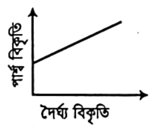
- [ ] 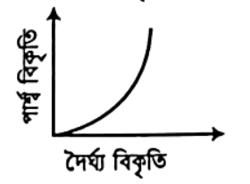
- [ ] 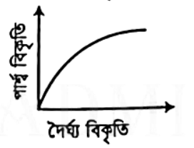
- [x] 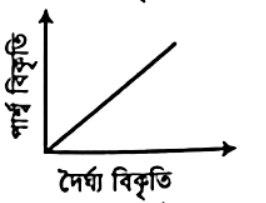

### Explanation

## Question: p1c07-061
- **Subject:** #p1
- **Chapter:** #c07
- **Topic:** #পয়সনের_অনুপাত
- **Source:** #Book_ইসহাক_স্যার
- **Type:** #MCQ
- **Difficulty:** #medium
- **Board Exam:** #CB_19, #JB_19
- **Admission Exam:**
- **College Exam:**
- **Book Question Number:** 80
- **Tags:**

$1\text{ m}$ লম্বা ও $1\text{ mm}$ ব্যাসের তারকে বল প্রয়োগে $0.025\text{ cm}$ দৈর্ঘ্য বৃদ্ধি করা হলো। ব্যাস হ্রাস কত? $[\sigma = 0.1]$

### Options
- [ ] $1.5 \times 10^5\text{ mm}$
- [ ] $2.5 \times 10^{-5}\text{ mm}$
- [x] $3.5 \times 10^5\text{ mm}$
- [ ] $25\text{ mm}$

### Explanation

## Question: p1c07-062
- **Subject:** #p1
- **Chapter:** #c07
- **Topic:** #প্রবাহীর_প্রবাহ
- **Source:** #Book_ইসহাক_স্যার
- **Type:** #MCQ
- **Difficulty:** #medium
- **Board Exam:**
- **Admission Exam:**
- **College Exam:**
- **Book Question Number:** 69
- **Tags:** #প্রবাহীর_প্রবাহ

$\rho$ ঘনত্ববিশিষ্ট এবং $\eta$ সান্দ্রতাঙ্কবিশিষ্ট একটি তরল $r$ ব্যাসার্ধের একটি সরু নলের মধ্য দিয়ে প্রবাহিত হচ্ছে। রেনল্ড সংখ্যা $\text{N}$ হবে—

### Options
- [ ] $N = \frac{\rho rv}{\eta^2}$
- [ ] $N = \frac{r v \rho}{2\eta}$
- [x] $N = \frac{r v \rho}{\eta}$
- [ ] $N = \frac{2 r v \rho}{\eta^2}$

### Explanation

## Question: p1c07-063
- **Subject:** #p1
- **Chapter:** #c07
- **Topic:** #প্রবাহীর_প্রবাহ
- **Source:** #Book_ইসহাক_স্যার
- **Type:** #MCQ
- **Difficulty:** #easy
- **Board Exam:**
- **Admission Exam:**
- **College Exam:**
- **Book Question Number:** 70
- **Tags:** #প্রবাহীর_প্রবাহ

রেনল্ড সংখ্যার মাত্রা কোনটি ?

### Options
- [ ] $[M^0L^1T^{-1}]$
- [x] $[M^0L^0T^0]$
- [ ] $[M^0L^0T^{-1}]$
- [ ] $[M^0L^2T^{-2}]$

### Explanation

## Question: p1c07-064
- **Subject:** #p1
- **Chapter:** #c07
- **Topic:** #প্রবাহীর_প্রবাহ
- **Source:** #Book_ইসহাক_স্যার
- **Type:** #MCQ
- **Difficulty:** #medium
- **Board Exam:** #CB_19
- **Admission Exam:**
- **College Exam:**
- **Book Question Number:** 83
- **Tags:** #প্রবাহীর_প্রবাহ

$v_c = \text{সংকট বেগ}$, $\eta = \text{তরলের সান্দ্রতাঙ্ক}$, $\rho = \text{তরলের ঘনত্ব}$, $r = \text{নলের ব্যাসার্ধ}$ হলে কোন লেখচিত্রটি সঠিক?

### Options
- [ ] 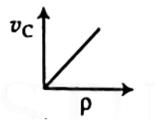
- [x] 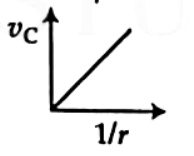
- [ ] 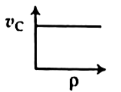
- [ ] 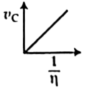

### Explanation

## Question: p1c07-065
- **Subject:** #p1
- **Chapter:** #c07
- **Topic:** #সান্দ্রতা
- **Source:** #Book_ইসহাক_স্যার
- **Type:** #MCQ
- **Difficulty:** #easy
- **Board Exam:** #RB_17
- **Admission Exam:**
- **College Exam:**
- **Book Question Number:** 14
- **Tags:** #সান্দ্রতা

যে ধর্মের ফলে তরল তার বিভিন্ন স্তরের আপেক্ষিক গতির বিরোধিতা করে তাকে তরলের কী বলে ?

### Options
- [ ] সান্দ্রতা বল
- [x] সান্দ্রতা
- [ ] সান্দ্রতাঙ্ক
- [ ] পৃষ্ঠটান

### Explanation

## Question: p1c07-066
- **Subject:** #p1
- **Chapter:** #c07
- **Topic:** #সান্দ্রতা
- **Source:** #Book_ইসহাক_স্যার
- **Type:** #MCQ
- **Difficulty:** #medium
- **Board Exam:** #ChB_16
- **Admission Exam:** #CU_21-22, #BRUR_19-20, #DU_19-20
- **College Exam:**
- **Book Question Number:** 27
- **Tags:** #সান্দ্রতা

গ্যাসের সান্দ্রতা গুণাঙ্ক তাপমাত্রার—

### Options
- [ ] সমানুপাতিক
- [ ] ব্যস্তানুপাতিক
- [x] বর্গমূলের সমানুপাতিক
- [ ] বর্গমূলের ব্যস্তানুপাতিক

### Explanation

## Question: p1c07-067
- **Subject:** #p1
- **Chapter:** #c07
- **Topic:** #সান্দ্রতা
- **Source:** #Book_ইসহাক_স্যার
- **Type:** #MCQ
- **Difficulty:** #medium
- **Board Exam:**
- **Admission Exam:** #Medical_13-14
- **College Exam:**
- **Book Question Number:** 73
- **Tags:** #সান্দ্রতা

সান্দ্রতাঙ্কের ওপর তাপমাত্রা ও চাপের প্রভাবের ক্ষেত্রে কোনটি সঠিক নয় ?

### Options
- [ ] তরল পদার্থের সান্দ্রতা তাপমাত্রা বৃদ্ধির সাথে দ্রুত হ্রাস পায়
- [ ] গ্যাসের সান্দ্রতা গ্যাস অণুসমূহের গড়বেগের সমানুপাতিক
- [x] গ্যাসের সান্দ্রতাঙ্ক চাপের ওপর নির্ভরশীল
- [ ] চাপ বৃদ্ধি পেলে তরল পদার্থের সান্দ্রতাঙ্ক বৃদ্ধি পায়

### Explanation

## Question: p1c07-068
- **Subject:** #p1
- **Chapter:** #c07
- **Topic:** #সান্দ্রতা
- **Source:** #Book_ইসহাক_স্যার
- **Type:** #MCQ
- **Difficulty:** #easy
- **Board Exam:**
- **Admission Exam:** #Dental_24-25
- **College Exam:**
- **Book Question Number:** 113
- **Tags:** #সান্দ্রতা

নির্দিষ্ট চাপ ও তাপে কোনটির সান্দ্রতা গুণাঙ্ক সবচেয়ে বেশি?

### Options
- [x] মধু
- [ ] কেচাপ
- [ ] চকলেট সিরাপ
- [ ] ঝোলাগুড়

### Explanation

## Question: p1c07-069
- **Subject:** #p1
- **Chapter:** #c07
- **Topic:** #সান্দ্রতা_সহগ_বা_সান্দ্রতাঙ্ক_বা_সান্দ্রতা_গুণাঙ্ক
- **Source:** #Book_ইসহাক_স্যার
- **Type:** #MCQ
- **Difficulty:** #easy
- **Board Exam:** #DB_16, #CB_15
- **Admission Exam:** #SUST_16-17
- **College Exam:**
- **Book Question Number:** 6
- **Tags:** #সান্দ্রতা_সহগ_বা_সান্দ্রতাঙ্ক_বা_সান্দ্রতা_গুণাঙ্ক

সান্দ্রতা গুণাঙ্কের একক—

### Options
- [ ] $\text{Nms}^{-1}$
- [ ] $\text{Nm}^{-1}\text{s}$
- [ ] $\text{N}^{-1}\text{m}^{-1}\text{s}$
- [x] $\text{Nsm}^{-2}$

### Explanation

## Question: p1c07-070
- **Subject:** #p1
- **Chapter:** #c07
- **Topic:** #সান্দ্রতা_সহগ_বা_সান্দ্রতাঙ্ক_বা_সান্দ্রতা_গুণাঙ্ক
- **Source:** #Book_ইসহাক_স্যার
- **Type:** #MCQ
- **Difficulty:** #medium
- **Board Exam:** #SB_19, #RB_17, #RB_15, #ChB_17, #BB_17
- **Admission Exam:** #JU_17-18, #RUET_09-10, #JnU_13-14, #CU_19-20, #CU_14-15, #BRUR_17-18, #GST_20-21
- **College Exam:**
- **Book Question Number:** 38
- **Tags:** #সান্দ্রতা_সহগ_বা_সান্দ্রতাঙ্ক_বা_সান্দ্রতা_গুণাঙ্ক

সান্দ্রতা সহগের মাত্রা কোনটি?

### Options
- [ ] $MLT^{-1}$
- [ ] $ML^{-1}T$
- [x] $ML^{-1}T^{-1}$
- [ ] $M^{-1}LT$

### Explanation

## Question: p1c07-071
- **Subject:** #p1
- **Chapter:** #c07
- **Topic:** #স্টোকসের_সূত্র
- **Source:** #Book_ইসহাক_স্যার
- **Type:** #MCQ
- **Difficulty:** #easy
- **Board Exam:**
- **Admission Exam:**
- **College Exam:**
- **Book Question Number:** 13
- **Tags:** #স্টোকসের_সূত্র

$200\text{ mm}$ ব্যাসার্ধের একটি গোলক কোনো তরলের ভেতর দিয়ে $2.1 \times 10^{-2}\text{ ms}^{-1}$ প্রান্ত বেগ নিয়ে পড়ছে। তরলের সান্দ্রতাঙ্ক $0.003\text{ Nm}^{-2}$ হলে সান্দ্র বল কত ?

### Options
- [x] $2.37 \times 10^{-4}\text{ N}$
- [ ] $3.37 \times 10^{-4}\text{ N}$
- [ ] $2.37 \times 10^4\text{ N}$
- [ ] $3.37 \times 10^4\text{ N}$

### Explanation

## Question: p1c07-072
- **Subject:** #p1
- **Chapter:** #c07
- **Topic:** #স্টোকসের_সূত্র
- **Source:** #Book_ইসহাক_স্যার
- **Type:** #MCQ
- **Difficulty:** #easy
- **Board Exam:** #CB_15
- **Admission Exam:** #MIST_17-18
- **College Exam:**
- **Book Question Number:** 36
- **Tags:** #স্টোকসের_সূত্র

নিচের কোন সম্পর্কটি স্টোকস-এর সূত্র?

### Options
- [ ] $F \propto \eta rv$
- [ ] $F \propto r \eta v$
- [x] $F \propto \eta r v$
- [ ] $F \propto \pi \eta v$

### Explanation

## Question: p1c07-073
- **Subject:** #p1
- **Chapter:** #c07
- **Topic:** #স্টোকসের_সূত্র
- **Source:** #Book_ইসহাক_স্যার
- **Type:** #MCQ
- **Difficulty:** #easy
- **Board Exam:** #DB_15
- **Admission Exam:**
- **College Exam:**
- **Book Question Number:** 52
- **Tags:** #স্টোকসের_সূত্র

নিচের উদ্দীপকটি পড়ে পরবর্তী দুইটি প্রশ্নের উত্তর দাও :
$2 \times 10^{-4}\text{ m}$ ব্যাসার্ধের একটি লোহার বল কোনো তরলের ভিতর দিয়ে কিছুক্ষণ পড়ার পর $4 \times 10^{-2}\text{ ms}^{-1}$ ধ্রুববেগ নিয়ে পড়তে থাকে। লোহা ও তরলের ঘনত্ব যথাক্রমে $7.8 \times 10^3\text{ kgm}^{-3}$ এবং $10^3\text{ kgm}^{-3}$।

তরলের সান্দ্রতাঙ্ক হবে—

### Options
- [x] $1.5 \times 10^{-2}\text{ Nsm}^{-2}$
- [ ] $1.5 \times 10^{-2}\text{ Ns}^{-1}\text{m}^{-2}$
- [ ] $6.7 \times 10^{-2}\text{ Nsm}^{-2}$
- [ ] $6.7 \times 10^{-2}\text{ Ns}^{-1}\text{m}^{-2}$

### Explanation

## Question: p1c07-074
- **Subject:** #p1
- **Chapter:** #c07
- **Topic:** #স্টোকসের_সূত্র
- **Source:** #Book_ইসহাক_স্যার
- **Type:** #MCQ
- **Difficulty:** #medium
- **Board Exam:** #DB_15
- **Admission Exam:**
- **College Exam:**
- **Book Question Number:** 53
- **Tags:** #স্টোকসের_সূত্র

$1.87 \times 10^3\text{ kg m}^{-3}$ ঘনত্বের তরলের মধ্য দিয়ে লোহার বলটি পড়লে দ্বিতীয় তরলের সান্দ্রতা গুণাঙ্ক প্রথম তরলের কত গুণ হবে ?

### Options
- [ ] $4$
- [ ] $3$
- [ ] $2$
- [x] প্রায় সমান

### Explanation

## Question: p1c07-075
- **Subject:** #p1
- **Chapter:** #c07
- **Topic:** #স্টোকসের_সূত্র
- **Source:** #Book_ইসহাক_স্যার
- **Type:** #MCQ
- **Difficulty:** #medium
- **Board Exam:** #JB_19
- **Admission Exam:**
- **College Exam:**
- **Book Question Number:** 77
- **Tags:** #স্টোকসের_সূত্র

$\eta$ সান্দ্রতা গুণাঙ্কবিশিষ্ট মাধ্যমে $R$ ব্যাসার্ধের একটি গোলাকার বল $v$ প্রান্তিক বেগে পড়লে ক্রিয়াশীল সান্দ্র বল $\text{F}$ হবে—

### Options
- [ ] $F \propto R \text{ এবং } F \propto \frac{1}{v}$
- [x] $F \propto R \text{ এবং } F \propto v$
- [ ] $F \propto \frac{1}{R} \text{ এবং } F \propto \frac{1}{v}$
- [ ] $F \propto \frac{1}{R} \text{ এবং } F \propto v$

### Explanation

## Question: p1c07-076
- **Subject:** #p1
- **Chapter:** #c07
- **Topic:** #অন্ত্যবেগ_বা_প্রান্তিক_বেগ
- **Source:** #Book_ইসহাক_স্যার
- **Type:** #MCQ
- **Difficulty:** #hard
- **Board Exam:**
- **Admission Exam:** #BUET_13-14
- **College Exam:**
- **Book Question Number:** 23
- **Tags:** #অন্ত্যবেগ_বা_প্রান্তিক_বেগ

$50\text{ m}$ উঁচু থেকে পড়ন্ত দুটি শিলাপিণ্ডের ব্যাসার্ধের অনুপাত $1 : 2$। শিলাখণ্ড দুটির অন্তবেগের অনুপাত কত ?

### Options
- [ ] $1 : 9$
- [x] $1 : 4$
- [ ] $4 : 1$
- [ ] $9 : 1$

### Explanation

## Question: p1c07-077
- **Subject:** #p1
- **Chapter:** #c07
- **Topic:** #অন্ত্যবেগ_বা_প্রান্তিক_বেগ
- **Source:** #Book_ইসহাক_স্যার
- **Type:** #MCQ
- **Difficulty:** #medium
- **Board Exam:** #BB_16
- **Admission Exam:**
- **College Exam:**
- **Book Question Number:** 34
- **Tags:** #অন্ত্যবেগ_বা_প্রান্তিক_বেগ

বৃষ্টির ফোঁটা বাতাসের মধ্য দিয়ে পড়তে থাকলে দূরত্ব বনাম বেগ লেখচিত্রের প্রকৃতি কোনটি?

### Options
- [ ] 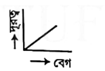
- [ ] 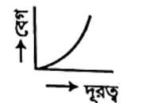
- [x] 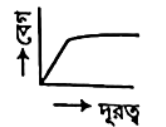
- [ ] 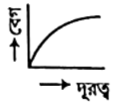

### Explanation

## Question: p1c07-078
- **Subject:** #p1
- **Chapter:** #c07
- **Topic:** #অন্ত্যবেগ_বা_প্রান্তিক_বেগ
- **Source:** #Book_ইসহাক_স্যার
- **Type:** #MCQ
- **Difficulty:** #medium
- **Board Exam:** #All_Board_14
- **Admission Exam:**
- **College Exam:**
- **Book Question Number:** 35
- **Tags:** #অন্ত্যবেগ_বা_প্রান্তিক_বেগ

প্রান্তবেগ সান্দ্রতা গুণাঙ্কের—

### Options
- [ ] সমানুপাতিক
- [x] ব্যস্তানুপাতিক
- [ ] বর্গমূলের সমানুপাতিক
- [ ] বর্গমূলের ব্যস্তানুপাতিক

### Explanation

## Question: p1c07-079
- **Subject:** #p1
- **Chapter:** #c07
- **Topic:** #অন্ত্যবেগ_বা_প্রান্তিক_বেগ
- **Source:** #Book_ইসহাক_স্যার
- **Type:** #MCQ
- **Difficulty:** #medium
- **Board Exam:**
- **Admission Exam:**
- **College Exam:**
- **Book Question Number:** 49
- **Tags:** #অন্ত্যবেগ_বা_প্রান্তিক_বেগ

সান্দ্র মাধ্যমের মধ্য দিয়ে পতনশীল $r$ ব্যাসার্ধের একটি বস্তুর প্রান্তীয় বেগ $v$ হলে—

### Options
- [ ] $v \propto r$
- [ ] $v \propto r^{-2}$
- [ ] $v \propto r^{-1}$
- [x] $v \propto r^2$

### Explanation

## Question: p1c07-080
- **Subject:** #p1
- **Chapter:** #c07
- **Topic:** #অন্ত্যবেগ_বা_প্রান্তিক_বেগ
- **Source:** #Book_ইসহাক_স্যার
- **Type:** #MCQ
- **Difficulty:** #medium
- **Board Exam:** #DB_17, #JB_17, #DiB_17, #BB_16
- **Admission Exam:**
- **College Exam:**
- **Book Question Number:** 54
- **Tags:** #অন্ত্যবেগ_বা_প্রান্তিক_বেগ

একটি তরলের মধ্যে নিরেট গোলাকার বস্তুকে ফেলে দিলে সময়ের সাথে বেগের পরিবর্তন হবে—

### Options
- [ ] 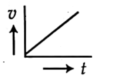
- [ ] 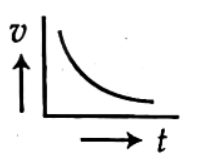
- [ ] 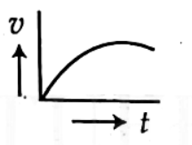
- [x] 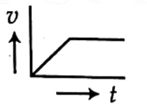

### Explanation

## Question: p1c07-081
- **Subject:** #p1
- **Chapter:** #c07
- **Topic:** #অন্ত্যবেগ_বা_প্রান্তিক_বেগ
- **Source:** #Book_ইসহাক_স্যার
- **Type:** #MCQ
- **Difficulty:** #hard
- **Board Exam:**
- **Admission Exam:** #BUET_13-14
- **College Exam:**
- **Book Question Number:** 108
- **Tags:** #অন্ত্যবেগ_বা_প্রান্তিক_বেগ

$50\text{ km}$ উঁচু থেকে পড়ন্ত দুটি শিলাপিণ্ডের ব্যাসার্ধের অনুপাত $1 : 2$। শিলা খণ্ড দুটির অন্তবেগের অনুপাত কত?

### Options
- [ ] $1 : 9$
- [ ] $9 : 1$
- [ ] $4 : 1$
- [x] $1 : 4$

### Explanation

## Question: p1c07-082
- **Subject:** #p1
- **Chapter:** #c07
- **Topic:** #অন্ত্যবেগ_বা_প্রান্তিক_বেগ
- **Source:** #Book_ইসহাক_স্যার
- **Type:** #MCQ
- **Difficulty:** #medium
- **Board Exam:**
- **Admission Exam:** #BUET_11-12
- **College Exam:**
- **Book Question Number:** 110
- **Tags:** #অন্ত্যবেগ_বা_প্রান্তিক_বেগ

একটি ধাতুর তৈরি দুটি গোলক যাদের একটির ব্যাসার্ধ অন্যটির দ্বিগুণ। গোলক দুটিকে তরল পদার্থে পূর্ণ একটি লম্বা জারের ভেতর দিয়ে পড়তে দেওয়া হলো, ছোটটির তুলনায় বড়টির টার্মিনাল গতি—

### Options
- [ ] একই থাকবে
- [ ] দ্বিগুণ হবে
- [x] চারগুণ হবে
- [ ] অর্ধেক হবে

### Explanation

## Question: p1c07-083
- **Subject:** #p1
- **Chapter:** #c07
- **Topic:** #পৃষ্ঠটান
- **Source:** #Book_ইসহাক_স্যার
- **Type:** #MCQ
- **Difficulty:** #easy
- **Board Exam:** #RB_19
- **Admission Exam:** #CU_22-23, #DU_16-17, #JU_11-12
- **College Exam:**
- **Book Question Number:** 2
- **Tags:** #পৃষ্ঠটান

বিভিন্ন পদার্থের অণুগুলোর মধ্যে পারস্পরিক আকর্ষণ বলকে কী বল বলে ?

### Options
- [x] আসঞ্জন বল
- [ ] সংশক্তি বল
- [ ] পৃষ্ঠ টান
- [ ] পৃষ্ঠ শক্তি

### Explanation

## Question: p1c07-084
- **Subject:** #p1
- **Chapter:** #c07
- **Topic:** #পৃষ্ঠটান
- **Source:** #Book_ইসহাক_স্যার
- **Type:** #MCQ
- **Difficulty:** #easy
- **Board Exam:**
- **Admission Exam:** #JnU_16-17, #JU_11-12, #DU_16-17
- **College Exam:**
- **Book Question Number:** 3
- **Tags:** #পৃষ্ঠটান

একই পদার্থের বিভিন্ন অণুর মধ্যে পারস্পরিক আকর্ষণ বলকে কী বলে ?

### Options
- [ ] আসঞ্জন বল
- [ ] পৃষ্ঠশক্তি
- [x] সংশক্তি বল
- [ ] পৃষ্ঠটান

### Explanation

## Question: p1c07-085
- **Subject:** #p1
- **Chapter:** #c07
- **Topic:** #পৃষ্ঠটান
- **Source:** #Book_ইসহাক_স্যার
- **Type:** #MCQ
- **Difficulty:** #medium
- **Board Exam:** #JB_19, #JB_16
- **Admission Exam:**
- **College Exam:**
- **Book Question Number:** 22
- **Tags:** #পৃষ্ঠটান

পানির উপরিতল হতে $0.5\text{ m}$ লম্বা একটি অনুভূমিক তারকে টেনে তুলতে তারের ওজনসহ সর্বাধিক $72.8 \times 10^{-3}\text{ N}$ বলের প্রয়োজন হয়। পানির পৃষ্ঠটান কত?

### Options
- [ ] $145.6 \times 10^{-3}\text{ Nm}^{-1}$
- [x] $72.8 \times 10^{-3}\text{ Nm}^{-1}$
- [ ] $14.56 \times 10^{-3}\text{ Nm}^{-1}$
- [ ] $7.28 \times 10^{-3}\text{ Nm}^{-1}$

### Explanation

## Question: p1c07-086
- **Subject:** #p1
- **Chapter:** #c07
- **Topic:** #পৃষ্ঠটান
- **Source:** #Book_ইসহাক_স্যার
- **Type:** #MCQ
- **Difficulty:** #easy
- **Board Exam:** #RB_15
- **Admission Exam:**
- **College Exam:**
- **Book Question Number:** 39
- **Tags:** #পৃষ্ঠটান

প্রভাব গোলকের ব্যাসার্ধ কোনটি?

### Options
- [ ] $10^{-15}\text{ m}$
- [x] $10^{-10}\text{ m}$
- [ ] $10^{-9}\text{ m}$
- [ ] $10^{-8}\text{ m}$

### Explanation

## Question: p1c07-087
- **Subject:** #p1
- **Chapter:** #c07
- **Topic:** #পৃষ্ঠটান
- **Source:** #Book_ইসহাক_স্যার
- **Type:** #MCQ
- **Difficulty:** #medium
- **Board Exam:** #DiB_15
- **Admission Exam:** #RU_15-16
- **College Exam:**
- **Book Question Number:** 41
- **Tags:** #পৃষ্ঠটান

পানির পৃষ্ঠটান হ্রাস পায়—
i. তাপমাত্রা হ্রাস পেলে
ii. তাপমাত্রা বৃদ্ধি পেলে
iii. সাবানের ফেনা মেশালে
নিচের কোনটি সঠিক?

### Options
- [ ] i ও ii
- [ ] i ও iii
- [x] ii ও iii
- [ ] i, ii ও iii

### Explanation

## Question: p1c07-088
- **Subject:** #p1
- **Chapter:** #c07
- **Topic:** #পৃষ্ঠটান
- **Source:** #Book_ইসহাক_স্যার
- **Type:** #MCQ
- **Difficulty:** #easy
- **Board Exam:** #DiB_15
- **Admission Exam:** #RU_15-16
- **College Exam:**
- **Book Question Number:** 42
- **Tags:** #পৃষ্ঠটান

যখন পানিতে কিছু ডিটারজেন্ট মেশানো হয় তখন এর পৃষ্ঠটান—

### Options
- [ ] বৃদ্ধি পায়
- [x] হ্রাস পায়
- [ ] অপরিবর্তিত থাকে
- [ ] শূন্য হয়

### Explanation

## Question: p1c07-089
- **Subject:** #p1
- **Chapter:** #c07
- **Topic:** #পৃষ্ঠটান
- **Source:** #Book_ইসহাক_স্যার
- **Type:** #MCQ
- **Difficulty:** #easy
- **Board Exam:** #BB_17
- **Admission Exam:** #DU_12-13
- **College Exam:**
- **Book Question Number:** 44
- **Tags:** #পৃষ্ঠটান

পৃষ্ঠটানের একক—

### Options
- [x] নিউটন/মিটার
- [ ] নিউটন/মিটার$^2$
- [ ] নিউটন-মিটার
- [ ] নিউটন

### Explanation

## Question: p1c07-090
- **Subject:** #p1
- **Chapter:** #c07
- **Topic:** #পৃষ্ঠটান
- **Source:** #Book_ইসহাক_স্যার
- **Type:** #MCQ
- **Difficulty:** #medium
- **Board Exam:** #DB_19
- **Admission Exam:** #CoU_19-20, #DU_19-20, #PSTU_17-18, #CU_15-16, #MBSTU_15-16, #BUET_09-10
- **College Exam:**
- **Book Question Number:** 48
- **Tags:** #পৃষ্ঠটান

ছোটো ছোটো তরল বিন্দু গোলাকার ধারণ করার কারণ হলো—

### Options
- [ ] মহাকর্ষীয় বল
- [ ] আসঞ্জন বল
- [ ] সকল দিক থেকে সমান চাপ
- [x] পৃষ্ঠটান বল

### Explanation

## Question: p1c07-091
- **Subject:** #p1
- **Chapter:** #c07
- **Topic:** #পৃষ্ঠটান
- **Source:** #Book_ইসহাক_স্যার
- **Type:** #MCQ
- **Difficulty:** #medium
- **Board Exam:**
- **Admission Exam:**
- **College Exam:**
- **Book Question Number:** 55
- **Tags:** #পৃষ্ঠটান

$25^\circ\text{C}$ তাপমাত্রায় কোনো তরলের উপরিতল থেকে $0.08\text{ m}$ লম্বা একটি হালকা অনুভূমিক তারকে $4.32 \times 10^{-3}\text{ N}$ বলে টেনে উঠানো হলে তরলের পৃষ্ঠটান কত নিউটন/ মিটার হবে?

### Options
- [ ] $1.79 \times 10^{-5}$
- [ ] $17.9 \times 10^{-5}$
- [ ] $1.89 \times 10^{-5}$
- [x] $2.7 \times 10^{-2}$

### Explanation

## Question: p1c07-092
- **Subject:** #p1
- **Chapter:** #c07
- **Topic:** #পৃষ্ঠটান
- **Source:** #Book_ইসহাক_স্যার
- **Type:** #MCQ
- **Difficulty:** #easy
- **Board Exam:**
- **Admission Exam:** #DU_17-18, #CU_15-16, #DU_20-21, #CU_20-21, #DU_14-15, #CU_11-12
- **College Exam:**
- **Book Question Number:** 58
- **Tags:** #পৃষ্ঠটান

পৃষ্ঠটানের মাত্রা সমীকরণ হলো—

### Options
- [ ] $[ML^{-1}T^{-1}]$
- [ ] $[ML^{-1}]$
- [ ] $[MT^{-1}]$
- [x] $[MT^{-2}]$

### Explanation

## Question: p1c07-093
- **Subject:** #p1
- **Chapter:** #c07
- **Topic:** #পৃষ্ঠটান
- **Source:** #Book_ইসহাক_স্যার
- **Type:** #MCQ
- **Difficulty:** #easy
- **Board Exam:** #DB_19
- **Admission Exam:** #DU_19-20, #CoM_19-20, #MBSTU_15-16, #BUET_09-10, #IU_02-03, #CU_22-23, #PUST_17-18
- **College Exam:**
- **Book Question Number:** 76
- **Tags:** #পৃষ্ঠটান

কোন ধর্মের কারণে পানির ফোঁটা গোলাকৃতি হয়?

### Options
- [x] তলটান
- [ ] সান্দ্রতা
- [ ] কৈশিকতা
- [ ] স্থিতিস্থাপকতা

### Explanation

## Question: p1c07-094
- **Subject:** #p1
- **Chapter:** #c07
- **Topic:** #পৃষ্ঠশক্তি
- **Source:** #Book_ইসহাক_স্যার
- **Type:** #MCQ
- **Difficulty:** #easy
- **Board Exam:** #SB_19, #RB_15
- **Admission Exam:** #DU_17-18, #CU_22-23
- **College Exam:**
- **Book Question Number:** 11
- **Tags:** #পৃষ্ঠশক্তি

পৃষ্ঠটান ($T$) এবং পৃষ্ঠশক্তি ($E$)-এর মধ্যে সম্পর্ক কীরূপ ?

### Options
- [ ] $E = 2T$
- [ ] $E = \frac{T}{2}$
- [ ] $E = \frac{T}{4}$
- [x] $E = T$

### Explanation

## Question: p1c07-095
- **Subject:** #p1
- **Chapter:** #c07
- **Topic:** #পৃষ্ঠশক্তি
- **Source:** #Book_ইসহাক_স্যার
- **Type:** #MCQ
- **Difficulty:** #easy
- **Board Exam:** #DB_16, #BB_16
- **Admission Exam:** #JUST_19-20, #BSFMSTU_19-20, #JU_20-21, #BSMRSTU_19-20
- **College Exam:**
- **Book Question Number:** 17
- **Tags:** #পৃষ্ঠশক্তি

পৃষ্ঠ শক্তির একক কোনটি?

### Options
- [ ] $\text{Nm}$
- [ ] $\text{N}^{-1}\text{m}$
- [ ] $\text{Nm}^{-2}$
- [x] $\text{Nm}^{-1}$

### Explanation

## Question: p1c07-096
- **Subject:** #p1
- **Chapter:** #c07
- **Topic:** #পৃষ্ঠশক্তি
- **Source:** #Book_ইসহাক_স্যার
- **Type:** #MCQ
- **Difficulty:** #medium
- **Board Exam:** #BB_16
- **Admission Exam:**
- **College Exam:**
- **Book Question Number:** 28
- **Tags:** #পৃষ্ঠশক্তি

$5\text{ cm}$ ব্যাসার্ধের বুদবুদ সৃষ্টি করতে কৃত কাজ কত? ($T = 3 \times 10^{-2}\text{ Nm}^{-1}$)

### Options
- [ ] $0.88 \times 10^{-3}\text{ J}$
- [ ] $0.98 \times 10^{-3}\text{ J}$
- [x] $1.88 \times 10^{-3}\text{ J}$
- [ ] $2.88 \times 10^{-3}\text{ J}$

### Explanation

## Question: p1c07-097
- **Subject:** #p1
- **Chapter:** #c07
- **Topic:** #পৃষ্ঠশক্তি
- **Source:** #Book_ইসহাক_স্যার
- **Type:** #MCQ
- **Difficulty:** #easy
- **Board Exam:** #SB_16
- **Admission Exam:**
- **College Exam:**
- **Book Question Number:** 30
- **Tags:** #পৃষ্ঠশক্তি

কোনো তরলের পৃষ্ঠের ক্ষেত্রফল এক একক বৃদ্ধি করতে কৃত কাজকে বলা হয়—

### Options
- [ ] পৃষ্ঠটান
- [ ] সান্দ্রতা
- [x] পৃষ্ঠ শক্তি
- [ ] আয়তন পীড়ন

### Explanation

## Question: p1c07-098
- **Subject:** #p1
- **Chapter:** #c07
- **Topic:** #পৃষ্ঠশক্তি
- **Source:** #Book_ইসহাক_স্যার
- **Type:** #MCQ
- **Difficulty:** #medium
- **Board Exam:** #ChB_23, #DB_16
- **Admission Exam:** #RU_17-18, #JU_19-20, #DU_21-22
- **College Exam:**
- **Book Question Number:** 60
- **Tags:** #পৃষ্ঠশক্তি

বৃষ্টির একটি বড়ো ফোঁটা ভেঙে অনেকগুলো ছোটো ফোঁটায় পরিণত হলে ফোঁটাগুলোর সর্বমোট—

### Options
- [ ] ক্ষেত্রফল হ্রাস পায়
- [x] ক্ষেত্রফল বৃদ্ধি পায়
- [ ] আয়তন হ্রাস পায়
- [ ] ক্ষেত্রফল অপরিবর্তিত থাকে

### Explanation

## Question: p1c07-099
- **Subject:** #p1
- **Chapter:** #c07
- **Topic:** #পৃষ্ঠশক্তি
- **Source:** #Book_ইসহাক_স্যার
- **Type:** #MCQ
- **Difficulty:** #easy
- **Board Exam:** #SB_19
- **Admission Exam:**
- **College Exam:**
- **Book Question Number:** 75
- **Tags:** #পৃষ্ঠশক্তি

পানির পৃষ্ঠটান $0.06\text{ N/m}$ হলে তার পৃষ্ঠশক্তি—

### Options
- [ ] $60\text{ N/m}$
- [ ] $6\text{ N/m}$
- [ ] $0.6\text{ N/m}$
- [x] $0.06\text{ N/m}$

### Explanation

## Question: p1c07-100
- **Subject:** #p1
- **Chapter:** #c07
- **Topic:** #স্পর্শকোণ
- **Source:** #Book_ইসহাক_স্যার
- **Type:** #MCQ
- **Difficulty:** #hard
- **Board Exam:**
- **Admission Exam:** #BUET_13-14, #MBSTU_19-20, #DU_19-20, #RU_19-20, #SAU_17-18, #BRUR_12-13, #BAU_14-15, #JU_22-23, #BMA_15-16, #BSMRSTU_19-20
- **College Exam:**
- **Book Question Number:** 4
- **Tags:** #স্পর্শকোণ

কাঁচ ও পারদের স্পর্শ কোণ $\theta$ হবে—

### Options
- [ ] $0 < \theta < 90^\circ$
- [x] $90^\circ < \theta < 180^\circ$
- [ ] $\theta = 90^\circ$
- [ ] $\theta = 180^\circ$

### Explanation

## Question: p1c07-101
- **Subject:** #p1
- **Chapter:** #c07
- **Topic:** #স্পর্শকোণ
- **Source:** #Book_ইসহাক_স্যার
- **Type:** #MCQ
- **Difficulty:** #medium
- **Board Exam:** #DB_16
- **Admission Exam:**
- **College Exam:**
- **Book Question Number:** 16
- **Tags:** #স্পর্শকোণ

চিত্রানুসারে—
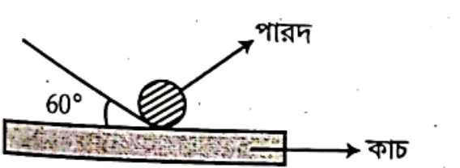
(i) সংশক্তি বল > আসঞ্জন বল
(ii) আসঞ্জন বল > সংশক্তি বল
(iii) $60^\circ$ হলো স্পর্শ কোণ
নিচের কোনটি সঠিক?

### Options
- [x] i
- [ ] i ও iii
- [ ] i ও ii
- [ ] ii ও iii

### Explanation

## Question: p1c07-102
- **Subject:** #p1
- **Chapter:** #c07
- **Topic:** #স্পর্শকোণ
- **Source:** #Book_ইসহাক_স্যার
- **Type:** #MCQ
- **Difficulty:** #medium
- **Board Exam:** #RB_16
- **Admission Exam:**
- **College Exam:**
- **Book Question Number:** 18
- **Tags:** #স্পর্শকোণ

কঠিনের ঘনত্ব $\rho_S$, তরলের ঘনত্ব $\rho_L$ এবং স্পর্শ কোণ $\theta$ হলে কোনটি সঠিক?

### Options
- [ ] $\rho_S > \rho_L, \theta = 90^\circ$
- [ ] $\rho_S < \rho_L, \theta = 90^\circ$
- [ ] $\rho_S > \rho_L, \theta > 90^\circ$
- [x] $\rho_S > \rho_L, \theta < 90^\circ$

### Explanation

## Question: p1c07-103
- **Subject:** #p1
- **Chapter:** #c07
- **Topic:** #স্পর্শকোণ
- **Source:** #Book_ইসহাক_স্যার
- **Type:** #MCQ
- **Difficulty:** #medium
- **Board Exam:** #JB_16
- **Admission Exam:**
- **College Exam:**
- **Book Question Number:** 25
- **Tags:** #স্পর্শকোণ

নিচের কোন ঘনত্বের তরলের মধ্যে কাচনল ডুবানো হলে স্থূল স্পর্শ কোণ হবে?

### Options
- [ ] $0.8 \times 10^3\text{ kgm}^{-3}$
- [ ] $0.87 \times 10^3\text{ kgm}^{-3}$
- [ ] $1 \times 10^3\text{ kgm}^{-3}$
- [x] $13.6 \times 10^3\text{ kgm}^{-3}$

### Explanation

## Question: p1c07-104
- **Subject:** #p1
- **Chapter:** #c07
- **Topic:** #স্পর্শকোণ
- **Source:** #Book_ইসহাক_স্যার
- **Type:** #MCQ
- **Difficulty:** #easy
- **Board Exam:** #SB_16
- **Admission Exam:**
- **College Exam:**
- **Book Question Number:** 31
- **Tags:** #স্পর্শকোণ

স্পর্শ কোণ নির্ভর করে—
i. কঠিন ও তরলের প্রকৃতির ওপর
ii. তরলের উচ্চতার ওপর
iii. কঠিন ও তরলের বিশুদ্ধতার ওপর
নিচের কোনটি সঠিক?

### Options
- [ ] i ও ii
- [ ] ii ও iii
- [x] i ও iii
- [ ] i, ii ও iii

### Explanation

## Question: p1c07-105
- **Subject:** #p1
- **Chapter:** #c07
- **Topic:** #স্পর্শকোণ
- **Source:** #Book_ইসহাক_স্যার
- **Type:** #MCQ
- **Difficulty:** #medium
- **Board Exam:** #RB_19, #DiB_15
- **Admission Exam:** #KU_19-20, #SUST_18-19, #BMA_15-16, #CU_21-22, #BSMRSTU_19-20
- **College Exam:**
- **Book Question Number:** 40
- **Tags:** #স্পর্শকোণ

যেসব তরল কাচকে ভেজায় না তাদের স্পর্শ কোণ—

### Options
- [ ] প্রায় শূন্য
- [ ] প্রায় $90^\circ$
- [ ] $90^\circ$-এর চেয়ে ছোট
- [x] $90^\circ$-এর চেয়ে বড়

### Explanation

## Question: p1c07-106
- **Subject:** #p1
- **Chapter:** #c07
- **Topic:** #স্পর্শকোণ
- **Source:** #Book_ইসহাক_স্যার
- **Type:** #MCQ
- **Difficulty:** #easy
- **Board Exam:** #SB_15
- **Admission Exam:**
- **College Exam:**
- **Book Question Number:** 43
- **Tags:** #স্পর্শকোণ

একটি কৈশিক নলকে গ্লিসারিনে ডুবালে—
i. কাচ ও গ্লিসারিনের স্পর্শ কোণ সূক্ষ্ম কোণ হয়
ii. তরল পৃষ্ঠ অবতল আকার ধারণ করে
iii. কাচ ও গ্লিসারিনের স্পর্শ কোণ স্থূল কোণ হয়
নিচের কোনটি সঠিক?

### Options
- [x] i ও ii
- [ ] i ও iii
- [ ] ii ও iii
- [ ] i, ii ও iii

### Explanation

## Question: p1c07-107
- **Subject:** #p1
- **Chapter:** #c07
- **Topic:** #স্পর্শকোণ
- **Source:** #Book_ইসহাক_স্যার
- **Type:** #MCQ
- **Difficulty:** #medium
- **Board Exam:** #BB_15
- **Admission Exam:** #RU_20-21
- **College Exam:**
- **Book Question Number:** 45
- **Tags:** #স্পর্শকোণ

স্পর্শ কোণ $120^\circ$ হলে কৈশিক নলে তরল—
i. ওপরে উঠবে
ii. নিচে নামবে
iii. অপরিবর্তিত থাকবে
নিচের কোনটি সঠিক?

### Options
- [ ] i
- [x] ii
- [ ] i ও iii
- [ ] ii ও iii

### Explanation

## Question: p1c07-108
- **Subject:** #p1
- **Chapter:** #c07
- **Topic:** #স্পর্শকোণ
- **Source:** #Book_ইসহাক_স্যার
- **Type:** #MCQ
- **Difficulty:** #medium
- **Board Exam:** #DiB_16
- **Admission Exam:** #RU_16-17, #MBSTU_19-20, #CU_20-21, #BSMRSTU_19-20
- **College Exam:**
- **Book Question Number:** 57
- **Tags:** #স্পর্শকোণ

যদি স্পর্শ কোণ $90^\circ$-এর বেশি হয়, তবে তরলের পৃষ্ঠ হবে—

### Options
- [x] উত্তল
- [ ] অবতল
- [ ] সমতলাবতল
- [ ] সমতলোত্তল

### Explanation

## Question: p1c07-109
- **Subject:** #p1
- **Chapter:** #c07
- **Topic:** #স্পর্শকোণ
- **Source:** #Book_ইসহাক_স্যার
- **Type:** #MCQ
- **Difficulty:** #medium
- **Board Exam:** #CB_19
- **Admission Exam:**
- **College Exam:**
- **Book Question Number:** 82
- **Tags:** #স্পর্শকোণ

স্পর্শকোণ $\theta$ হলে—
i. কাচ ও পানির ক্ষেত্রে $0^\circ < \theta < 90^\circ$
ii. পারদ ও কাচের ক্ষেত্রে $0^\circ < \theta < 180^\circ$
iii. কাচ ও কেরোসিনের ক্ষেত্রে $0^\circ < \theta < 90^\circ$
নিচের কোনটি সঠিক?

### Options
- [ ] i
- [ ] ii
- [ ] i ও iii
- [x] i, ii ও iii

### Explanation

## Question: p1c07-110
- **Subject:** #p1
- **Chapter:** #c07
- **Topic:** #স্পর্শকোণ
- **Source:** #Book_ইসহাক_স্যার
- **Type:** #MCQ
- **Difficulty:** #medium
- **Board Exam:**
- **Admission Exam:** #Medical_22-23
- **College Exam:**
- **Book Question Number:** 104
- **Tags:** #স্পর্শকোণ

কঠিন ও তরলের মধ্যকার স্পর্শকোণের মান কত হলে তরল পদার্থ কঠিন পদার্থকে ভেজাবে না?

### Options
- [x] $120^\circ$
- [ ] $0^\circ$
- [ ] $40^\circ$
- [ ] $60^\circ$

### Explanation

## Question: p1c07-111
- **Subject:** #p1
- **Chapter:** #c07
- **Topic:** #স্পর্শকোণ
- **Source:** #Book_ইসহাক_স্যার
- **Type:** #MCQ
- **Difficulty:** #medium
- **Board Exam:**
- **Admission Exam:** #CU_20-21
- **College Exam:**
- **Book Question Number:** 105
- **Tags:** #স্পর্শকোণ

কোনো তরলে স্পর্শকোণ $90^\circ$ থেকে কম হলে ঐ তরলের তল কীরূপ হবে?

### Options
- [ ] উত্তল
- [x] অবতল
- [ ] সমাবতল
- [ ] সমোত্তল

### Explanation

## Question: p1c07-112
- **Subject:** #p1
- **Chapter:** #c07
- **Topic:** #স্পর্শকোণ
- **Source:** #Book_ইসহাক_স্যার
- **Type:** #MCQ
- **Difficulty:** #hard
- **Board Exam:**
- **Admission Exam:** #BUET_13-14
- **College Exam:**
- **Book Question Number:** 109
- **Tags:** #স্পর্শকোণ

কাচ ও পারদের স্পর্শকোণ $\theta$ হবে—

### Options
- [ ] $0 < \theta < 90^\circ$
- [x] $90^\circ < \theta < 180^\circ$
- [ ] $\theta = 90^\circ$
- [ ] $\theta = 180^\circ$

### Explanation

## Question: p1c07-113
- **Subject:** #p1
- **Chapter:** #c07
- **Topic:** #পৃষ্ঠটান_সম্পর্কিত_কয়েকটি_ঘটনা
- **Source:** #Book_ইসহাক_স্যার
- **Type:** #MCQ
- **Difficulty:** #hard
- **Board Exam:**
- **Admission Exam:** #SUST_16-17
- **College Exam:**
- **Book Question Number:** 68
- **Tags:** #পৃষ্ঠটান_সম্পর্কিত_কয়েকটি_ঘটনা

একটি কৈশিক নলের ব্যাস $0.2\text{ mm}$। একে $7.2 \times 10^{-2}\text{ Nm}^{-1}$ পৃষ্ঠটান এবং $10^3\text{ kg/m}^3$ ঘনত্বের পানিতে ডুবালে নলের কত $\text{m}$ উচ্চতায় পানি উঠবে ?

### Options
- [ ] $0.25$
- [x] $0.5$
- [ ] $0.45$
- [ ] $0.35$
- [ ] $0.40$

### Explanation

## Question: p1c07-114
- **Subject:** #p1
- **Chapter:** #c07
- **Topic:** #পৃষ্ঠটান_সম্পর্কিত_কয়েকটি_ঘটনা
- **Source:** #Book_ইসহাক_স্যার
- **Type:** #MCQ
- **Difficulty:** #hard
- **Board Exam:** #SB_19
- **Admission Exam:** #SUST_16-17, #BSMRSTU_17-18
- **College Exam:**
- **Book Question Number:** 87
- **Tags:** #পৃষ্ঠটান_সম্পর্কিত_কয়েকটি_ঘটনা

একটি কৈশিক নলের ব্যাস $0.4\text{ mm}$। একে $72 \times 10^{-3}\text{ N/m}$ পৃষ্ঠটান এবং $10^3\text{ kg m}^{-3}$ ঘনত্বের পানিতে ডুবানো হলো। তথ্যের আলোকে ৮৭ ও ৮৮নং প্রশ্নের উত্তর দাও:
নলের কত উচ্চতায় পানি উঠবে?

### Options
- [ ] $7.3469\text{ m}$
- [ ] $0.73469\text{ m}$
- [x] $0.073469\text{ m}$
- [ ] $0.00734\text{ m}$

### Explanation

## Question: p1c07-115
- **Subject:** #p1
- **Chapter:** #c07
- **Topic:** #পৃষ্ঠটান_সম্পর্কিত_কয়েকটি_ঘটনা
- **Source:** #Book_ইসহাক_স্যার
- **Type:** #MCQ
- **Difficulty:** #hard
- **Board Exam:**
- **Admission Exam:**
- **College Exam:**
- **Book Question Number:** 88
- **Tags:** #পৃষ্ঠটান_সম্পর্কিত_কয়েকটি_ঘটনা

ব্যাসার্ধ দ্বিগুণ হলে নলের কত উচ্চতায় পানি উঠবে?

### Options
- [ ] $0.00367\text{ m}$
- [x] $0.03673\text{ m}$
- [ ] $0.3673\text{ m}$
- [ ] $3.6734\text{ m}$

### Explanation