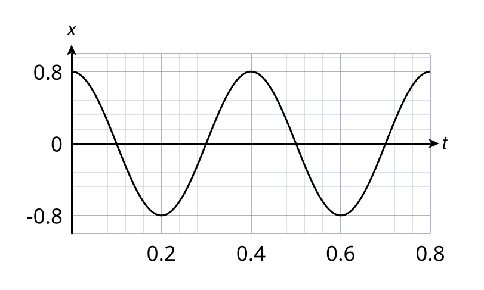
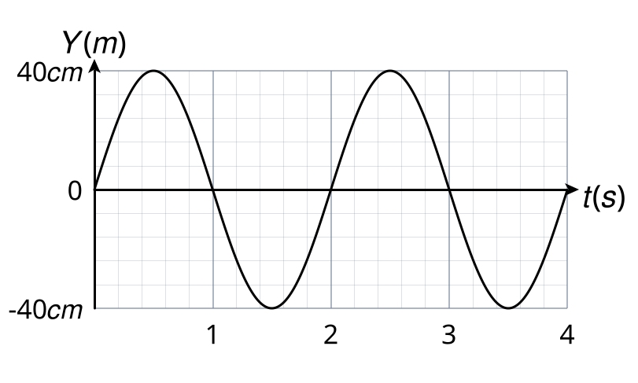
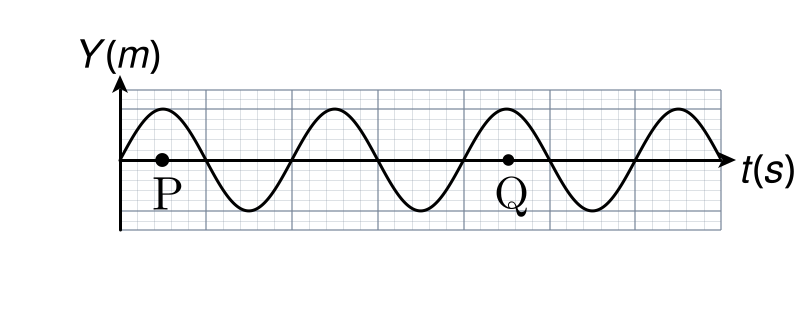

## Question: p1c08-001
- **Subject:** #p1
- **Chapter:** #c08
- **Topic:** #পর্যায়বৃত্তি_গতি
- **Source:** #Book_ইসহাক_স্যার
- **Type:** #MCQ
- **Difficulty:** #easy
- **Board Exam:** #CB_23
- **Admission Exam:**
- **College Exam:**
- **Book Question Number:** 68
- **Tags:** #পর্যায়বৃত্তি_গতি, #দোলন_গতি

নিচের কোনটি দোলন গতির উদাহরণ?

### Options
- [ ] ঘড়ির কাঁটার গতি
- [x] সুরশলাকার গতি
- [ ] বৈদ্যুতিক পাখার গতি
- [ ] সূর্যের চারদিকে পৃথিবীর গতি

### Explanation
## Question: p1c08-002
- **Subject:** #p1
- **Chapter:** #c08
- **Topic:** #সরল_দোলন_গতি_বা_সরল_ছন্দিত_গতি
- **Source:** #Book_ইসহাক_স্যার
- **Type:** #MCQ
- **Difficulty:** #medium
- **Board Exam:** #RB_19, #SB_17
- **Admission Exam:**
- **College Exam:**
- **Book Question Number:** 1
- **Tags:** #সরল_ছন্দিত_গতি, #বৈশিষ্ট্য

সরল ছন্দিত স্পন্দনের বৈশিষ্ট্য-
i. বস্তুর গতি পর্যায় গতি
ii. ত্বরণ বস্তুর সরণ অভিমুখী
iii. ত্বরণ বস্তুর সরণের সমানুপাতিক
নিচের কোনটি সঠিক?

### Options
- [ ] i ও ii
- [x] i ও iii
- [ ] ii ও iii
- [ ] i, ii ও iii

### Explanation
## Question: p1c08-003
- **Subject:** #p1
- **Chapter:** #c08
- **Topic:** #সরল_দোলন_গতি_বা_সরল_ছন্দিত_গতি
- **Source:** #Book_ইসহাক_স্যার
- **Type:** #MCQ
- **Difficulty:** #medium
- **Board Exam:** #RB_21, #RB_16, #BB_16
- **Admission Exam:**
- **College Exam:**
- **Book Question Number:** 9
- **Tags:** #সরল_ছন্দিত_গতি, #ত্বরণ

সরল ছন্দিত গতিসম্পন্ন কোনো কণার ত্বরণ কোন রাশিটির সমানুপাতিক?

### Options
- [ ] বল
- [x] সরণ
- [ ] পর্যায়কাল
- [ ] বেগ

### Explanation
## Question: p1c08-004
- **Subject:** #p1
- **Chapter:** #c08
- **Topic:** #সরল_দোলন_গতি_বা_সরল_ছন্দিত_গতি
- **Source:** #Book_ইসহাক_স্যার
- **Type:** #MCQ
- **Difficulty:** #medium
- **Board Exam:** #RB_16
- **Admission Exam:**
- **College Exam:**
- **Book Question Number:** 26
- **Tags:** #সরল_ছন্দিত_গতি, #পর্যাবৃত্ত

পৃথিবীর ব্যাস বরাবর সুড়ঙ্গের মধ্যে বস্তুর গতি-
i. পর্যাবৃত্ত
ii. স্পন্দন
iii. সরলরৈখিক
নিচের কোনটি সঠিক?

### Options
- [ ] i ও ii
- [ ] i ও iii
- [ ] ii ও iii
- [x] i, ii ও iii

### Explanation
## Question: p1c08-005
- **Subject:** #p1
- **Chapter:** #c08
- **Topic:** #সরল_দোলন_গতি_বা_সরল_ছন্দিত_গতি
- **Source:** #Book_ইসহাক_স্যার
- **Type:** #MCQ
- **Difficulty:** #medium
- **Board Exam:** #DB_23, #ChB_16
- **Admission Exam:**
- **College Exam:**
- **Book Question Number:** 28
- **Tags:** #সরল_ছন্দিত_গতি, #প্রত্যায়নক_বল

সরল ছন্দিত স্পন্দনে স্পন্দিত কোনো কণার বারবার স্পন্দিত হবার কারণ-
i. স্থির জড়তা
ii. গতি জড়তা
iii. প্রত্যায়নক বল
নিচের কোনটি সঠিক?

### Options
- [ ] i ও ii
- [ ] i ও iii
- [x] ii ও iii
- [ ] i, ii ও iii

### Explanation
## Question: p1c08-006
- **Subject:** #p1
- **Chapter:** #c08
- **Topic:** #সরল_দোলন_গতি_বা_সরল_ছন্দিত_গতি
- **Source:** #Book_ইসহাক_স্যার
- **Type:** #MCQ
- **Difficulty:** #easy
- **Board Exam:** #CB_15
- **Admission Exam:**
- **College Exam:**
- **Book Question Number:** 35
- **Tags:** #সরল_দোলন_গতি, #উদাহরণ

সরল দোলন গতির বিশেষ ও গুরুত্বপূর্ণ উদাহরণ-
i. উল্লম্ব স্প্রিং-এর গতি
ii. তাৎক্ষণিক গতি
iii. সরল দোলকের গতি
নিচের কোনটি সঠিক?

### Options
- [ ] i ও ii
- [x] i ও iii
- [ ] ii ও iii
- [ ] i, ii ও iii

### Explanation
## Question: p1c08-007
- **Subject:** #p1
- **Chapter:** #c08
- **Topic:** #সরল_দোলন_গতি_বা_সরল_ছন্দিত_গতি
- **Source:** #Book_ইসহাক_স্যার
- **Type:** #MCQ
- **Difficulty:** #easy
- **Board Exam:** #CB_15
- **Admission Exam:**
- **College Exam:**
- **Book Question Number:** 36
- **Tags:** #সরল_ছন্দিত_তরঙ্গ

সরল ছন্দিত তরঙ্গ (SHW)-
i. অনুপ্রস্থ তরঙ্গ
ii. অগ্রগামী তরঙ্গ
iii. অনুদৈর্ঘ্য তরঙ্গ
নিচের কোনটি সঠিক?

### Options
- [ ] i ও ii
- [ ] i ও iii
- [ ] ii ও iii
- [x] i, ii ও iii

### Explanation
## Question: p1c08-008
- **Subject:** #p1
- **Chapter:** #c08
- **Topic:** #সরল_দোলন_গতি_বা_সরল_ছন্দিত_গতি
- **Source:** #Book_ইসহাক_স্যার
- **Type:** #MCQ
- **Difficulty:** #easy
- **Board Exam:** #BB_24
- **Admission Exam:**
- **College Exam:**
- **Book Question Number:** 101
- **Tags:** #সরল_ছন্দিত_গতি, #প্রত্যায়নী_বল

সরল ছন্দিত গতির প্রত্যায়নী বলের ক্ষেত্রে নিচের কোনটি সঠিক?

### Options
- [x] নিউটনের গতিসূত্র মেনে চলে
- [ ] হুকের সূত্র মেনে চলে না
- [ ] সরণের ব্যস্তানুপাতিক
- [ ] সাম্যাবস্থান অভিমুখী নয়

### Explanation
## Question: p1c08-009
- **Subject:** #p1
- **Chapter:** #c08
- **Topic:** #সরল_দোলন_গতির_অন্তরক_বা_ব্যবকলনীয়_সমীকরণ
- **Source:** #Book_ইসহাক_স্যার
- **Type:** #MCQ
- **Difficulty:** #medium
- **Board Exam:** #JB_23, #BB_23, #RB_21
- **Admission Exam:**
- **College Exam:**
- **Book Question Number:** 5
- **Tags:** #ব্যবকলনীয়_সমীকরণ, #কৌণিক_কম্পাঙ্ক

সরল দোলন গতিসম্পন্ন কোনো কণার অন্তরকলন সমীকরণ $4\frac{d^2x}{dt^2} + 100x = 0$ হলে কণাটির কৌণিক কম্পাঙ্ক কত হবে?

### Options
- [ ] $2 \text{ rad/s}$
- [ ] $4 \text{ rad/s}$
- [x] $5 \text{ rad/s}$
- [ ] $100 \text{ rad/s}$

### Explanation
## Question: p1c08-010
- **Subject:** #p1
- **Chapter:** #c08
- **Topic:** #সরল_দোলন_গতির_অন্তরক_সমীকরণের_সমাধান
- **Source:** #Book_ইসহাক_স্যার
- **Type:** #MCQ
- **Difficulty:** #medium
- **Board Exam:** #SB_19
- **Admission Exam:**
- **College Exam:**
- **Book Question Number:** 77
- **Tags:** #সরণের_সমীকরণ, #সরল_ছন্দিত_গতি

সরল ছন্দিত স্পন্দনসম্পন্ন একটি কণার সরণের রাশিমালা হলো-
i. $x=A \sin 2\pi nt$
ii. $y=ax-bx^2$
iii. $x=A \sin \omega t$
নিচের কোনটি সঠিক?

### Options
- [ ] i ও ii
- [x] i ও iii
- [ ] ii ও iii
- [ ] i, ii ও iii

### Explanation
## Question: p1c08-011
- **Subject:** #p1
- **Chapter:** #c08
- **Topic:** #সরল_দোলন_গতিসংক্রান্ত_বিভিন্ন_রাশি
- **Source:** #Book_ইসহাক_স্যার
- **Type:** #MCQ
- **Difficulty:** #medium
- **Board Exam:** #MB_23, #ChB_22, #DB_15
- **Admission Exam:**
- **College Exam:**
- **Book Question Number:** 3
- **Tags:** #সরণ, #বেগ

সরল ছন্দিত গতিসম্পন্ন কণার গতিপথের মধ্য-অবস্থানে-

### Options
- [ ] বেগ সর্বনিম্ন, সরণ সর্বোচ্চ
- [ ] বেগ সর্বনিম্ন, সরণ সর্বনিম্ন
- [ ] বেগ সর্বাধিক, সরণ সর্বাধিক
- [x] বেগ সর্বাধিক, সরণ সর্বনিম্ন

### Explanation
## Question: p1c08-012
- **Subject:** #p1
- **Chapter:** #c08
- **Topic:** #সরল_দোলন_গতিসংক্রান্ত_বিভিন্ন_রাশি
- **Source:** #Book_ইসহাক_স্যার
- **Type:** #MCQ
- **Difficulty:** #medium
- **Board Exam:** #CB_21, #DB_15, #ChB_15
- **Admission Exam:**
- **College Exam:**
- **Book Question Number:** 4
- **Tags:** #ত্বরণ, #সরণ

সরল ছন্দিত স্পন্দনশীল একটি কণার দোলনকাল $10$ সেকেন্ড। কোন সমীকরণটি এর ত্বরণ $a$ এবং সরণ $x$-এর সম্পর্ক প্রকাশ করে?

### Options
- [x] $a = -10\pi x$
- [ ] $a = -(20\pi)x$
- [ ] $a = -(\frac{2\pi}{10})^2 x$
- [ ] $a = -(20\pi)^2 x$

### Explanation
## Question: p1c08-013
- **Subject:** #p1
- **Chapter:** #c08
- **Topic:** #সরল_দোলন_গতিসংক্রান্ত_বিভিন্ন_রাশি
- **Source:** #Book_ইসহাক_স্যার
- **Type:** #MCQ
- **Difficulty:** #medium
- **Board Exam:** #RB_16, #RB_15
- **Admission Exam:** #JU_22-23
- **College Exam:**
- **Book Question Number:** 8
- **Tags:** #সর্বোচ্চ_বেগ

সরল দোলন গতিসম্পন্ন কোনো কণার সর্বোচ্চ বেগ কত হবে?

### Options
- [ ] $v_{max} = \frac{\omega}{A}$
- [ ] $v_{max} = \frac{A}{\omega}$
- [x] $v_{max} = \omega A$
- [ ] $v_{max} = \omega^2 A$

### Explanation
## Question: p1c08-014
- **Subject:** #p1
- **Chapter:** #c08
- **Topic:** #সরল_দোলন_গতিসংক্রান্ত_বিভিন্ন_রাশি
- **Source:** #Book_ইসহাক_স্যার
- **Type:** #MCQ
- **Difficulty:** #easy
- **Board Exam:** #DiB_21, #BB_15
- **Admission Exam:**
- **College Exam:**
- **Book Question Number:** 15
- **Tags:** #ত্বরণের_সমীকরণ

সরল ছন্দিত গতির ক্ষেত্রে ত্বরণের সমীকরণ-

### Options
- [ ] $a = kA \sin \omega t$
- [ ] $a = A\omega \cos \omega t$
- [x] $a = -A\omega^2 \sin \omega t$
- [ ] $a = -A\omega^2 \cos \omega t$

### Explanation
## Question: p1c08-015
- **Subject:** #p1
- **Chapter:** #c08
- **Topic:** #সরল_দোলন_গতিসংক্রান্ত_বিভিন্ন_রাশি
- **Source:** #Book_ইসহাক_স্যার
- **Type:** #MCQ
- **Difficulty:** #easy
- **Board Exam:** #CB_16, #SB_15
- **Admission Exam:**
- **College Exam:**
- **Book Question Number:** 16
- **Tags:** #পর্যায়কাল, #বল_ধ্রুবক

নিচের কোনটি পর্যায়কাল ও বল ধ্রুবকের মধ্যকার সম্পর্ক?

### Options
- [ ] $T = 2\pi\sqrt{\frac{K}{m}}$
- [ ] $T = 2\pi\sqrt{\frac{K}{mg}}$
- [x] $T = 2\pi\sqrt{\frac{m}{K}}$
- [ ] $T = 2\pi\sqrt{\frac{l}{g}}$

### Explanation
## Question: p1c08-016
- **Subject:** #p1
- **Chapter:** #c08
- **Topic:** #সরল_দোলন_গতিসংক্রান্ত_বিভিন্ন_রাশি
- **Source:** #Book_ইসহাক_স্যার
- **Type:** #MCQ
- **Difficulty:** #medium
- **Board Exam:** #SB_23, #DiB_21
- **Admission Exam:**
- **College Exam:**
- **Book Question Number:** 17
- **Tags:** #পর্যায়কাল

নিচের উদ্দীপকটির আলোকে প্রশ্নের উত্তর দাও:
সরল দোলন গতিসম্পন্ন একটি কণার সরণ, $x = \sqrt{3} \sin 2\pi t$
কণাটির পর্যায়কাল কত?

### Options
- [x] $0.5 \text{ s}$
- [ ] $1 \text{ s}$
- [ ] $1.5 \text{ s}$
- [ ] $2 \text{ s}$

### Explanation
## Question: p1c08-017
- **Subject:** #p1
- **Chapter:** #c08
- **Topic:** #সরল_দোলন_গতিসংক্রান্ত_বিভিন্ন_রাশি
- **Source:** #Book_ইসহাক_স্যার
- **Type:** #MCQ
- **Difficulty:** #medium
- **Board Exam:**
- **Admission Exam:**
- **College Exam:**
- **Book Question Number:** 21
- **Tags:** #বেগ, #সরণ

সরল ছন্দিত স্পন্দন গতিসম্পন্ন কোনো কণার ক্ষেত্রে-
i. কণার বেগ সাম্যাবস্থানে সর্বোচ্চ হয়
ii. সরণ বৃদ্ধির সাথে সাথে বেগ হ্রাস পায়
iii. বিস্তারের প্রান্তে বেগ শূন্য হয়
নিচের কোনটি সঠিক?

### Options
- [ ] i ও ii
- [ ] i ও iii
- [ ] ii ও iii
- [x] i, ii ও iii

### Explanation
## Question: p1c08-018
- **Subject:** #p1
- **Chapter:** #c08
- **Topic:** #সরল_দোলন_গতিসংক্রান্ত_বিভিন্ন_রাশি
- **Source:** #Book_ইসহাক_স্যার
- **Type:** #MCQ
- **Difficulty:** #easy
- **Board Exam:** #CB_16
- **Admission Exam:**
- **College Exam:**
- **Book Question Number:** 23
- **Tags:** #দশা_পার্থক্য

সরল ছন্দিত স্পন্দনশীল কণার সর্বোচ্চ অবস্থান ও সাম্যাবস্থার মধ্যে দশা পার্থক্য-

### Options
- [ ] $\frac{\pi}{4}$
- [x] $\frac{\pi}{2}$
- [ ] $\pi$
- [ ] $2\pi$

### Explanation
## Question: p1c08-019
- **Subject:** #p1
- **Chapter:** #c08
- **Topic:** #সরল_দোলন_গতিসংক্রান্ত_বিভিন্ন_রাশি
- **Source:** #Book_ইসহাক_স্যার
- **Type:** #MCQ
- **Difficulty:** #hard
- **Board Exam:** #ChB_16
- **Admission Exam:**
- **College Exam:**
- **Book Question Number:** 24
- **Tags:** #সর্বোচ্চ_ত্বরণ, #লেখচিত্র

নিচের উদ্দীপকটি পড় এবং প্রশ্নের উত্তর দাও:
একটি স্প্রিং-এর ওপরের প্রান্ত আটকানো এবং অপর প্রান্তে $0.25\text{ kg}$ ভরের একটি গোলক ঝুলানো আছে। গোলকটিকে সাম্যাবস্থা হতে $0.08\text{ m}$ ওপরে উঠিয়ে ছেড়ে দেয়া হলো। স্প্রিং-এর গতির সরণ বনাম সময় গ্রাফটি নিচে দেয়া হলো।

গোলকটির সর্বোচ্চ ত্বরণের মান কত?

### Options
- [ ] $\frac{\pi^2}{4}\text{ ms}^{-2}$
- [ ] $\pi^2\text{ ms}^{-2}$
- [x] $2\pi^2\text{ ms}^{-2}$
- [ ] $4\pi^2\text{ ms}^{-2}$

### Explanation
## Question: p1c08-020
- **Subject:** #p1
- **Chapter:** #c08
- **Topic:** #সরল_দোলন_গতিসংক্রান্ত_বিভিন্ন_রাশি
- **Source:** #Book_ইসহাক_স্যার
- **Type:** #MCQ
- **Difficulty:** #easy
- **Board Exam:** #SB_22, #JB_16
- **Admission Exam:**
- **College Exam:**
- **Book Question Number:** 27
- **Tags:** #শূন্য_দশা

নিচের কোনটি শূন্য দশার সমতুল্য?

### Options
- [ ] $\frac{\pi}{2}$
- [ ] $\pi$
- [ ] $\frac{3\pi}{2}$
- [x] $2\pi$

### Explanation
## Question: p1c08-021
- **Subject:** #p1
- **Chapter:** #c08
- **Topic:** #সরল_দোলন_গতিসংক্রান্ত_বিভিন্ন_রাশি
- **Source:** #Book_ইসহাক_স্যার
- **Type:** #MCQ
- **Difficulty:** #medium
- **Board Exam:** #MB_22, #ChB_15
- **Admission Exam:**
- **College Exam:**
- **Book Question Number:** 32
- **Tags:** #বেগ_সময়_লেখচিত্র

সরল ছন্দিত স্পন্দনসম্পন্ন কোনো কণার সমীকরণ $a=A \sin \omega t$ হলে বেগ-সময় লেখচিত্র হবে-

### Options
- [ ] 
- [ ] 
- [ ] 
- [x] 

### Explanation
## Question: p1c08-022
- **Subject:** #p1
- **Chapter:** #c08
- **Topic:** #সরল_দোলন_গতিসংক্রান্ত_বিভিন্ন_রাশি
- **Source:** #Book_ইসহাক_স্যার
- **Type:** #MCQ
- **Difficulty:** #medium
- **Board Exam:** #ChB_15
- **Admission Exam:**
- **College Exam:**
- **Book Question Number:** 33
- **Tags:** #তরঙ্গ_বেগ, #লেখচিত্র

একটি তরঙ্গের সরণ-সময় গ্রাফ নিম্নরূপ-

তরঙ্গটির বেগ কত?

### Options
- [ ] $0\cdot02\text{ cms}^{-1}$
- [ ] $0\cdot20\text{ cms}^{-1}$
- [x] $20\text{ cms}^{-1}$
- [ ] $20\text{ ms}^{-1}$

### Explanation
## Question: p1c08-023
- **Subject:** #p1
- **Chapter:** #c08
- **Topic:** #সরল_দোলন_গতিসংক্রান্ত_বিভিন্ন_রাশি
- **Source:** #Book_ইসহাক_স্যার
- **Type:** #MCQ
- **Difficulty:** #medium
- **Board Exam:** #DB_23, #DiB_23, #CB_15
- **Admission Exam:**
- **College Exam:**
- **Book Question Number:** 37
- **Tags:** #কৌণিক_কম্পাঙ্ক

সরল ছন্দিত গতিসম্পন্ন কোনো কণার গতির সমীকরণ হলো $y=10 \sin(\omega t+\delta)$ পর্যায়কাল $=30\text{ s}$ এবং আদি সরণ $=5\text{ cm}$।
উপরের উদ্দীপকের আলোকে ৩৭নং প্রশ্নের উত্তর দাও:

কোনো কণার কৌণিক কম্পাঙ্ক হলো-

### Options
- [ ] $\frac{\pi}{2}\text{ rad s}^{-1}$
- [ ] $\frac{\pi}{4}\text{ rad s}^{-1}$
- [ ] $\frac{\pi}{12}\text{ rad s}^{-1}$
- [x] $\frac{\pi}{15}\text{ rad s}^{-1}$

### Explanation
## Question: p1c08-024
- **Subject:** #p1
- **Chapter:** #c08
- **Topic:** #সরল_দোলন_গতিসংক্রান্ত_বিভিন্ন_রাশি
- **Source:** #Book_ইসহাক_স্যার
- **Type:** #MCQ
- **Difficulty:** #medium
- **Board Exam:** #DB_23, #DiB_23, #CB_15
- **Admission Exam:**
- **College Exam:**
- **Book Question Number:** 38
- **Tags:** #সর্বোচ্চ_বেগ

সরল ছন্দিত গতিসম্পন্ন কোনো কণার গতির সমীকরণ হলো $y=10 \sin(\omega t+\delta)$ পর্যায়কাল $=30\text{ s}$ এবং আদি সরণ $=5\text{ cm}$।
উপরের উদ্দীপকের আলোকে ৩৮নং প্রশ্নের উত্তর দাও:

কণার সর্বোচ্চ বেগ হলো-

### Options
- [ ] $3\cdot14\text{ ms}^{-1}$
- [x] $2\cdot09\text{ ms}^{-1}$
- [ ] $1\cdot04\text{ ms}^{-1}$
- [ ] $-28\text{ ms}^{-1}$

### Explanation
## Question: p1c08-025
- **Subject:** #p1
- **Chapter:** #c08
- **Topic:** #সরল_দোলন_গতিসংক্রান্ত_বিভিন্ন_রাশি
- **Source:** #Book_ইসহাক_স্যার
- **Type:** #MCQ
- **Difficulty:** #medium
- **Board Exam:** #RB_23, #DB_22, #CB_15
- **Admission Exam:** #BRUR_19-20, #DU_19-20
- **College Exam:**
- **Book Question Number:** 41
- **Tags:** #দশা_পার্থক্য, #লেখচিত্র

প্রদর্শিত তরঙ্গে P ও Q বিন্দুর দশা পার্থক্য কত?

### Options
- [ ] $\frac{\pi}{2}$
- [ ] $\pi$
- [ ] $2\pi$
- [x] $4\pi$

### Explanation
## Question: p1c08-026
- **Subject:** #p1
- **Chapter:** #c08
- **Topic:** #সরল_দোলন_গতিসংক্রান্ত_বিভিন্ন_রাশি
- **Source:** #Book_ইসহাক_স্যার
- **Type:** #MCQ
- **Difficulty:** #medium
- **Board Exam:** #RB_17
- **Admission Exam:**
- **College Exam:**
- **Book Question Number:** 45
- **Tags:** #দশা_পার্থক্য, #লেখচিত্র

চিত্র হতে, P বিন্দুর সাপেক্ষে A বিন্দুর এবং C বিন্দুর দশা পার্থক্যের অনুপাত হবে-

### Options
- [ ] 1:2
- [ ] 1.5:2.5
- [x] 2:1
- [ ] 3:2

### Explanation
## Question: p1c08-027
- **Subject:** #p1
- **Chapter:** #c08
- **Topic:** #সরল_দোলন_গতিসংক্রান্ত_বিভিন্ন_রাশি
- **Source:** #Book_ইসহাক_স্যার
- **Type:** #MCQ
- **Difficulty:** #medium
- **Board Exam:** #CB_17
- **Admission Exam:**
- **College Exam:**
- **Book Question Number:** 46
- **Tags:** #ত্বরণ_সময়_লেখচিত্র

$Y=A \sin \omega t$ একটি কণার সরণ হলে ত্বরণ বনাম সময় লেখচিত্র কোনটি?

### Options
- [x] 
- [ ] 
- [ ] 
- [ ] 

### Explanation
## Question: p1c08-028
- **Subject:** #p1
- **Chapter:** #c08
- **Topic:** #সরল_দোলন_গতিসংক্রান্ত_বিভিন্ন_রাশি
- **Source:** #Book_ইসহাক_স্যার
- **Type:** #MCQ
- **Difficulty:** #medium
- **Board Exam:** #MB_23, #JB_17
- **Admission Exam:** #RU_21-22
- **College Exam:**
- **Book Question Number:** 47
- **Tags:** #কম্পাঙ্ক

কোনো কণার স্পন্দন গতির সমীকরণ $x=10 \sin (6\pi t+2\pi)$। কণাটির কম্পাঙ্ক কত?

### Options
- [ ] 1.5 Hz
- [ ] 6 Hz
- [x] 3 Hz
- [ ] 10 Hz

### Explanation
## Question: p1c08-029
- **Subject:** #p1
- **Chapter:** #c08
- **Topic:** #সরল_দোলন_গতিসংক্রান্ত_বিভিন্ন_রাশি
- **Source:** #Book_ইসহাক_স্যার
- **Type:** #MCQ
- **Difficulty:** #medium
- **Board Exam:** #SB_11
- **Admission Exam:**
- **College Exam:**
- **Book Question Number:** 51
- **Tags:** #দশা_পার্থক্য, #লেখচিত্র

উদ্দীপকের আলোকে ৫১নং প্রশ্নের উত্তর দাও:

O ও P বিন্দুদ্বয়ের মধ্যে দশা পার্থক্য কত?

### Options
- [ ] $\frac{\pi}{2}$
- [x] $\frac{5\pi}{2}$
- [ ] $\frac{3\pi}{2}$
- [ ] $\frac{7\pi}{2}$

### Explanation
## Question: p1c08-030
- **Subject:** #p1
- **Chapter:** #c08
- **Topic:** #সরল_দোলন_গতিসংক্রান্ত_বিভিন্ন_রাশি
- **Source:** #Book_ইসহাক_স্যার
- **Type:** #MCQ
- **Difficulty:** #medium
- **Board Exam:** #ChB_17
- **Admission Exam:**
- **College Exam:**
- **Book Question Number:** 52
- **Tags:** #পথ_পার্থক্য, #লেখচিত্র

উদ্দীপকের আলোকে ৫২নং প্রশ্নের উত্তর দাও:

চিত্রে P বিন্দুর সাপেক্ষে A ও C বিন্দুর পথ পার্থক্যের অনুপাত কোনটি?

### Options
- [x] 2:1
- [ ] 3:4
- [ ] 3:2
- [ ] 4:3

### Explanation
## Question: p1c08-031
- **Subject:** #p1
- **Chapter:** #c08
- **Topic:** #সরল_দোলন_গতিসংক্রান্ত_বিভিন্ন_রাশি
- **Source:** #Book_ইসহাক_স্যার
- **Type:** #MCQ
- **Difficulty:** #easy
- **Board Exam:** #JB_16
- **Admission Exam:**
- **College Exam:**
- **Book Question Number:** 56
- **Tags:** #সর্বোচ্চ_সরণ

সরল গতিসম্পন্ন কোনো কণার সর্বোচ্চ সরণ কত হবে?

### Options
- [ ] $x_{max} = \omega^2 A$
- [ ] $x_{max} = \omega A$
- [x] $x_{max} = A$
- [ ] $x_{max} = \omega^2 x$

### Explanation
## Question: p1c08-032
- **Subject:** #p1
- **Chapter:** #c08
- **Topic:** #সরল_দোলন_গতিসংক্রান্ত_বিভিন্ন_রাশি
- **Source:** #Book_ইসহাক_স্যার
- **Type:** #MCQ
- **Difficulty:** #medium
- **Board Exam:**
- **Admission Exam:**
- **College Exam:**
- **Book Question Number:** 57
- **Tags:** #তরঙ্গদৈর্ঘ্য, #লেখচিত্র

নিচের চিত্রের আলোকে ৫৭নং প্রশ্নের উত্তর দাও :

তরঙ্গটির তরঙ্গদৈর্ঘ্য কত?

### Options
- [ ] $35 \text{ cm}$
- [x] $40 \text{ cm}$
- [ ] $60 \text{ cm}$
- [ ] $50 \text{ cm}$

### Explanation
## Question: p1c08-033
- **Subject:** #p1
- **Chapter:** #c08
- **Topic:** #সরল_দোলন_গতিসংক্রান্ত_বিভিন্ন_রাশি
- **Source:** #Book_ইসহাক_স্যার
- **Type:** #MCQ
- **Difficulty:** #medium
- **Board Exam:** #RB_21, #RB_16
- **Admission Exam:**
- **College Exam:**
- **Book Question Number:** 60
- **Tags:** #আদি_দশা

সরল ছন্দিত স্পন্দনরত কোনো কণার গতি সরণের সর্বোচ্চ অবস্থান থেকে শুরু হলে, আদি দশা-

### Options
- [x] $\frac{\pi}{2}$
- [ ] $\pi$
- [ ] $0$
- [ ] $\frac{3\pi}{2}$

### Explanation
## Question: p1c08-034
- **Subject:** #p1
- **Chapter:** #c08
- **Topic:** #সরল_দোলন_গতিসংক্রান্ত_বিভিন্ন_রাশি
- **Source:** #Book_ইসহাক_স্যার
- **Type:** #MCQ
- **Difficulty:** #medium
- **Board Exam:** #RB_17
- **Admission Exam:**
- **College Exam:**
- **Book Question Number:** 61
- **Tags:** #বেগ

সরল ছন্দিত গতিতে চলমান একটি বস্তুর বিস্তার $0\cdot01\text{ m}$ ও কম্পাঙ্ক $12\text{ Hz}$, বস্তুটির $0\cdot005\text{ m}$ সরণে বেগ কত?

### Options
- [ ] $0\cdot03\text{ ms}^{-1}$
- [ ] $0\cdot65264\text{ ms}^{-1}$
- [ ] $0\cdot3968\text{ ms}^{-1}$
- [x] $0\cdot5328\text{ ms}^{-1}$

### Explanation
## Question: p1c08-035
- **Subject:** #p1
- **Chapter:** #c08
- **Topic:** #সরল_দোলন_গতিসংক্রান্ত_বিভিন্ন_রাশি
- **Source:** #Book_ইসহাক_স্যার
- **Type:** #MCQ
- **Difficulty:** #medium
- **Board Exam:**
- **Admission Exam:**
- **College Exam:**
- **Book Question Number:** 63
- **Tags:** #বিস্তার

কোনো বস্তু কণার সরণ $x=(6 \cos \omega t + 8 \sin \omega t)\text{ m}$ দ্বারা প্রকাশ করলে এর বিস্তার-

### Options
- [ ] $14 \text{ m}$
- [x] $10 \text{ m}$
- [ ] $4 \text{ m}$
- [ ] $5 \text{ m}$

### Explanation
## Question: p1c08-036
- **Subject:** #p1
- **Chapter:** #c08
- **Topic:** #সরল_দোলন_গতিসংক্রান্ত_বিভিন্ন_রাশি
- **Source:** #Book_ইসহাক_স্যার
- **Type:** #MCQ
- **Difficulty:** #medium
- **Board Exam:** #DiB_21
- **Admission Exam:**
- **College Exam:**
- **Book Question Number:** 66
- **Tags:** #বল_ধ্রুবক

একটি সরল দোলগতিসম্পন্ন বস্তুকণার ভর $m$ এবং কম্পাঙ্ক $\omega$ হলে বল ধ্রুবকটি হবে-

### Options
- [ ] $\sqrt{\frac{m}{\omega}}$
- [ ] $m\omega^2$
- [x] $\sqrt{\frac{\omega}{m}}$
- [ ] $\frac{m}{\omega}$

### Explanation
## Question: p1c08-037
- **Subject:** #p1
- **Chapter:** #c08
- **Topic:** #সরল_দোলন_গতিসংক্রান্ত_বিভিন্ন_রাশি
- **Source:** #Book_ইসহাক_স্যার
- **Type:** #MCQ
- **Difficulty:** #medium
- **Board Exam:** #JB_19
- **Admission Exam:**
- **College Exam:**
- **Book Question Number:** 70
- **Tags:** #ত্বরণ, #সর্বনিম্ন

কোনো সরল ছন্দিত স্পন্দনরত বস্তুকণার বিস্তার $A$ ও সরণ $x$ হলে ত্বরণ সর্বনিম্ন হবে-

### Options
- [ ] $x=A$ অবস্থানে
- [ ] $x=\frac{A}{2}$ অবস্থানে
- [ ] $x=\frac{A}{4}$ অবস্থানে
- [x] $x=0$ অবস্থানে

### Explanation
## Question: p1c08-038
- **Subject:** #p1
- **Chapter:** #c08
- **Topic:** #সরল_দোলন_গতিসংক্রান্ত_বিভিন্ন_রাশি
- **Source:** #Book_ইসহাক_স্যার
- **Type:** #MCQ
- **Difficulty:** #medium
- **Board Exam:**
- **Admission Exam:** #BUET_17-18, #DU_18-19, #KUET_17-18
- **College Exam:**
- **Book Question Number:** 71
- **Tags:** #গতিবেগ

সরল ছন্দিত গতিসম্পন্ন একটি বস্তুর বিস্তার $0\cdot01\text{ m}$ এবং কম্পাঙ্ক $12\text{ Hz}$। বস্তুটির সরণ $5 \times 10^{-3}\text{ m}$ হলে, এর গতিবেগ কত?

### Options
- [ ] $0\cdot755\text{ ms}^{-1}$
- [x] $0\cdot653\text{ ms}^{-1}$
- [ ] $6\cdot52\text{ ms}^{-1}$
- [ ] $0\cdot564\text{ ms}^{-1}$

### Explanation
## Question: p1c08-039
- **Subject:** #p1
- **Chapter:** #c08
- **Topic:** #সরল_দোলন_গতিসংক্রান্ত_বিভিন্ন_রাশি
- **Source:** #Book_ইসহাক_স্যার
- **Type:** #MCQ
- **Difficulty:** #medium
- **Board Exam:** #CB_21, #SB_21
- **Admission Exam:** #KUET_16-17, #JU_19-20
- **College Exam:**
- **Book Question Number:** 73
- **Tags:** #পর্যায়কাল

সরল ছন্দিত গতিসম্পন্ন কোনো কণার সর্বোচ্চ বেগ $0\cdot02\text{ ms}^{-1}$ এবং কণাটির বিস্তার $5\text{ mm}$ হলে কণাটির পর্যায়কাল কত?

### Options
- [ ] 1.26 s
- [ ] 1.36 s
- [ ] 1.52 s
- [x] 1.57 s

### Explanation
## Question: p1c08-040
- **Subject:** #p1
- **Chapter:** #c08
- **Topic:** #সরল_দোলন_গতিসংক্রান্ত_বিভিন্ন_রাশি
- **Source:** #Book_ইসহাক_স্যার
- **Type:** #MCQ
- **Difficulty:** #easy
- **Board Exam:** #SB_19
- **Admission Exam:**
- **College Exam:**
- **Book Question Number:** 78
- **Tags:** #তরঙ্গদৈর্ঘ্য

একটি তরঙ্গের বেগ $3\cdot1\text{ ms}^{-1}$ এবং পর্যায়কাল $0\cdot20\text{ s}$ হলে তরঙ্গদৈর্ঘ্য কত?

### Options
- [ ] 62 m
- [x] 0.62 m
- [ ] 0.062 m
- [ ] 0.0062 m

### Explanation
## Question: p1c08-041
- **Subject:** #p1
- **Chapter:** #c08
- **Topic:** #সরল_দোলন_গতিসংক্রান্ত_বিভিন্ন_রাশি
- **Source:** #Book_ইসহাক_স্যার
- **Type:** #MCQ
- **Difficulty:** #medium
- **Board Exam:** #DiB_19
- **Admission Exam:**
- **College Exam:**
- **Book Question Number:** 79
- **Tags:** #আদি_দশা, #লেখচিত্র

সরল ছন্দিত স্পন্দনে গতিশীল একটি কণার সরণ বনাম সময় লেখচিত্র দেখানো হলো:

কণাটির আদি দশা কত?

### Options
- [ ] $\pi$
- [x] $\frac{\pi}{2}$
- [ ] $\frac{\pi}{4}$
- [ ] $0$

### Explanation
## Question: p1c08-042
- **Subject:** #p1
- **Chapter:** #c08
- **Topic:** #সরল_দোলন_গতিসংক্রান্ত_বিভিন্ন_রাশি
- **Source:** #Book_ইসহাক_স্যার
- **Type:** #MCQ
- **Difficulty:** #medium
- **Board Exam:** #JB_23
- **Admission Exam:**
- **College Exam:**
- **Book Question Number:** 87
- **Tags:** #বেগ, #বিস্তার

স্প্রিং-এ সংযুক্ত কোনো কণার সরণ বিস্তারের অর্ধেক হলে সেক্ষেত্রে বেগ হবে-
($V_{max} =$ সর্বোচ্চ বেগ)

### Options
- [ ] $V_{max}$
- [ ] $\frac{V_{max}}{2}$
- [ ] $\frac{V_{max}}{\sqrt{2}}$
- [x] $\frac{\sqrt{3}}{2}V_{max}$

### Explanation
## Question: p1c08-043
- **Subject:** #p1
- **Chapter:** #c08
- **Topic:** #সরল_দোলন_গতিসংক্রান্ত_বিভিন্ন_রাশি
- **Source:** #Book_ইসহাক_স্যার
- **Type:** #MCQ
- **Difficulty:** #easy
- **Board Exam:**
- **Admission Exam:** #Medical_18-19
- **College Exam:**
- **Book Question Number:** 89
- **Tags:** #পর্যায়কাল, #বল_ধ্রুবক

পর্যায়কাল ও বল ধ্রুবকের মধ্যে সম্পর্কসূচক সমীকরণ কোনটি?

### Options
- [ ] $T \propto \sqrt{K}$
- [x] $T \propto \frac{1}{\sqrt{K}}$
- [ ] $K \propto T$
- [ ] $T \propto K$

### Explanation
## Question: p1c08-044
- **Subject:** #p1
- **Chapter:** #c08
- **Topic:** #সরল_দোলন_গতিসংক্রান্ত_বিভিন্ন_রাশি
- **Source:** #Book_ইসহাক_স্যার
- **Type:** #MCQ
- **Difficulty:** #medium
- **Board Exam:**
- **Admission Exam:** #SUST_19-20
- **College Exam:**
- **Book Question Number:** 90
- **Tags:** #দশা_পার্থক্য

দুটি সরল ছন্দিত কণার গতির সমীকরণ $x = a \sin(\omega t + \pi)$ ও $x = a \cos(\omega t + \frac{\pi}{3})$ হলে কণা দুটির দশা পার্থক্য কত?

### Options
- [ ] $0$
- [ ] $\frac{2\pi}{3}$
- [x] $\frac{\pi}{6}$
- [ ] $\frac{\pi}{3}$

### Explanation
## Question: p1c08-045
- **Subject:** #p1
- **Chapter:** #c08
- **Topic:** #সরল_দোলন_গতিসংক্রান্ত_বিভিন্ন_রাশি
- **Source:** #Book_ইসহাক_স্যার
- **Type:** #MCQ
- **Difficulty:** #easy
- **Board Exam:**
- **Admission Exam:**
- **College Exam:**
- **Book Question Number:** 91
- **Tags:** #শূন্য_দশা

নিচের কোনটি শূন্য দশার সমতুল্য-

### Options
- [ ] $\frac{\pi}{2}$
- [ ] $\pi$
- [ ] $\frac{3\pi}{2}$
- [x] $2\pi$

### Explanation
## Question: p1c08-046
- **Subject:** #p1
- **Chapter:** #c08
- **Topic:** #সরল_দোলন_গতিসংক্রান্ত_বিভিন্ন_রাশি
- **Source:** #Book_ইসহাক_স্যার
- **Type:** #MCQ
- **Difficulty:** #hard
- **Board Exam:**
- **Admission Exam:** #BUET_21-22
- **College Exam:**
- **Book Question Number:** 92
- **Tags:** #বেগ

সম্যাবস্থা থেকে কত দূরে SHM-এ থাকা বস্তুর বেগ সর্বোচ্চ বেগের $\frac{1}{3}$ অংশ? [বিস্তার A]

### Options
- [ ] $\pm\frac{2}{3}A$
- [ ] $\pm\frac{2}{\sqrt{3}}A$
- [x] $\pm\frac{2\sqrt{2}}{3}A$
- [ ] None

### Explanation
## Question: p1c08-047
- **Subject:** #p1
- **Chapter:** #c08
- **Topic:** #সরল_দোলন_গতিসংক্রান্ত_বিভিন্ন_রাশি
- **Source:** #Book_ইসহাক_স্যার
- **Type:** #MCQ
- **Difficulty:** #medium
- **Board Exam:**
- **Admission Exam:** #KUET_16-17
- **College Exam:**
- **Book Question Number:** 97
- **Tags:** #পর্যায়কাল

সরল ছন্দিত গতি সম্পন্নকারী কোনো কণার সর্বোচ্চ বেগ $0\cdot02\text{ ms}^{-1}$। কণাটির বিস্তার $5\text{ mm}$ হলে কণাটির পর্যায়কাল কত হবে?

### Options
- [ ] $1.26 \text{ sec}$
- [ ] $1.36 \text{ sec}$
- [x] $1.57 \text{ sec}$
- [ ] $1.82 \text{ sec}$

### Explanation
## Question: p1c08-048
- **Subject:** #p1
- **Chapter:** #c08
- **Topic:** #সরল_দোলন_গতিসংক্রান্ত_বিভিন্ন_রাশি
- **Source:** #Book_ইসহাক_স্যার
- **Type:** #MCQ
- **Difficulty:** #medium
- **Board Exam:**
- **Admission Exam:** #BUET_21-22
- **College Exam:**
- **Book Question Number:** 93
- **Tags:** #কম্পাঙ্ক

$62\text{ m}$ বিস্তার ও $0\cdot32\text{ ms}^{-1}$ সর্বোচ্চ বেগবিশিষ্ট কোনো সরল দোলকের কম্পাঙ্ক-

### Options
- [ ] $0\cdot82\text{ s}^{-1}$
- [ ] $0\cdot082\text{ s}^{-1}$
- [x] $0\cdot0082\text{ s}^{-1}$
- [ ] $0\cdot8\text{ s}^{-1}$

### Explanation
## Question: p1c08-049
- **Subject:** #p1
- **Chapter:** #c08
- **Topic:** #সরল_দোলন_গতিসংক্রান্ত_বিভিন্ন_রাশি
- **Source:** #Book_ইসহাক_স্যার
- **Type:** #MCQ
- **Difficulty:** #hard
- **Board Exam:**
- **Admission Exam:** #KUET_15-16
- **College Exam:**
- **Book Question Number:** 96
- **Tags:** #অগ্রগামী_তরঙ্গ, #সরণ

একটি সরল ছন্দিত তরঙ্গ গ্যাসের মধ্য দিয়ে +x অক্ষের দিকে চলমান এবং এর বিস্তার $2\text{ cm}$, বেগ $30\text{ ms}^{-1}$ এবং কম্পাঙ্ক $300\text{ sec}^{-1}$। মূল বিন্দু হতে $100\text{ cm}$ দূরত্বে $6 \text{ sec}$ পর অগ্রগামী তরঙ্গটির সরণ কত?

### Options
- [ ] $3000\text{ cm}$
- [ ] $100\text{ cm}$
- [ ] $10\text{ cm}$
- [x] $0\text{ cm}$

### Explanation
## Question: p1c08-050
- **Subject:** #p1
- **Chapter:** #c08
- **Topic:** #সরল_দোলন_গতিসংক্রান্ত_বিভিন্ন_রাশি
- **Source:** #Book_ইসহাক_স্যার
- **Type:** #MCQ
- **Difficulty:** #medium
- **Board Exam:**
- **Admission Exam:**
- **College Exam:**
- **Book Question Number:** 98
- **Tags:** #সরণ, #বেগ

সাম্যাবস্থান থেকে একটি সরল দোলন গতি সম্পন্ন বস্তু কণার কী পরিমাণ সরণ হলে এর বেগ সর্বোচ্চ বেগের $V_{max}$ অর্ধেক হবে? [A = বিস্তার]

### Options
- [ ] $\pm\sqrt{a^2-\frac{v^2}{\omega^2}}$
- [ ] $\pm\frac{A}{\sqrt{2}}$
- [x] $\pm\frac{\sqrt{3}}{2}A$
- [ ] $\frac{1}{2}A^2\sin^2(\omega+\delta)$

### Explanation
## Question: p1c08-051
- **Subject:** #p1
- **Chapter:** #c08
- **Topic:** #সরল_দোলন_গতিসংক্রান্ত_বিভিন্ন_রাশি
- **Source:** #Book_ইসহাক_স্যার
- **Type:** #MCQ
- **Difficulty:** #medium
- **Board Exam:**
- **Admission Exam:** #BUET_17-18
- **College Exam:**
- **Book Question Number:** 99
- **Tags:** #দশা_পার্থক্য

সরল ছন্দিত গতিতে স্পন্দনরত দুটি কণার সরণ $x_1=A\sin \omega t$ এবং $x_2=A\cos \omega t$, যেকোনো সময়ে এদের মধ্যে দশা পার্থক্য কত হবে?

### Options
- [ ] $0$
- [ ] $\pi$
- [x] $\frac{\pi}{2}$
- [ ] $\frac{\pi}{4}$

### Explanation
## Question: p1c08-052
- **Subject:** #p1
- **Chapter:** #c08
- **Topic:** #সরল_দোলন_গতিসংক্রান্ত_বিভিন্ন_রাশি
- **Source:** #Book_ইসহাক_স্যার
- **Type:** #MCQ
- **Difficulty:** #medium
- **Board Exam:**
- **Admission Exam:** #DU_19-20
- **College Exam:**
- **Book Question Number:** 95
- **Tags:** #গতিবেগ

সরল ছন্দিত গতিসম্পন্ন একটি বস্তুর বিস্তার $0\cdot01\text{ m}$ এবং কম্পাঙ্ক $12\text{ Hz}$। বস্তুটির সরণ $5 \times 10^{-3}\text{ m}$ হলে এর গতিবেগ কত?

### Options
- [ ] $0\cdot755\text{ ms}^{-1}$
- [x] $0\cdot653\text{ ms}^{-1}$
- [ ] $6\cdot52\text{ ms}^{-1}$
- [ ] $0\cdot564\text{ ms}^{-1}$

### Explanation
## Question: p1c08-053
- **Subject:** #p1
- **Chapter:** #c08
- **Topic:** #সরল_দোলন_গতির_ক্ষেত্রে_শক্তি
- **Source:** #Book_ইসহাক_স্যার
- **Type:** #MCQ
- **Difficulty:** #hard
- **Board Exam:**
- **Admission Exam:** #BUET_13-14, #JU_21-22, #RU_21-22
- **College Exam:**
- **Book Question Number:** 2
- **Tags:** #শক্তি, #সরণ

একটি বস্তু $4\text{ cm}$ বিস্তারের সরল ছন্দিত স্পন্দন সম্পন্ন করছে। সাম্যাবস্থা থেকে কত দূরত্বে বস্তুটির গতিশক্তি ও স্থিতিশক্তি সমান হবে?

### Options
- [x] $2\sqrt{2}\text{ cm}$
- [ ] $2\text{ cm}$
- [ ] $1\text{ cm}$
- [ ] $\sqrt{2}\text{ cm}$

### Explanation
## Question: p1c08-054
- **Subject:** #p1
- **Chapter:** #c08
- **Topic:** #সরল_দোলন_গতির_ক্ষেত্রে_শক্তি
- **Source:** #Book_ইসহাক_স্যার
- **Type:** #MCQ
- **Difficulty:** #medium
- **Board Exam:**
- **Admission Exam:** #MBSTU_17-18, #RU_15-16
- **College Exam:**
- **Book Question Number:** 6
- **Tags:** #বিভবশক্তি

সরল ছন্দিত স্পন্দনে স্পন্দিত কণার বিভবশক্তি সর্বোচ্চ হবে যখন সরণ-

### Options
- [ ] $A$
- [ ] $\frac{A}{2}$
- [x] $\frac{A}{\sqrt{2}}$
- [ ] $0$ হয়

### Explanation
## Question: p1c08-055
- **Subject:** #p1
- **Chapter:** #c08
- **Topic:** #সরল_দোলন_গতির_ক্ষেত্রে_শক্তি
- **Source:** #Book_ইসহাক_স্যার
- **Type:** #MCQ
- **Difficulty:** #medium
- **Board Exam:** #DiB_21
- **Admission Exam:**
- **College Exam:**
- **Book Question Number:** 18
- **Tags:** #গতিশক্তি, #বিভব_শক্তি

নিচের উদ্দীপকটির আলোকে ১৮নং প্রশ্নের উত্তর দাও:
সরল দোলন গতিসম্পন্ন একটি কণার সরণ, $x = \sqrt{3} \sin 2\pi t$

সাম্যাবস্থা থেকে $1\text{ m}$ দূরে গতিশক্তি ও বিভব শক্তির অনুপাত-

### Options
- [x] 2:1
- [ ] 1:2
- [ ] $1:\sqrt{3}$
- [ ] $\sqrt{3}:1$

### Explanation
## Question: p1c08-056
- **Subject:** #p1
- **Chapter:** #c08
- **Topic:** #সরল_দোলন_গতির_ক্ষেত্রে_শক্তি
- **Source:** #Book_ইসহাক_স্যার
- **Type:** #MCQ
- **Difficulty:** #medium
- **Board Exam:**
- **Admission Exam:**
- **College Exam:**
- **Book Question Number:** 25
- **Tags:** #গতিশক্তি, #লেখচিত্র

নিচের উদ্দীপকটি পড় এবং  প্রশ্নের উত্তর দাও:
একটি স্প্রিং-এর ওপরের প্রান্ত আটকানো এবং অপর প্রান্তে $0.25\text{ kg}$ ভরের একটি গোলক ঝুলানো আছে। গোলকটিকে সাম্যাবস্থা হতে $0.08\text{ m}$ ওপরে উঠিয়ে ছেড়ে দেয়া হলো। স্প্রিং-এর গতির সরণ বনাম সময় গ্রাফটি নিচে দেয়া হলো।

গতিশক্তির সর্বোচ্চ এবং সর্বনিম্ন মান বনাম সময়সূচক গ্রাফ কোনটি?

### Options
- [ ] 
- [ ] 
- [ ] 
- [x] 

### Explanation
## Question: p1c08-057
- **Subject:** #p1
- **Chapter:** #c08
- **Topic:** #সরল_দোলন_গতির_ক্ষেত্রে_শক্তি
- **Source:** #Book_ইসহাক_স্যার
- **Type:** #MCQ
- **Difficulty:** #hard
- **Board Exam:**
- **Admission Exam:**
- **College Exam:**
- **Book Question Number:** 62
- **Tags:** #গতিশক্তি, #কম্পাঙ্ক

একটি দোলক ঘড়ি সরল দোলগতি সম্পন্ন করছে যার কম্পাঙ্ক $\omega$। এর গতিশক্তির পরিবর্তনের কম্পাঙ্ক-

### Options
- [ ] $\frac{\omega}{2}$
- [ ] $3\omega$
- [x] $2\omega$
- [ ] $\frac{\omega}{4}$

### Explanation
## Question: p1c08-058
- **Subject:** #p1
- **Chapter:** #c08
- **Topic:** #সরল_দোলন_গতির_ক্ষেত্রে_শক্তি
- **Source:** #Book_ইসহাক_স্যার
- **Type:** #MCQ
- **Difficulty:** #medium
- **Board Exam:**
- **Admission Exam:** #JnU_16-17
- **College Exam:**
- **Book Question Number:** 64
- **Tags:** #গতিশক্তি, #সমীকরণ

সরল দোল গতিসম্পন্ন কোনো বস্তুর সর্বোচ্চ গতিশক্তির সমীকরণ-

### Options
- [ ] $E_{max} = \frac{1}{2}m\omega^2 K^2$
- [x] $E_{max} = \frac{1}{2}m\omega^2 a^2$
- [ ] $E_{max} = \frac{1}{2}m\omega a^2$
- [ ] $E_{max} = \frac{1}{2}m\omega K^2$

### Explanation
## Question: p1c08-059
- **Subject:** #p1
- **Chapter:** #c08
- **Topic:** #সরল_দোলন_গতির_ক্ষেত্রে_শক্তি
- **Source:** #Book_ইসহাক_স্যার
- **Type:** #MCQ
- **Difficulty:** #hard
- **Board Exam:**
- **Admission Exam:** #DU_16-17
- **College Exam:**
- **Book Question Number:** 65
- **Tags:** #গতিশক্তি

যদি $60\text{ kg}$ ওজনের একজন লোক $4\text{ m}$ দৈর্ঘ্যের একটি দোলনায় বসে $3\text{ m}$ বিস্তারে দুলতে থাকে তা হলে লোকটির সর্বোচ্চ গতিশক্তি কত হবে?

### Options
- [x] $660\text{ J}$
- [ ] $680\text{ J}$
- [ ] $700\text{ J}$
- [ ] $720\text{ J}$

### Explanation
## Question: p1c08-060
- **Subject:** #p1
- **Chapter:** #c08
- **Topic:** #সরল_দোলন_গতির_ক্ষেত্রে_শক্তি
- **Source:** #Book_ইসহাক_স্যার
- **Type:** #MCQ
- **Difficulty:** #medium
- **Board Exam:** #CB_21, #BB_19
- **Admission Exam:** #MBSTU_15-16, #CU_22-23
- **College Exam:**
- **Book Question Number:** 82
- **Tags:** #শক্তি, #সমীকরণ

সরল ছন্দিত গতিসম্পন্ন কোনো কণার ক্ষেত্রে-
[অক্ষরগুলো প্রচলিত অর্থ বহন করে]
i. বিভব শক্তি, $E_p = \frac{1}{2}k A^2 \sin^2(\omega t + \delta)$
ii. গতিশক্তি, $E_k = \frac{1}{2}k A^2 \cos^2(\omega t + \delta)$
iii. মোট শক্তি, $E \propto A^2$
নিচের কোনটি সঠিক?

### Options
- [ ] i ও ii
- [ ] i ও iii
- [ ] ii ও iii
- [x] i, ii ও iii

### Explanation
## Question: p1c08-061
- **Subject:** #p1
- **Chapter:** #c08
- **Topic:** #সরল_দোলন_গতির_ক্ষেত্রে_শক্তি
- **Source:** #Book_ইসহাক_স্যার
- **Type:** #MCQ
- **Difficulty:** #medium
- **Board Exam:** #SB_24
- **Admission Exam:**
- **College Exam:**
- **Book Question Number:** 84
- **Tags:** #গতিশক্তি, #স্থিতিশক্তি

স্পন্দিত বস্তুর সরণ যখন $0\cdot1\text{ m}$ তখন গতিশক্তি ও স্থিতিশক্তির অনুপাত কত হবে?

### Options
- [ ] 1:2
- [ ] 1:3
- [x] 3:1
- [ ] 2:1

### Explanation
## Question: p1c08-062
- **Subject:** #p1
- **Chapter:** #c08
- **Topic:** #সরল_দোলন_গতির_ক্ষেত্রে_শক্তি
- **Source:** #Book_ইসহাক_স্যার
- **Type:** #MCQ
- **Difficulty:** #hard
- **Board Exam:**
- **Admission Exam:** #DU_22-23
- **College Exam:**
- **Book Question Number:** 100
- **Tags:** #গতিশক্তি, #স্থিতিশক্তি, #বিস্তার

সরল দোলগতিসম্পন্ন একটি বস্তু যখন তার সাম্যাবস্থান থেকে $2\text{ cm}$ দূরে, তখন তার গতিশক্তি স্থিতিশক্তির ৩ গুণ। বস্তুটির দোলনের বিস্তার কত হবে?

### Options
- [ ] $3\text{ cm}$
- [ ] $1\text{ cm}$
- [ ] $2\text{ cm}$
- [x] $4\text{ cm}$

### Explanation
## Question: p1c08-063
- **Subject:** #p1
- **Chapter:** #c08
- **Topic:** #সরল_দোলন_গতির_ব্যবহার
- **Source:** #Book_ইসহাক_স্যার
- **Type:** #MCQ
- **Difficulty:** #medium
- **Board Exam:** #ChB_21, #ChB_16, #DB_17
- **Admission Exam:**
- **College Exam:**
- **Book Question Number:** 19
- **Tags:** #দোলক_ঘড়ি, #পাহাড়ের_চূড়া

দোলক ঘড়িকে পাহাড়ের চূড়ায় নিয়ে গেলে যা ঘটে তা হলো, ঘড়িটি-
i. সময় লাভ করবে
ii. সময় হারাবে
iii. ধীরে চলবে
নিচের কোনটি সঠিক?

### Options
- [ ] i ও ii
- [ ] i ও iii
- [x] ii ও iii
- [ ] i, ii ও iii

### Explanation
## Question: p1c08-064
- **Subject:** #p1
- **Chapter:** #c08
- **Topic:** #সরল_দোলন_গতির_ব্যবহার
- **Source:** #Book_ইসহাক_স্যার
- **Type:** #MCQ
- **Difficulty:** #easy
- **Board Exam:** #DiB_15
- **Admission Exam:** #JKKNIU_17-18
- **College Exam:**
- **Book Question Number:** 43
- **Tags:** #সরল_দোলক, #ব্যবহার

সরল দোলকের সাহায্যে নির্ণয় করা যায়-

### Options
- [ ] মুক্তিবেগ
- [x] পাহাড়ের উচ্চতা
- [ ] মহাকর্ষীয় ধ্রুবক
- [ ] পৃথিবীর আবর্তন বেগ

### Explanation
## Question: p1c08-065
- **Subject:** #p1
- **Chapter:** #c08
- **Topic:** #সরল_দোলন_গতির_ব্যবহার
- **Source:** #Book_ইসহাক_স্যার
- **Type:** #MCQ
- **Difficulty:** #medium
- **Board Exam:** #ChB_15
- **Admission Exam:**
- **College Exam:**
- **Book Question Number:** 55
- **Tags:** #অভিকর্ষজ_ত্বরণ, #গভীরতা, #লেখচিত্র

অভিকর্ষজ ত্বরণ $g$ ও গভীরতা $h$-এর লেখচিত্র কোনটি?

### Options
- [x] 
- [ ] 
- [ ] 
- [ ] 

### Explanation
## Question: p1c08-066
- **Subject:** #p1
- **Chapter:** #c08
- **Topic:** #সরল_দোলন_গতির_ব্যবহার
- **Source:** #Book_ইসহাক_স্যার
- **Type:** #MCQ
- **Difficulty:** #medium
- **Board Exam:** #BB_22
- **Admission Exam:** #KUET_12-13
- **College Exam:**
- **Book Question Number:** 72
- **Tags:** #দোলনকাল, #পাহাড়ের_উচ্চতা

যদি কোনো পাহাড়ের শীর্ষে এবং খনির গভীরে সরল দোলকের দোলনকাল সমান হয় তা হলে পাহাড়ের উচ্চতা ও খনির গভীরতার অনুপাত হবে-

### Options
- [ ] 3:4
- [ ] 4:3
- [x] 1:2
- [ ] 2:1

### Explanation
## Question: p1c08-067
- **Subject:** #p1
- **Chapter:** #c08
- **Topic:** #সরল_দোলন_গতির_ব্যবহার
- **Source:** #Book_ইসহাক_স্যার
- **Type:** #MCQ
- **Difficulty:** #hard
- **Board Exam:**
- **Admission Exam:** #CUET_10-11
- **College Exam:**
- **Book Question Number:** 75
- **Tags:** #দোলনকাল, #দৈর্ঘ্য

একটি সরল দোলকের দোলনকাল $2 \text{ sec}$-এর বেশি। ফলে তা দৈনিক $20 \text{ sec}$ ধীরে চলে। এর দৈর্ঘ্য কত পরিবর্তন করলে ঠিক $2 \text{ sec}$ দোলনকাল দুলবে?

### Options
- [ ] 2%
- [ ] 1.99%
- [x] 0.046%
- [ ] 200%

### Explanation
## Question: p1c08-068
- **Subject:** #p1
- **Chapter:** #c08
- **Topic:** #সরল_দোলন_গতির_ব্যবহার
- **Source:** #Book_ইসহাক_স্যার
- **Type:** #MCQ
- **Difficulty:** #medium
- **Board Exam:** #DiB_19
- **Admission Exam:**
- **College Exam:**
- **Book Question Number:** 80
- **Tags:** #দোলক_ঘড়ি

দোলক ঘড়ি-
i. পাহাড়ের ওপর ধীরে চলে
ii. বিষুব অঞ্চল থেকে মেরু অঞ্চলে নিলে এটি ধীরে চলে
iii. গ্রীষ্মকালের চেয়ে শীতকালে দ্রুত চলে
নিচের কোনটি সঠিক?

### Options
- [ ] i ও ii
- [ ] i ও iii
- [ ] ii ও iii
- [x] i, ii ও iii

### Explanation
## Question: p1c08-069
- **Subject:** #p1
- **Chapter:** #c08
- **Topic:** #সরল_দোলন_গতির_ব্যবহার
- **Source:** #Book_ইসহাক_স্যার
- **Type:** #MCQ
- **Difficulty:** #medium
- **Board Exam:** #ChB_24
- **Admission Exam:**
- **College Exam:**
- **Book Question Number:** 83
- **Tags:** #দোলক_ঘড়ি, #পাহাড়ের_চূড়া

একটি দোলক ঘড়িকে পাহাড়ের চূড়ায় নিয়ে গেলে-
(i) সময় হারাবে
(ii) দ্রুত চলবে
(iii) দোলনকাল বৃদ্ধি পাবে
নিচের কোনটি সঠিক?

### Options
- [ ] i ও ii
- [x] i ও iii
- [ ] ii ও iii
- [ ] i, ii ও iii

### Explanation
## Question: p1c08-070
- **Subject:** #p1
- **Chapter:** #c08
- **Topic:** #উলম্ব_স্প্রিং_এর_দোলন
- **Source:** #Book_ইসহাক_স্যার
- **Type:** #MCQ
- **Difficulty:** #medium
- **Board Exam:** #BB_22, #ChB_21
- **Admission Exam:**
- **College Exam:**
- **Book Question Number:** 50
- **Tags:** #স্প্রিং, #লেখচিত্র

দোলনরত একটি স্প্রিং-এর দৈর্ঘ্য বৃদ্ধি বনাম ভর লেখচিত্র কোনটি?

### Options
- [ ] 
- [x] 
- [ ] 
- [ ] 

### Explanation
## Question: p1c08-071
- **Subject:** #p1
- **Chapter:** #c08
- **Topic:** #উলম্ব_স্প্রিং_এর_দোলন
- **Source:** #Book_ইসহাক_স্যার
- **Type:** #MCQ
- **Difficulty:** #medium
- **Board Exam:** #DB_22
- **Admission Exam:** #BUET_10-11
- **College Exam:**
- **Book Question Number:** 74
- **Tags:** #স্প্রিং_ধ্রুবক

$L$ দৈর্ঘ্য ও $K$ স্প্রিং ধ্রুবকবিশিষ্ট একটি স্প্রিংকে কেটে সমান চার টুকরা করা হলে, প্রতি টুকরা স্প্রিং-এর ধ্রুবক হবে-

### Options
- [ ] $\frac{K}{4}$
- [ ] $\frac{K}{2}$
- [ ] $2K$
- [x] $4K$

### Explanation
## Question: p1c08-072
- **Subject:** #p1
- **Chapter:** #c08
- **Topic:** #উলম্ব_স্প্রিং_এর_দোলন
- **Source:** #Book_ইসহাক_স্যার
- **Type:** #MCQ
- **Difficulty:** #hard
- **Board Exam:** #BB_23, #DB_19, #ChB_17
- **Admission Exam:** #JU_19-20
- **College Exam:**
- **Book Question Number:** 81
- **Tags:** #স্প্রিং, #কম্পাঙ্ক

চিত্রে $m$ ভরের বস্তুটি টেনে ছেড়ে দিলে স্পন্দনের কম্পাঙ্ক হবে-

### Options
- [ ] $f=\frac{1}{2\pi}\sqrt{\frac{k_1-k_2}{m}}$
- [ ] $f=\frac{1}{2\pi}\sqrt{\frac{m}{k_1+k_2}}$
- [ ] $f=\frac{1}{2\pi}\sqrt{\frac{m}{k_1-k_2}}$
- [x] $f=\frac{1}{2\pi}\sqrt{\frac{k_1+k_2}{m}}$

### Explanation
## Question: p1c08-073
- **Subject:** #p1
- **Chapter:** #c08
- **Topic:** #উলম্ব_স্প্রিং_এর_দোলন
- **Source:** #Book_ইসহাক_স্যার
- **Type:** #MCQ
- **Difficulty:** #medium
- **Board Exam:** #DB_23
- **Admission Exam:**
- **College Exam:**
- **Book Question Number:** 86
- **Tags:** #স্প্রিং_ধ্রুবক

$100\text{ Nm}^{-1}$ স্প্রিং ধ্রুবকবিশিষ্ট একটি স্প্রিংকে সমান দুই ভাগে কাটা হলো। প্রতিটি খণ্ডের স্প্রিং ধ্রুবক হলো-

### Options
- [ ] $50\text{ Nm}^{-1}$
- [ ] $100\text{ Nm}^{-1}$
- [x] $200\text{ Nm}^{-1}$
- [ ] $10^4\text{ Nm}^{-1}$

### Explanation
## Question: p1c08-074
- **Subject:** #p1
- **Chapter:** #c08
- **Topic:** #সরল_দোলক
- **Source:** #Book_ইসহাক_স্যার
- **Type:** #MCQ
- **Difficulty:** #easy
- **Board Exam:** #ChB_21, #SB_21, #JB_16
- **Admission Exam:**
- **College Exam:**
- **Book Question Number:** 7
- **Tags:** #সেকেন্ড_দোলক, #কার্যকর_দৈর্ঘ্য

একটি সেকেন্ড দোলকের কার্যকর দৈর্ঘ্য-

### Options
- [ ] $0.971 \text{ m}$
- [x] $0.993 \text{ m}$
- [ ] $0.971 \text{ m}$
- [ ] $0.248 \text{ m}$

### Explanation
## Question: p1c08-075
- **Subject:** #p1
- **Chapter:** #c08
- **Topic:** #সরল_দোলক
- **Source:** #Book_ইসহাক_স্যার
- **Type:** #MCQ
- **Difficulty:** #medium
- **Board Exam:** #SB_22, #DiB_16
- **Admission Exam:**
- **College Exam:**
- **Book Question Number:** 10
- **Tags:** #কৌণিক_সরণ

একটি সরল দোলন গতির জন্য কৌণিক সরণ নিচের কোনটির চেয়ে বেশি হতে পারবে না?

### Options
- [ ] 3°
- [x] 4°
- [ ] 5°
- [ ] 60°

### Explanation
## Question: p1c08-076
- **Subject:** #p1
- **Chapter:** #c08
- **Topic:** #সরল_দোলক
- **Source:** #Book_ইসহাক_স্যার
- **Type:** #MCQ
- **Difficulty:** #medium
- **Board Exam:** #MB_21, #DB_15
- **Admission Exam:**
- **College Exam:**
- **Book Question Number:** 11
- **Tags:** #সেকেন্ড_দোলক, #অভিকর্ষজ_ত্বরণ

সেকেন্ড দোলকের দৈর্ঘ্য অভিকর্ষজ ত্বরণ $g$-এর-

### Options
- [ ] বর্গমূলের সমানুপাতিক
- [x] সমানুপাতিক
- [ ] বর্গমূলের ব্যস্তানুপাতিক
- [ ] ব্যস্তানুপাতিক

### Explanation
## Question: p1c08-077
- **Subject:** #p1
- **Chapter:** #c08
- **Topic:** #সরল_দোলক
- **Source:** #Book_ইসহাক_স্যার
- **Type:** #MCQ
- **Difficulty:** #easy
- **Board Exam:** #DiB_21, #BB_15
- **Admission Exam:**
- **College Exam:**
- **Book Question Number:** 12
- **Tags:** #সেকেন্ড_দোলক, #সময়

একটি সেকেন্ড দোলকের এক প্রান্ত থেকে অন্য প্রান্তে যেতে সময় লাগে-

### Options
- [ ] $0.5 \text{ s}$
- [x] $1 \text{ s}$
- [ ] $1.5 \text{ s}$
- [ ] $2 \text{ s}$

### Explanation
## Question: p1c08-078
- **Subject:** #p1
- **Chapter:** #c08
- **Topic:** #সরল_দোলক
- **Source:** #Book_ইসহাক_স্যার
- **Type:** #MCQ
- **Difficulty:** #medium
- **Board Exam:** #SB_23, #RB_15
- **Admission Exam:**
- **College Exam:**
- **Book Question Number:** 13
- **Tags:** #দোলনকাল, #ভর

দোলকের ববের ভর বেশি হলে দোলনকাল কী হবে?

### Options
- [ ] বাড়বে
- [ ] কমবে
- [x] অপরিবর্তিত থাকবে
- [ ] ভরের বর্গমূলের সমানুপাতিক হবে

### Explanation
## Question: p1c08-079
- **Subject:** #p1
- **Chapter:** #c08
- **Topic:** #সরল_দোলক
- **Source:** #Book_ইসহাক_স্যার
- **Type:** #MCQ
- **Difficulty:** #medium
- **Board Exam:** #SB_15
- **Admission Exam:**
- **College Exam:**
- **Book Question Number:** 14
- **Tags:** #দোলনকাল, #কার্যকর_দৈর্ঘ্য

কোনো স্থানে দুটি সরল দোলকের দোলনকালের অনুপাত 1:2 হলে, এদের কার্যকর দৈর্ঘ্যের অনুপাত কত?

### Options
- [ ] $1:\sqrt{2}$
- [ ] 1:2
- [x] 1:4
- [ ] 2:1

### Explanation
## Question: p1c08-080
- **Subject:** #p1
- **Chapter:** #c08
- **Topic:** #সরল_দোলক
- **Source:** #Book_ইসহাক_স্যার
- **Type:** #MCQ
- **Difficulty:** #medium
- **Board Exam:** #SB_15
- **Admission Exam:**
- **College Exam:**
- **Book Question Number:** 20
- **Tags:** #সরল_দোলক, #কৃত্রিম_উপগ্রহ

একটি সরল দোলককে ঘূর্ণায়মান কৃত্রিম উপগ্রহের ভেতরে নিলে-
i. অভিকর্ষজ ত্বরণ শূন্য হবে
ii. দোলনকাল অসীম হবে
iii. দোলকটি স্থির থাকবে
নিচের কোনটি সঠিক?

### Options
- [ ] i ও ii
- [ ] i ও iii
- [ ] ii ও iii
- [x] i, ii ও iii

### Explanation
## Question: p1c08-081
- **Subject:** #p1
- **Chapter:** #c08
- **Topic:** #সরল_দোলক
- **Source:** #Book_ইসহাক_স্যার
- **Type:** #MCQ
- **Difficulty:** #medium
- **Board Exam:** #RB_23, #DB_21, #DiB_16
- **Admission Exam:**
- **College Exam:**
- **Book Question Number:** 29
- **Tags:** #সরল_দোলক, #পৃথিবীর_কেন্দ্র

একটি সরল দোলককে পৃথিবীর কেন্দ্রে নিয়ে গেলে এর দোলনকাল-

### Options
- [ ] শূন্য হবে
- [ ] অপরিবর্তিত থাকবে
- [ ] অর্ধেক হবে
- [x] অসীম হবে

### Explanation
## Question: p1c08-082
- **Subject:** #p1
- **Chapter:** #c08
- **Topic:** #সরল_দোলক
- **Source:** #Book_ইসহাক_স্যার
- **Type:** #MCQ
- **Difficulty:** #medium
- **Board Exam:** #DiB_16
- **Admission Exam:**
- **College Exam:**
- **Book Question Number:** 30
- **Tags:** #সরল_দোলক, #কার্যকর_দৈর্ঘ্য

একটি সরল দোলক ভূপৃষ্ঠে $0.75 \text{ sec}$-এ একবার টিক দেয়। দোলকটির কার্যকর দৈর্ঘ্য কত?

### Options
- [ ] $0.186 \text{ m}$
- [ ] $0.326 \text{ m}$
- [x] $0.559 \text{ m}$
- [ ] $0.686 \text{ m}$

### Explanation
## Question: p1c08-083
- **Subject:** #p1
- **Chapter:** #c08
- **Topic:** #সরল_দোলক
- **Source:** #Book_ইসহাক_স্যার
- **Type:** #MCQ
- **Difficulty:** #hard
- **Board Exam:** #JB_23, #DB_19
- **Admission Exam:** #CUET_11-12, #BUET_13-14, #KUET_12-13, #CU_22-23
- **College Exam:**
- **Book Question Number:** 31
- **Tags:** #সেকেন্ড_দোলক, #দোলনকাল

কোনো সেকেন্ড দোলকের কার্যকরী দৈর্ঘ্য 1.96 গুণ করলে এর দোলনকাল কত হবে?

### Options
- [ ] $3.92 \text{ sec}$
- [ ] $3.44 \text{ sec}$
- [x] $2.8 \text{ sec}$
- [ ] $1.4 \text{ sec}$

### Explanation
## Question: p1c08-084
- **Subject:** #p1
- **Chapter:** #c08
- **Topic:** #সরল_দোলক
- **Source:** #Book_ইসহাক_স্যার
- **Type:** #MCQ
- **Difficulty:** #easy
- **Board Exam:** #JB_23, #MB_23, #ChB_21, #ChB_15, #SB_11
- **Admission Exam:** #MBSTU_19-20, #DU_19-20
- **College Exam:**
- **Book Question Number:** 34
- **Tags:** #সেকেন্ড_দোলক, #কম্পাঙ্ক

সেকেন্ড দোলকের কম্পাঙ্ক-

### Options
- [x] $0.5 \text{ Hz}$
- [ ] $1 \text{ Hz}$
- [ ] $2 \text{ Hz}$
- [ ] ভূপৃষ্ঠে $0.75 \text{ Hz}$

### Explanation
## Question: p1c08-085
- **Subject:** #p1
- **Chapter:** #c08
- **Topic:** #সরল_দোলক
- **Source:** #Book_ইসহাক_স্যার
- **Type:** #MCQ
- **Difficulty:** #hard
- **Board Exam:** #RB_17
- **Admission Exam:**
- **College Exam:**
- **Book Question Number:** 39
- **Tags:** #সরল_দোলক, #ভারকেন্দ্র

একটি সরল দোলকের ফাঁপা ববকে তরল দ্বারা পূর্ণ করে তলায় ছোট ছিদ্র করে দিলে এবং তরল ফোঁটায় ফোঁটায় পড়তে থাকলে দোলকটি-
i. প্রথমে ধীরে এবং পরে দ্রুত চলবে
ii. প্রথমে দ্রুত এবং পরে ধীরে চলবে
iii. লব্ধি ভারকেন্দ্র কেন্দ্র থেকে নিচে নামতে থাকবে
নিচের কোনটি সঠিক?

### Options
- [ ] i ও ii
- [x] i ও iii
- [ ] ii ও iii
- [ ] i, ii ও iii

### Explanation
## Question: p1c08-086
- **Subject:** #p1
- **Chapter:** #c08
- **Topic:** #সরল_দোলক
- **Source:** #Book_ইসহাক_স্যার
- **Type:** #MCQ
- **Difficulty:** #medium
- **Board Exam:** #RB_15
- **Admission Exam:**
- **College Exam:**
- **Book Question Number:** 40
- **Tags:** #কম্পাঙ্ক, #দৈর্ঘ্য

একটি সরল দোলকের দৈর্ঘ্য $L$, ভর $M$ এবং কম্পাঙ্ক $f$। এর কম্পাঙ্ক $2f$ করতে হলে-

### Options
- [ ] দৈর্ঘ্য বৃদ্ধি করে $4L$ করতে হবে
- [ ] দৈর্ঘ্য বৃদ্ধি করে $2L$ করতে হবে
- [ ] দৈর্ঘ্য হ্রাস করে $\frac{L}{2}$ করতে হবে
- [x] দৈর্ঘ্য হ্রাস করে $\frac{L}{4}$ করতে হবে

### Explanation
## Question: p1c08-087
- **Subject:** #p1
- **Chapter:** #c08
- **Topic:** #সরল_দোলক
- **Source:** #Book_ইসহাক_স্যার
- **Type:** #MCQ
- **Difficulty:** #medium
- **Board Exam:** #CB_21, #CB_19, #JB_19, #JB_15, #ChB_19
- **Admission Exam:**
- **College Exam:**
- **Book Question Number:** 42
- **Tags:** #লেখচিত্র, #সরল_দোলক

সরল দোলকের ক্ষেত্রে লেখচিত্র হচ্ছে-

নিচের কোনটি সঠিক?

### Options
- [ ] i ও ii
- [ ] i ও iii
- [x] ii ও iii
- [ ] i, ii ও iii

### Explanation
## Question: p1c08-088
- **Subject:** #p1
- **Chapter:** #c08
- **Topic:** #সরল_দোলক
- **Source:** #Book_ইসহাক_স্যার
- **Type:** #MCQ
- **Difficulty:** #medium
- **Board Exam:** #DB_21, #CB_17, #RB_15, #SB_15, #BB_15
- **Admission Exam:**
- **College Exam:**
- **Book Question Number:** 44
- **Tags:** #লেখচিত্র, #সরল_দোলক

$(l-T^2)$ লেখচিত্রটির প্রকৃতি কীরূপ হবে?

### Options
- [ ] 
- [x] 
- [ ] 
- [ ] 

### Explanation
## Question: p1c08-089
- **Subject:** #p1
- **Chapter:** #c08
- **Topic:** #সরল_দোলক
- **Source:** #Book_ইসহাক_স্যার
- **Type:** #MCQ
- **Difficulty:** #medium
- **Board Exam:**
- **Admission Exam:**
- **College Exam:**
- **Book Question Number:** 48
- **Tags:** #কার্যকর_দৈর্ঘ্য, #সেকেন্ড_দোলক

উদ্দীপকটির আলোকে নিচের প্রশ্নের উত্তর দাও:
একটি সেকেন্ড দোলকের সিলিন্ডার আকৃতির বব পানিপূর্ণ অবস্থায় আছে। ববের দৈর্ঘ্য $8\text{cm}$।

দোলকটির কার্যকর দৈর্ঘ্য কত?

### Options
- [ ] $95 \text{ cm}$
- [x] $99 \text{ cm}$
- [ ] $103 \text{ cm}$
- [ ] $107 \text{ cm}$

### Explanation
## Question: p1c08-090
- **Subject:** #p1
- **Chapter:** #c08
- **Topic:** #সরল_দোলক
- **Source:** #Book_ইসহাক_স্যার
- **Type:** #MCQ
- **Difficulty:** #hard
- **Board Exam:**
- **Admission Exam:** #SAU_09-10, #BAU_14-15
- **College Exam:**
- **Book Question Number:** 49
- **Tags:** #দোলনকাল, #বব

উদ্দীপকটির আলোকে নিচের প্রশ্নের উত্তর দাও:
একটি সেকেন্ড দোলকের সিলিন্ডার আকৃতির বব পানিপূর্ণ অবস্থায় আছে। ববের দৈর্ঘ্য $8\text{cm}$।

ববটির অর্ধেক খালি করলে এক্ষেত্রে দোলনকাল হবে-

### Options
- [ ] $1.99 \text{ সে.}$
- [ ] $2 \text{ সে.}$
- [ ] $2.01 \text{ সে.}$
- [x] $2.03 \text{ সে.}$

### Explanation
## Question: p1c08-091
- **Subject:** #p1
- **Chapter:** #c08
- **Topic:** #সরল_দোলক
- **Source:** #Book_ইসহাক_স্যার
- **Type:** #MCQ
- **Difficulty:** #medium
- **Board Exam:** #CB_21
- **Admission Exam:** #KU_16-17, #JUST_17-18, #JnU_10-11, #CU_22-23, #CU_18-19, #RU_14-15, #JKKNIU_19-20, #DU_20-21, #Medical_20-21, #JU_21-22, #Medical_21-22, #RU_21-22
- **College Exam:**
- **Book Question Number:** 53
- **Tags:** #পর্যায়কাল, #দৈর্ঘ্য

পর্যায়কাল দ্বিগুণ করলে সরল দোলকের দৈর্ঘ্য কতগুণ বৃদ্ধি করতে হবে?

### Options
- [x] 4
- [ ] 2
- [ ] $\frac{1}{2}$
- [ ] $\frac{1}{4}$

### Explanation
## Question: p1c08-092
- **Subject:** #p1
- **Chapter:** #c08
- **Topic:** #সরল_দোলক
- **Source:** #Book_ইসহাক_স্যার
- **Type:** #MCQ
- **Difficulty:** #medium
- **Board Exam:** #JB_21, #DB_15
- **Admission Exam:**
- **College Exam:**
- **Book Question Number:** 54
- **Tags:** #সেকেন্ড_দোলক, #অভিকর্ষজ_ত্বরণ

সেকেন্ড দোলকের দৈর্ঘ্য অভিকর্ষজ ত্বরণ $g$-এর-

### Options
- [ ] বর্গমূলের সমানুপাতিক
- [x] সমানুপাতিক
- [ ] বর্গমূলের ব্যস্তানুপাতিক
- [ ] ব্যস্তানুপাতিক

### Explanation
## Question: p1c08-093
- **Subject:** #p1
- **Chapter:** #c08
- **Topic:** #সরল_দোলক
- **Source:** #Book_ইসহাক_স্যার
- **Type:** #MCQ
- **Difficulty:** #medium
- **Board Exam:**
- **Admission Exam:** #Medical_17-18, #BUET_11-12, #CU_15-16, #JnU_16-17, #IU_18-19, #JU_21-22
- **College Exam:**
- **Book Question Number:** 58
- **Tags:** #মহাকাশ, #সেকেন্ড_দোলক

মহাকাশে একটি সেকেন্ড দোলকের কম্পাঙ্ক কত হবে?

### Options
- [x] $0 \text{ Hz}$
- [ ] $1 \text{ Hz}$
- [ ] $2 \text{ Hz}$
- [ ] অসীম

### Explanation
## Question: p1c08-094
- **Subject:** #p1
- **Chapter:** #c08
- **Topic:** #সরল_দোলক
- **Source:** #Book_ইসহাক_স্যার
- **Type:** #MCQ
- **Difficulty:** #easy
- **Board Exam:**
- **Admission Exam:**
- **College Exam:**
- **Book Question Number:** 59
- **Tags:** #সরল_দোলক, #সাম্যাবস্থা

সরল দোলকের সাম্যাবস্থায় সর্বোচ্চ হয়-

### Options
- [ ] সরণ
- [ ] প্রত্যায়নক বল
- [ ] বেগ
- [x] ত্বরণ

### Explanation
## Question: p1c08-095
- **Subject:** #p1
- **Chapter:** #c08
- **Topic:** #সরল_দোলক
- **Source:** #Book_ইসহাক_স্যার
- **Type:** #MCQ
- **Difficulty:** #medium
- **Board Exam:**
- **Admission Exam:** #KUET_17-18, #JU_17-18, #DU_20-21, #JUST_17-18
- **College Exam:**
- **Book Question Number:** 67
- **Tags:** #দোলনকাল, #কার্যকর_দৈর্ঘ্য

একটি সরল দোলকের দোলনকাল 50% বৃদ্ধি করতে এর কার্যকর দৈর্ঘ্য কতগুণ বাড়াতে হবে?

### Options
- [x] $1\cdot25$ গুণ
- [ ] $1\cdot52$ গুণ
- [ ] $1\cdot35$ গুণ
- [ ] $1\cdot75$ গুণ

### Explanation
## Question: p1c08-096
- **Subject:** #p1
- **Chapter:** #c08
- **Topic:** #সরল_দোলক
- **Source:** #Book_ইসহাক_স্যার
- **Type:** #MCQ
- **Difficulty:** #medium
- **Board Exam:**
- **Admission Exam:** #Medical_15-16, #RU_17-18, #JKKNIU_17-18, #SAU_14-15, #CU_18-19
- **College Exam:**
- **Book Question Number:** 69
- **Tags:** #দোলনকাল, #সুতার_দৈর্ঘ্য

একটি সরল দোলকের সুতার দৈর্ঘ্য 4 গুণ বাড়ালে দোলনকাল-

### Options
- [ ] 4 গুণ বাড়বে
- [x] দ্বিগুণ বাড়বে
- [ ] দুইগুণ কমবে
- [ ] 4 গুণ কমবে

### Explanation
## Question: p1c08-097
- **Subject:** #p1
- **Chapter:** #c08
- **Topic:** #সরল_দোলক
- **Source:** #Book_ইসহাক_স্যার
- **Type:** #MCQ
- **Difficulty:** #hard
- **Board Exam:** #RB_19
- **Admission Exam:**
- **College Exam:**
- **Book Question Number:** 76
- **Tags:** #দোলনা, #গতি

নিচের উদ্দীপকটি পড়ে প্রশ্নের উত্তর দাও :
একজন শিশু শিশুপার্কের একটি দোলনায় বসে দোল খাচ্ছে। হঠাৎ তার মাকে দেখে সে দাঁড়িয়ে গেল।

দোলনাটির গতি প্রকৃতি কেমন হবে?

### Options
- [ ] ধীরে চলবে
- [x] দ্রুত চলবে
- [ ] থেমে যাবে
- [ ] প্রথমে দ্রুত এবং পরে ধীরে চলবে

### Explanation
## Question: p1c08-098
- **Subject:** #p1
- **Chapter:** #c08
- **Topic:** #সরল_দোলক
- **Source:** #Book_ইসহাক_স্যার
- **Type:** #MCQ
- **Difficulty:** #medium
- **Board Exam:**
- **Admission Exam:**
- **College Exam:**
- **Book Question Number:** 85
- **Tags:** #দোলক_ঘড়ি, #কার্যকর_দৈর্ঘ্য

ভূপৃষ্ঠে একটি দোলক ঘড়ি $1 \text{ sec}$-এ একবার টিক শব্দ করে। দোলকটির কার্যকর দৈর্ঘ্য কত?

### Options
- [ ] $0.248 \text{ m}$
- [ ] $0.745 \text{ m}$
- [x] $0.993 \text{ m}$
- [ ] $1.241 \text{ m}$

### Explanation
## Question: p1c08-099
- **Subject:** #p1
- **Chapter:** #c08
- **Topic:** #সরল_দোলক
- **Source:** #Book_ইসহাক_স্যার
- **Type:** #MCQ
- **Difficulty:** #medium
- **Board Exam:** #CB_21
- **Admission Exam:** #Medical_21-22
- **College Exam:**
- **Book Question Number:** 88
- **Tags:** #পর্যায়কাল, #দৈর্ঘ্য

পর্যায়কাল দ্বিগুণ করলে সরল দোলকের দৈর্ঘ্য কত গুণ বৃদ্ধি করতে হবে?

### Options
- [x] 4
- [ ] 2
- [ ] $\frac{1}{2}$
- [ ] $\frac{1}{4}$

### Explanation
## Question: p1c08-100
- **Subject:** #p1
- **Chapter:** #c08
- **Topic:** #সরল_দোলক
- **Source:** #Book_ইসহাক_স্যার
- **Type:** #MCQ
- **Difficulty:** #hard
- **Board Exam:**
- **Admission Exam:** #CKRUET_20-21
- **College Exam:**
- **Book Question Number:** 94
- **Tags:** #লিফট, #দোলনকাল

$\frac{g}{5}$ ত্বরণে নিচে নামা লিফটে দোলনকাল কত হবে যদি স্বাভাবিক দোলনকাল $T$ হয়?

### Options
- [ ] $2\sqrt{5}T$
- [ ] $\frac{2}{\sqrt{5}}T$
- [ ] $\frac{2\sqrt{2}}{\sqrt{2}}T$
- [x] $\frac{\sqrt{5}}{2}T$

### Explanation
## Question: p1c08-101
- **Subject:** #p1
- **Chapter:** #c08
- **Topic:** #সরল_দোলন_গতি_ও_বৃত্তাকার_গতির_সম্পর্ক
- **Source:** #Book_ইসহাক_স্যার
- **Type:** #MCQ
- **Difficulty:** #medium
- **Board Exam:** #ChB_21, #CB_15
- **Admission Exam:**
- **College Exam:**
- **Book Question Number:** 22
- **Tags:** #সরল_দোলন_গতি, #বৃত্তাকার_গতি

সরল দোলন গতি এবং বৃত্তাকার গতির সম্পর্কের ক্ষেত্রে নিম্নোক্ত ধারণা হলো-
i. সরল দোলন গতির বিস্তার বৃত্তের ব্যাসার্ধের সমান
ii. সুষম বৃত্তাকার এবং সরল দোলন গতির পর্যায়কাল একই হয়
iii. সরল দোলন গতির কৌণিক কম্পাঙ্ক এবং সুষম বৃত্তাকার গতির কৌণিক দ্রুতি একই হয় না
নিচের কোনটি সঠিক?

### Options
- [x] i ও ii
- [ ] i ও iii
- [ ] ii ও iii
- [ ] i, ii ও iii

### Explanation