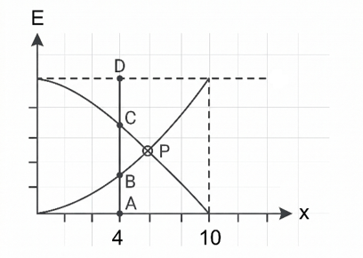
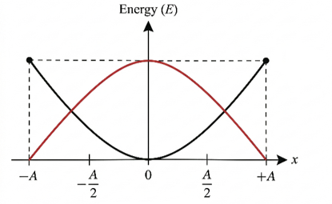
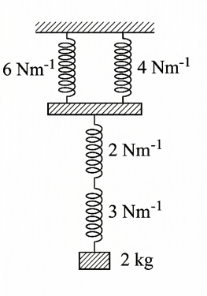

## Question: p1c08-CQ01
- **Subject:** #p1
- **Chapter:** #c08
- **Topic:** #SHM
- **Source:** #Book
- **Type:** #CQ
- **Difficulty:** #medium
- **Board Exam:** 
- **Admission Exam:** 
- **College Exam:** 
- **Book Question Number:** 
- **Tags:** #সরণ #প্রমাণ

### Sub-questions
- [ ] P বিন্দুতে স্বরণের মান কত?
- [ ] যেকোনো মুহূর্তের জন্য গাণিতিক বিশ্লেষণের সাহায্যে প্রমাণ কর যে AB + AC = AD.

### Explanation

 

## Question: p1c08-CQ02
- **Subject:** #p1
- **Chapter:** #c08
- **Topic:** #SHM
- **Source:** #Book
- **Type:** #CQ
- **Difficulty:** #medium
- **Board Exam:** 
- **Admission Exam:** 
- **College Exam:** 
- **Book Question Number:** 
- **Tags:** #বেগ #শক্তি_সংরক্ষণশীলতা

চিত্রে S.H.M বস্তুর ভর 1kg, বিস্তার 0.01m এবং কম্পাঙ্ক 12 Hz.

### Sub-questions
- [ ] $x=\frac{A}{2}$ অবস্থানে কণার বেগ = ?
- [ ] $x=A/2$ ও $x=A$ অবস্থানে শক্তি সংরক্ষণশীলতা পালিত হয়েছে কিনা?

### Explanation

 

## Question: p1c08-Q01
- **Subject:** #p1
- **Chapter:** #c08
- **Topic:** #স্প্রিং
- **Source:** #Book
- **Type:** #Question
- **Difficulty:** #easy
- **Board Exam:** 
- **Admission Exam:** 
- **College Exam:** 
- **Book Question Number:** 
- **Tags:** #পর্যায়কাল #কম্পাঙ্ক

একটি স্প্রিংকে দৃঢ় অবলম্বনে ঝুলিয়ে এর মুক্ত প্রান্তে একটি ভর ঝোলালে স্প্রিংটি 8cm প্রসারিত হয়। ভরটিকে টেনে ছেড়ে দিলে S.H.M তৈরী হয়। স্প্রিং এর পর্যায়কাল ও কম্পাঙ্ক নির্ণয় কর।

### Explanation

 

## Question: p1c08-CQ03
- **Subject:** #p1
- **Chapter:** #c08
- **Topic:** #স্প্রিং
- **Source:** #Book
- **Type:** #CQ
- **Difficulty:** #hard
- **Board Exam:** 
- **Admission Exam:** 
- **College Exam:** 
- **Book Question Number:** 
- **Tags:** #স্প্রিং_ধ্রুবক #শক্তি #সমীকরণ #বেগ #ত্বরণ

একটি স্প্রিংকে কোনো দৃঢ় অবলম্বনে ঝুলিয়ে এর মুক্ত প্রান্তে 2kg ভর যুক্ত করা হলো। ফলে স্প্রিংটির প্রসারণ হয় 0.1m, এবার স্প্রিংটিকে নিচের দিকে (-ve) 0.08m টেনে ছেড়ে দিলে S.H.M তৈরী হয়।

### Sub-questions
- [ ] স্প্রিং ধ্রুবক = ?
- [ ] কৌণিক কম্পাঙ্ক ও বিস্তার = ?
- [ ] সর্বোচ্চ বেগ ও ত্বরণ বের কর।
- [ ] সাম্যাবস্থা থেকে 0.03m অবস্থানে বেগ ও ত্বরণ = ?
- [ ] পর্যায়কাল ও কম্পাঙ্ক = ?
- [ ] S.H.M কণার মোট শক্তি = ?
- [ ] সাম্যাবস্থান থেকে 0.03m সরণ অবস্থানে শক্তি সংরক্ষণশীল কিনা?
- [ ] আদি দশা = ?
- [ ] S.H.M সমীকরণটি লিখ (অর্থাৎ $x=A\sin(\omega t+\delta)$)
- [ ] যাত্রা শুরুর 0.15 sec পর কণার সরণ, বেগ ও ত্বরণ = ?
- [ ] যাত্রা শুরুর 0.15 sec পর শক্তি সংরক্ষণশীল কিনা?

### Explanation

 

## Question: p1c08-CQ04
- **Subject:** #p1
- **Chapter:** #c08
- **Topic:** #SHM
- **Source:** #Book
- **Type:** #CQ
- **Difficulty:** #medium
- **Board Exam:** 
- **Admission Exam:** 
- **College Exam:** 
- **Book Question Number:** 
- **Tags:** #সমীকরণ #আদি_দশা #ত্বরণ

একটি S.H.M কণার গতির সমীকরণ $x=10\sin(\omega t+\delta)m$, পর্যায়কাল 30s এবং আদিসরণ 5m হলে,

### Sub-questions
- [ ] কৌণিক কম্পাঙ্ক = ?
- [ ] আদি দশা = ?
- [ ] সর্বোচ্চ বেগ ও সর্বোচ্চ ত্বরণ = ?

### Explanation

 

## Question: p1c08-Q02
- **Subject:** #p1
- **Chapter:** #c08
- **Topic:** #সরল_দোলক
- **Source:** #Book
- **Type:** #Question
- **Difficulty:** #medium
- **Board Exam:** 
- **Admission Exam:** 
- **College Exam:** 
- **Book Question Number:** 
- **Tags:** #সেকেন্ড_দোলক #দোলনকাল #শতকরা_বৃদ্ধি

একটি সেকেন্ড দোলকের কার্যকর দৈর্ঘ্য ২০০% বৃদ্ধি করা হলে এর দোলনকাল শতকরা বৃদ্ধির পরিমান = ?

### Explanation

 

## Question: p1c08-Q03
- **Subject:** #p1
- **Chapter:** #c08
- **Topic:** #সরল_দোলক
- **Source:** #Book
- **Type:** #Question
- **Difficulty:** #medium
- **Board Exam:** 
- **Admission Exam:** 
- **College Exam:** 
- **Book Question Number:** 
- **Tags:** #চাঁদ #অভিকর্ষজ_ত্বরণ #দোলনকাল

এক সেকেন্ড দোলক ভূপৃষ্ঠে সঠিক সময় দেয়। চাঁদের পৃষ্ঠে নিয়ে গেলে দোলনকাল = ? (পৃথিবীর ভর ও ব্যাসার্ধ যথাক্রমে চাঁদের ভর ও ব্যাসার্ধের ৮১ ও ৩.৭ গুন।)

### Explanation

 

## Question: p1c08-Q04
- **Subject:** #p1
- **Chapter:** #c08
- **Topic:** #সরল_দোলক
- **Source:** #Book
- **Type:** #Question
- **Difficulty:** #hard
- **Board Exam:** 
- **Admission Exam:** 
- **College Exam:** 
- **Book Question Number:** 
- **Tags:** #তাপমাত্রা #সময়_হারানো_বা_লাভ

একটি সেকেন্ড দোলকের কার্যকর দৈর্ঘ্য শৈত্যের ফলে হ্রাস পেল। ফলে দোলকঘড়িটি দিনে 10 sec দ্রুত চলে। পরিবর্তীত দোলনকাল = ?

### Explanation

 

## Question: p1c08-CQ05
- **Subject:** #p1
- **Chapter:** #c08
- **Topic:** #সরল_দোলক
- **Source:** #Book
- **Type:** #CQ
- **Difficulty:** #hard
- **Board Exam:** 
- **Admission Exam:** 
- **College Exam:** 
- **Book Question Number:** 
- **Tags:** #পাহাড়ের_উচ্চতা #সময়_হারানো

একটি সেকেন্ড দোলক পাহাড়ের পাদদেশে সঠিক সময় দেয়। পাহাড়ের চূড়ায় সেটি ঘন্টায় 30 sec সময় হারায়। R = 6400km

### Sub-questions
- [ ] পাহাড়ের চূড়ার সরল দোলকের দোলনকাল = ?
- [ ] ঐ পাহাড়ের উচ্চতা নির্ণয় কর।

### Explanation

 

## Question: p1c08-Q05
- **Subject:** #p1
- **Chapter:** #c08
- **Topic:** #সরল_দোলক
- **Source:** #Book
- **Type:** #Question
- **Difficulty:** #medium
- **Board Exam:** 
- **Admission Exam:** 
- **College Exam:** 
- **Book Question Number:** 
- **Tags:** #ফাঁপা_বব #ভারকেন্দ্র #দোলনকাল

একটি ফাঁপা ববযুক্ত সরলদোলকের ববটি পানি বা তরলপূর্ণ করে দুলতে দিয়ে এর তলায় একটি ছোট্ট ছিদ্র করে দিলে যখন এই ছিদ্রপথে ফোঁটায় ফোঁটায় তরল পড়ে যাবে তখন দোলনকালের কীরূপ পরিবর্তন হবে?

### Explanation

 

## Question: p1c08-CQ06
- **Subject:** #p1
- **Chapter:** #c08
- **Topic:** #সরল_দোলক
- **Source:** #Book
- **Type:** #CQ
- **Difficulty:** #medium
- **Board Exam:** 
- **Admission Exam:** 
- **College Exam:** 
- **Book Question Number:** 
- **Tags:** #সিলিন্ডার_বব #ভারকেন্দ্র

একটি সেকেন্ড দোলকের সিলিন্ডার আকৃতির বব পানি পূর্ণ অবস্থায় আছে। ববের উচ্চতা বা দৈর্ঘ্য 8cm।

### Sub-questions
- [ ] দোলকটির সুতার কার্যকরী দৈর্ঘ্য = ?
- [ ] ববটি অর্ধেক খালি করা হলে দ্রুত চলবে নাকি ধীরে চলবে?

### Explanation

 

## Question: p1c08-CQ07
- **Subject:** #p1
- **Chapter:** #c08
- **Topic:** #সরল_দোলক
- **Source:** #Book
- **Type:** #CQ
- **Difficulty:** #hard
- **Board Exam:** 
- **Admission Exam:** 
- **College Exam:** 
- **Book Question Number:** 
- **Tags:** #বব_গলানো #সিলিন্ডার #ভারকেন্দ্র

একটি সেকেন্ড দোলকের ববের ব্যাসার্ধ 0.29 cm, ববটিকে গলিয়ে একটি সিলিন্ডারে পরিণত করা হল। সুতার দৈর্ঘ্য অপরিবর্তীত রেখে সিলিন্ডারটিকে বব হিসেবে ব্যবহার করা হলো, দেখা গেল দোলনকাল অপরিবর্তীত থাকে।

### Sub-questions
- [ ] সুতার দৈর্ঘ্য = ?
- [ ] দেখাও যে সিলিন্ডারটির ব্যাসার্ধ $r = \sqrt{\frac{2}{3}}R$ [R হলো গোলকের ব্যাসার্ধ]

### Explanation

 

## Question: p1c08-CQ08
- **Subject:** #p1
- **Chapter:** #c08
- **Topic:** #সরল_দোলক
- **Source:** #Book
- **Type:** #CQ
- **Difficulty:** #medium
- **Board Exam:** 
- **Admission Exam:** 
- **College Exam:** 
- **Book Question Number:** 
- **Tags:** #দোলনা #ভারকেন্দ্র #দোলনকাল

রাকিব পার্কে একটি দোলনায় বসে বসে দোল খাচ্ছে। রাকিবের ভর 20kg, দোলনার দড়ির দৈর্ঘ্য 2m। কিছুক্ষণ পর রাকিব দাঁড়িয়ে দোল খাওয়া শুরু করল। কৌণিক বিস্তার $\le 4^\circ$

### Sub-questions
- [ ] বসে দোল খাওয়া অবস্থায় পর্যায়কাল = ?
- [ ] সে যখন দাঁড়িয়ে দোল খাবে তখন একক সময়ে দোলনসংখ্যা পূর্বের বেশি নাকি কম হবে?

### Explanation

 

## Question: p1c08-Q06
- **Subject:** #p1
- **Chapter:** #c08
- **Topic:** #স্প্রিং
- **Source:** #Book
- **Type:** #Question
- **Difficulty:** #easy
- **Board Exam:** 
- **Admission Exam:** 
- **College Exam:** 
- **Book Question Number:** 
- **Tags:** #স্প্রিং_ধ্রুবক #স্প্রিং_কাটা

$K$ স্প্রিং constant বিশিষ্ট একটি স্প্রিংকে সমান ৩টি টুকরা করা হলো। প্রতিটি টুকরার স্প্রিং ধ্রুবক = ?

### Explanation

 

## Question: p1c08-Q07
- **Subject:** #p1
- **Chapter:** #c08
- **Topic:** #স্প্রিং
- **Source:** #Book
- **Type:** #Question
- **Difficulty:** #medium
- **Board Exam:** 
- **Admission Exam:** 
- **College Exam:** 
- **Book Question Number:** 
- **Tags:** #স্প্রিং_ধ্রুবক #স্প্রিং_কাটা

একটি $K$ স্প্রিং ধ্রুবক বিশিষ্ট স্প্রিংকে কেটে এমনভাবে দুইটি টুকরা করা হলো যেন একটি টুকরা অপরটির দ্বিগুণ হয়। বৃহৎ টুকরাটির স্প্রিং ধ্রুবক = ?

### Explanation

 

## Question: p1c08-CQ09
- **Subject:** #p1
- **Chapter:** #c08
- **Topic:** #স্প্রিং
- **Source:** #Book
- **Type:** #CQ
- **Difficulty:** #medium
- **Board Exam:** 
- **Admission Exam:** 
- **College Exam:** 
- **Book Question Number:** 
- **Tags:** #স্প্রিং_সমবায় #শ্রেণি_সমবায় #প্রসারণ

6 Nm⁻¹ এবং 3 Nm⁻¹ স্প্রিং ধ্রুবকবিশিষ্ট দুইটি স্প্রিং শ্রেণিতে যুক্ত আছে। এ অবস্থায় এদের ওপর 0.6N টানবল প্রযুক্ত করা হলো।

### Sub-questions
- [ ] প্রতিটি স্প্রিং এর প্রসারণ = ?
- [ ] সমবায়ের তুল্য স্প্রিং ধ্রুবক = ?

### Explanation

 

## Question: p1c08-CQ10
- **Subject:** #p1
- **Chapter:** #c08
- **Topic:** #স্প্রিং
- **Source:** #Book
- **Type:** #CQ
- **Difficulty:** #medium
- **Board Exam:** 
- **Admission Exam:** 
- **College Exam:** 
- **Book Question Number:** 
- **Tags:** #স্প্রিং_সমবায় #পর্যায়কাল #কম্পাঙ্ক

### Sub-questions
- [ ] সমবায়ের স্প্রিং ধ্রুবক = ?
- [ ] সরল ছন্দিত স্পন্দনের পর্যায়কাল ও কম্পাঙ্ক = ?
- [ ] স্প্রিংগুলোকে পুণরায় খুলে আবার কীভাবে যুক্ত করলে কম্পাঙ্ক সবচেয়ে বেশি হবে?

### Explanation