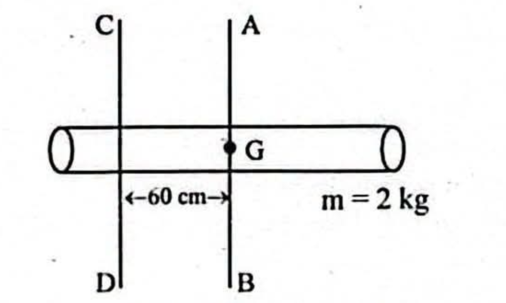
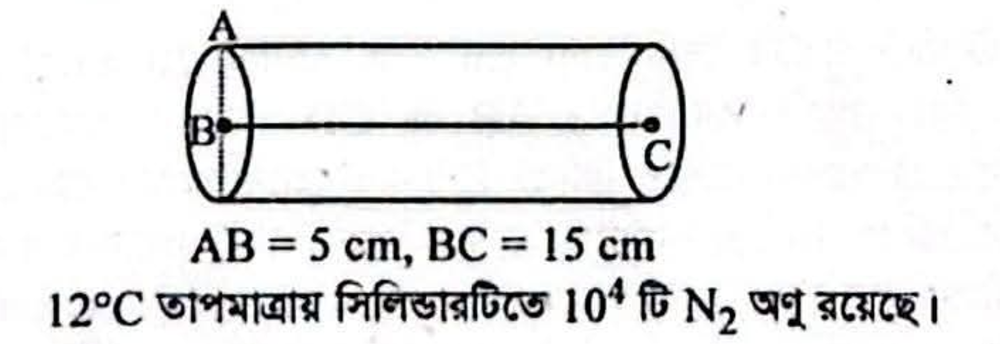
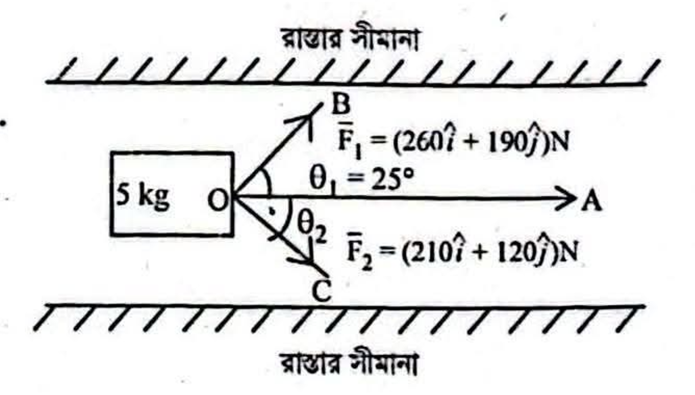

## Question: hsc26-CQ01
- **Subject:** #p1
- **Chapter:** #c03
- **Topic:** #প্রাস
- **Source:** #Board
- **Type:** #CQ
- **Difficulty:** #medium
- **Board Exam:** #All_Board_26 
- **Admission Exam:**
- **College Exam:**
- **Book Question Number:**
- **Tags:** #প্রাস #টর্ক #ভরবেগ

$20\text{ m}$ উঁচু দালানের ছাদ হতে $180\text{ gm}$ ভরের টেনিস বলকে $65\text{ m/s}$ আনুভূমিক বেগে নিক্ষেপ করা হলো। দালানের পাদদেশ হতে $25\text{ m}$ দূরে একটি পুকুর রয়েছে। পুকুরটি $14\text{ m}$ চওড়া।

### Sub-questions
- [ ] কর্মদক্ষতা কাকে বলে?
- [ ] সমভর ও সম ব্যাসার্ধের একটি সিডি ও একটি কয়েন স্থির অবস্থা হতে সমকৌণিক বেগ প্রাপ্ত হলো। এক্ষেত্রে প্রযুক্ত টর্ক একই কি না? ব্যাখ্যা কর।
- [ ] $0.7\text{ sec}$ পর টেনিস বলটির ভরবেগের মান নির্ণয় কর।
- [ ] নিক্ষেপণ বেগের মান কোন সীমার মধ্যে রাখলে উদ্দীপকের টেনিস বলটি পুকুরে পড়তে পারে? গাণিতিক বিশ্লেষণসহ মতামত দাও।

### Explanation

## Question: hsc26-CQ02
- **Subject:** #p1
- **Chapter:** #c04
- **Topic:** #জড়তার_ভ্রামক
- **Source:** #Board
- **Type:** #CQ
- **Difficulty:** #hard
- **Board Exam:** #All_Board_26 
- **Admission Exam:**
- **College Exam:**
- **Book Question Number:**
- **Tags:** #ঘূর্ণন_গতিশক্তি #সিলিন্ডার

একটি নিরেট সিলিন্ডারের দৈর্ঘ্য $160\text{ cm}$ এবং ব্যাসার্ধ $20\text{ cm}$। এর ভর $m = 2\text{ kg}$। $AB$ সিলিন্ডারের ভরকেন্দ্র $G$ গামী লম্ব অক্ষ। $AB$ ও $CD$ পরস্পর সমান্তরাল এবং এদের মধ্যবর্তী লম্ব দূরত্ব $60\text{ cm}$। সিলিন্ডারটিকে $CD$ অক্ষের সাপেক্ষে মিনিটে $120$ বার ঘোরানো হলো। পরবর্তীতে সিলিন্ডারটিকে গলিয়ে $30\text{ cm}$ ব্যাসার্ধের ও সম ভরের একটি বৃত্তাকার চাকতি বানিয়ে চাকতিকে তার ভরকেন্দ্রগামী অক্ষের সাপেক্ষে একইভাবে ঘোরানো হলো।

### Sub-questions
- [ ] ব্যাংকিং কোণ কাকে বলে?
- [ ] ঘূর্ণন অক্ষ হতে ভিন্ন দূরত্বে কণাগুলোর কৌণিক বেগ একই তবে রৈখিক বেগ ভিন্ন হয় কেন? ব্যাখ্যা কর।
- [ ] উদ্দীপকের $CD$ অক্ষের সাপেক্ষে সিলিন্ডারের জড়তার ভ্রামক নির্ণয় কর।
- [ ] উদ্দীপকের সিলিন্ডারের ঘূর্ণন গতিশক্তি চাকতির ঘূর্ণন গতিশক্তির পাঁচগুণের অধিক—গাণিতিক বিশ্লেষণে সত্যতা যাচাই কর।

### Explanation

## Question: hsc26-CQ03
- **Subject:** #p1
- **Chapter:** #c06
- **Topic:** #কৃত্রিম_উপগ্রহ
- **Source:** #Board
- **Type:** #CQ
- **Difficulty:** #medium
- **Board Exam:** #All_Board_26 
- **Admission Exam:**
- **College Exam:**
- **Book Question Number:**
- **Tags:** #মুক্তিবেগ #কৃতকাজ

$2500\text{ kg}$ ভরের একটি বস্তুকে কৃত্রিম উপগ্রহে পরিণত করার জন্য একে ভূ-পৃষ্ঠ হতে $4 \times 10^4\text{ km}$ উচ্চতায় নিয়ে যাওয়া হলো, অতঃপর এতে প্রয়োজনীয় গতিশক্তি সরবরাহ করা হলো। পৃথিবীর ভর এবং ব্যাসার্ধ যথাক্রমে $6 \times 10^{24}\text{ kg}$ এবং $6.4 \times 10^6\text{ m}$।

### Sub-questions
- [ ] মুক্তিবেগ কাকে বলে?
- [ ] পৃথিবীর পৃষ্ঠ হতে কোন বস্তুকে গভীরে নিয়ে গেলে $g$ এর মান হ্রাস পায় কেন? ব্যাখ্যা কর।
- [ ] উপগ্রহকে উল্লিখিত উচ্চতায় নিতে কৃতকাজ নির্ণয় কর।
- [ ] ভূ-পৃষ্ঠ হতে কৃত্রিম উপগ্রহটিকে স্থির বলে মনে হবে কি? গাণিতিকভাবে যাচাই কর।

### Explanation

## Question: hsc26-CQ04
- **Subject:** #p1
- **Chapter:** #c07
- **Topic:** #সান্দ্রতা
- **Source:** #Board
- **Type:** #CQ
- **Difficulty:** #hard
- **Board Exam:** #All_Board_26 
- **Admission Exam:**
- **College Exam:**
- **Book Question Number:**
- **Tags:** #পয়সনের_অনুপাত #পৃষ্ঠটান #লব্ধি_বল #প্রান্তিক_বেগ

$5\ \mu\text{m}$ ব্যাসার্ধের দুটি পানির ফোঁটা একত্রিত হয়ে একটি বড় পানির ফোঁটায় পরিণত হলো। পানির পৃষ্ঠটান $0.074\text{ Nm}^{-1}$। বাতাসের সান্দ্রতাঙ্ক $1.84 \times 10^{-5}\text{ kgm}^{-1}\text{s}^{-1}$।

### Sub-questions
- [ ] পয়সনের অনুপাত কাকে বলে?
- [ ] প্রভাব গোলকের অর্ধাংশ তরলের অভ্যন্তর হতে বাতাসে চলে আসলে ঐ অণুটির উপর লব্ধি বলের কী পরিবর্তন হবে? চিত্রসহ ব্যাখ্যা কর।
- [ ] বড় পানির ফোঁটায় পরিণত করতে কৃতকাজ নির্ণয় কর।
- [ ] মিলিত হবার পর পানির ফোঁটার ভরবেগের কী পরিবর্তন হবে? গাণিতিক বিশ্লেষণসহ মতামত দাও।

### Explanation

## Question: hsc26-CQ05
- **Subject:** #p1
- **Chapter:** #c08
- **Topic:** #সরল_ছন্দিত_স্পন্দন
- **Source:** #Board
- **Type:** #CQ
- **Difficulty:** #medium
- **Board Exam:** #All_Board_26 
- **Admission Exam:**
- **College Exam:**
- **Book Question Number:**
- **Tags:** #দশা #গতিশক্তি #বিভবশক্তি

$150\text{ gm}$ ভরের একটি বস্তু $11\text{ cm}$ বিস্তারে সরল ছন্দিত স্পন্দনে আছে। সাম্যাবস্থায়, এর গতিশক্তি $0.01\text{ J}$।

### Sub-questions
- [ ] দশা কাকে বলে?
- [ ] ঘড়ির কাঁটার গতি সরল দোলন গতি নয় কেন? ব্যাখ্যা কর।
- [ ] উদ্দীপকে বর্ণিত কণাটির গতির ব্যবকলনীয় সমীকরণ নির্ণয় কর।
- [ ] সাম্যাবস্থা হতে $5\text{ cm}$ দূরত্বে গতিশক্তি বিভবশক্তির সমান কি না? গাণিতিক বিশ্লেষণের মাধ্যমে যাচাই কর।

### Explanation

## Question: hsc26-CQ06
- **Subject:** #p1
- **Chapter:** #c10
- **Topic:** #গ্যাসের_গতিতত্ত্ব
- **Source:** #Board
- **Type:** #CQ
- **Difficulty:** #medium
- **Board Exam:** #All_Board_26 
- **Admission Exam:**
- **College Exam:**
- **Book Question Number:**
- **Tags:** #স্বাধীনতার_মাত্রা #গড়_মুক্ত_পথ #মূলগড়_বর্গবেগ

### Sub-questions
- [ ] স্বাধীনতার মাত্রা কাকে বলে?
- [ ] স্থির চাপে তাপমাত্রা বনাম আয়তন লেখচিত্র হতে পরমশূন্য তাপমাত্রা চিহ্নিত কর।
- [ ] শুধুমাত্র একটি অণুকে গতিশীল বিবেচনা করে গড় মুক্ত পথ নির্ণয় কর।
- [ ] উদ্দীপকের সিলিন্ডারটির দৈর্ঘ্য এক-তৃতীয়াংশ হ্রাস পেলে গ্যাসের অণুর মূলগড় বর্গবেগ দ্বিগুণ হবে কিনা—গাণিতিক বিশ্লেষণসহ যাচাই কর।

### Explanation

## Question: hsc26-CQ07
- **Subject:** #p1
- **Chapter:** #c02
- **Topic:** #ভেক্টর
- **Source:** #Board
- **Type:** #CQ
- **Difficulty:** #hard
- **Board Exam:** #All_Board_26 
- **Admission Exam:**
- **College Exam:**
- **Book Question Number:**
- **Tags:** #ভেক্টর_যোগ #ঘর্ষণ

বস্তুর তলের সাথে রাস্তার তলের গতীয় ঘর্ষণ গুণাঙ্ক $0.7$।

### Sub-questions
- [ ] ভেক্টর যোগের ত্রিভুজ সূত্রটি লেখ।
- [ ] $10\hat{j}$ এবং $0.1\hat{j}$ ভেক্টর দুটি বিপ্রতীপ হলেও সমরেখিত।—ব্যাখ্যা কর।
- [ ] উদ্দীপকে বস্তুটি $OA$ বরাবর গতিশীল করতে $\theta_2$ এর মান নির্ণয় কর।
- [ ] $\theta_1 = \theta_2$ হলে বস্তুটি স্থির অবস্থা হতে যাত্রা শুরু করে $10$ সেকেন্ডে $5\text{ km}$ পথ অতিক্রম করতে পারবে কি না? গাণিতিক বিশ্লেষণসহ যাচাই কর।

### Explanation

## Question: hsc26-CQ08
- **Subject:** #p1
- **Chapter:** #c09
- **Topic:** #তরঙ্গ
- **Source:** #Board
- **Type:** #CQ
- **Difficulty:** #medium
- **Board Exam:** #All_Board_26 
- **Admission Exam:**
- **College Exam:**
- **Book Question Number:**
- **Tags:** #অনুনাদ #বিট #স্থির_তরঙ্গ

দুটি সুরশলাকা থেকে নিঃসৃত শব্দ তরঙ্গের সমীকরণ:
$y_1 = 0.1 \sin \frac{\pi}{25} (100t - x)$
$y_2 = 0.1 \sin \pi \left(14t - \frac{x}{7.143}\right)$

### Sub-questions
- [ ] অনুনাদ কাকে বলে?
- [ ] দুই মুখ খোলা নলে নিঃসৃত সুর একমুখ খোলা নল অপেক্ষা বেশি শ্রুতিমধুর হয়—ব্যাখ্যা কর।
- [ ] প্রথম সুরশলাকা হতে নিঃসৃত তরঙ্গ একটি একমুখ খোলা নলে প্রথম উপসুর সৃষ্টি করলে নলের দৈর্ঘ্য নির্ণয় কর।
- [ ] দ্বিতীয় সুরশলাকাটি ঘষে সুরশলাকা দুটিকে একত্রে শব্দায়িত করলে বিট সংখ্যা দ্বিগুণ করতে দ্বিতীয় সুরশলাকার কম্পাঙ্কের কী পরিবর্তন হবে—গাণিতিক বিশ্লেষণপূর্বক মতামত দাও।

### Explanation